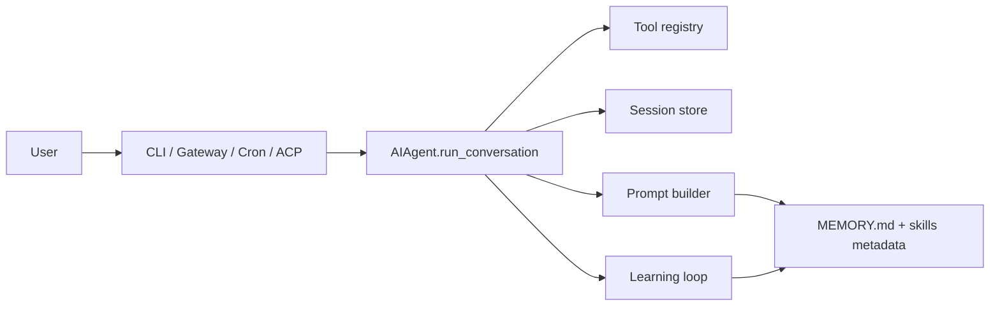

# ch00_introduction

# Introduction

Harness Agent tutorial — `ch00_introduction.ipynb`


## Chapter objectives

By the end of this chapter you will be able to:

- **Distinguish** a chat completion from an agent harness — and explain *why* the extra machinery exists.
- **Name the four subsystems** a harness adds (tools, sessions, prompt assembly, learning) and give a concrete example of each.
- **Map** Harness Agent components to analogous pieces in Nous Research agent, OpenClaw, and IDE agents (Cursor / Claude Code).
- **Install** the tutorial package (`pip install -e ".[dev]"`) and verify `HARNESS_AGENT_HOME` is set correctly.
- **Preview** the `harness-agent` CLI surface you will build out by ch21 (`chat`, `doctor`, `gateway`, `cron`).

## Prerequisites

- Python 3.11+
- Basic familiarity with `pip` and virtual environments
- Optional: API key for OpenAI or Anthropic (not required for this chapter)


## Concept: Chat completion vs. agent harness

### The simplest possible model interaction — chat completion

A **chat completion** is a single round-trip: one user message in, one model response out. No memory, no tools, no persistence.

```python
# Pseudocode — raw chat completion
response = openai.chat.completions.create(
    model="gpt-4o",
    messages=[{"role": "user", "content": "Summarise logs/app.log"}]
)
# The model has never seen logs/app.log. It can only reply with:
# "I'd be happy to help, but I don't have access to your log file."
```

The model is blind to your filesystem, your history, and your preferences. Every conversation starts from zero.

---

### What an agent harness adds

An **agent harness** wraps the model with four durable subsystems:

| Subsystem | What it does | Concrete example |
|-----------|-------------|-----------------|
| **Tools** | Model can call functions; results feed back in | `read_file("logs/app.log")` → file contents returned to model |
| **Sessions** | Conversations persist across process restarts | Resume a debug session from yesterday without re-explaining context |
| **Prompt assembly** | System prompt built from stable layers | `persona.md` + `MEMORY.md` + skills metadata combined before every call |
| **Learning loop** | Successful workflows become reusable skills | After "summarise + ticket" workflow succeeds, harness saves a `triage-logs` skill |

---

### The self-improving loop

Most harnesses run an **extra step after the user-visible answer**:

```
Turn N completes
    ↓
Evaluator: "Was this workflow novel and successful?"
    ├── YES → serialize it as a skill, update MEMORY.md
    └── NO  → discard, move on
```

This is what separates a one-shot agent from a system that gets better over time.

---

### Ecosystem comparison

| Harness | Optimises for |
|---------|---------------|
| **Harness Agent** (this tutorial) | Complete pedagogical shape — every subsystem present, minimal scope |
| **Nous Research open-source agent** | Closed learning loop, large gateway (many messenger platforms), skills hub with sharing |
| **OpenClaw** | SOUL/workspace files, rich messaging gateway, migration tooling |
| **Cursor / Claude Code** | Editor integration, hooks, MCP protocol, IDE-native skills |

The key insight: **all four make the same architectural bet** — the model produces better, more consistent outputs when it has tools, memory, and a learning loop underneath it.

## How it works — the full request path

By the end of the tutorial, every user-visible path converges on one method: `AIAgent.run_conversation()`.



### What each node does

| Node | File | Role |
|------|------|------|
| CLI | `harness_agent/cli.py` | `harness-agent chat "..."` — your terminal entry point |
| Gateway | `harness_agent/gateway/` | HTTP webhook for external messengers |
| Cron | `harness_agent/cron/` | Scheduled background tasks |
| ACP | `harness_agent/acp/` | IDE protocol (e.g. Agent Communication Protocol) |
| AIAgent | `harness_agent/agent.py` | Orchestrates everything; the single convergence point |
| Tool registry | `harness_agent/tools/` | All callable functions the model can invoke |
| Session store | `labs/sessions/*.sqlite` | SQLite — persists conversation history |
| Prompt builder | `harness_agent/prompt.py` | Assembles system prompt from layered sources |
| MEMORY.md + skills | `labs/MEMORY.md`, `labs/skills/` | Durable knowledge the agent accumulates |
| Learning loop | `harness_agent/learning/` | Post-turn evaluator — decides what's worth saving |

### State directory layout

Everything stateful lives under `HARNESS_AGENT_HOME` (default `./labs`):

```
labs/
├── MEMORY.md          ← free-form persistent memory, updated by learning loop
├── USER.md            ← user preferences / profile (name, timezone, style)
├── sessions/
│   └── abc123.sqlite  ← one DB per conversation; stores full message history
├── skills/
│   ├── triage-logs.md ← a learned skill: "how to summarise + ticket logs"
│   └── deploy.md      ← another skill authored during a past session
└── cron/
    └── jobs.json      ← scheduled task definitions
```

### Setup commands

```bash
# 1. Install the package in editable mode with dev extras
pip install -e ".[dev]"

# 2. Copy the environment template — add your API key here
copy .env.example .env      # Windows
# cp .env.example .env      # macOS/Linux

# 3. Verify all subsystems are wired up correctly
harness-agent doctor
```

`harness-agent doctor` checks: Python version, `HARNESS_AGENT_HOME` exists, env vars present, SQLite writable, skills directory accessible. You'll implement it in ch03.

## Reference implementation map

This table lets you open an analogous file in any reference repo and immediately understand what role it plays.

| Harness Agent (this tutorial) | Nous Research agent | OpenClaw | What it does |
|------------------------------|---------------------|----------|--------------|
| `harness_agent/agent.py` | `run_agent.py` | workspace agent | Central orchestrator — tool loop, session, prompt |
| `harness_agent/gateway/` | `gateway/` | gateway adapters | Entry point adapters (HTTP, Slack, Telegram…) |
| `harness_agent/skills/` | bundled + user skills | user skills dir | Skill `.md` files loaded into context |
| `harness_agent/learning/` | post-turn skill authoring | workspace routines | Post-turn evaluator — save or discard |
| `harness_agent/prompt.py` | prompt assembly | SOUL files | Builds system prompt from layered sources |
| `harness_agent/tools/` | tool registry | tool functions | All callable functions available to the model |
| `labs/sessions/` | session store | workspace state | Persisted conversation history (SQLite) |
| `labs/MEMORY.md` | memory files | MEMORY.md | Durable free-form memory |

### How to use a reference repo

```bash
# Clone a reference repo alongside this tutorial
git clone https://github.com/<org>/<reference-agent> ../reference

# Point the env var so later chapters can walk the files
export REFERENCE_REPO_PATH=../reference

# ch05 and later chapters use this to open analogous files side-by-side
```

> **Scope note:** Harness Agent implements a **complete shape** at tutorial scope — two terminal backends (local, Docker), one gateway adapter (HTTP webhook). External harnesses support dozens of messaging platforms. The architecture is identical; only the breadth differs.

## Reference implementation map

| Harness Agent (this tutorial) | Nous Research agent | OpenClaw |
|------------------------------|---------------------|----------|
| `harness_agent/agent.py` | `run_agent.py` | workspace agent |
| `harness_agent/gateway/` | `gateway/` | gateway adapters |
| `harness_agent/skills/` | bundled + user skills | user skills dir |
| `harness_agent/learning/` | post-turn skill authoring | workspace routines |

Clone an external repo and set `REFERENCE_REPO_PATH` for file walkthroughs in later chapters.


## Design choices in harness_agent

We implement a **complete shape** with tutorial scope: two terminal backends (local, Docker), one gateway adapter (HTTP webhook), not dozens of messaging platforms. Our package name stays `harness_agent`; external product names appear only in pedagogy.


```python
import sys
from pathlib import Path

print("=== Environment check ===")
print(f"Python version : {sys.version}")
print(f"Project root   : {Path.cwd()}")
print()

```

```python

# Check whether the package is installed
try:
    import harness_agent
    print(f"harness_agent  : installed ✓  (location: {Path(harness_agent.__file__).parent})")
except ImportError:
    print("harness_agent  : NOT installed — run:  pip install -e \".[dev]\"")

# Show the expected directory structure under the project root
root = Path.cwd().parent  # one level up from notebooks/
print()
print("=== Expected project layout ===")
important = [
    "harness_agent/agent.py",
    "harness_agent/config.py",
    "harness_agent/prompt/",
    "harness_agent/tools/",
    "harness_agent/gateway/",
    "harness_agent/learning/",
    "harness_agent/skills/",
    "labs/",
    ".env.example",
    "pyproject.toml",
]
for rel in important:
    p = root / rel
    exists = "✓" if p.exists() else "✗ (not yet created)"
    print(f"  {rel:<40} {exists}")
```

## Trace: one request end-to-end

Walk through exactly what happens when a user runs:

```bash
harness-agent chat "Read logs/app.log and tell me what's wrong"
```

```
1. CLI parses args → calls AIAgent(session_id="abc123")

2. Prompt builder assembles system prompt:
   ┌─────────────────────────────────────────────────┐
   │ [persona]   You are a helpful dev assistant.    │
   │ [memory]    User is debugging a Python service. │
   │ [skills]    triage-logs, deploy                 │
   └─────────────────────────────────────────────────┘

3. Session store loads prior messages from labs/sessions/abc123.sqlite
   → 3 prior turns found, injected into messages list

4. Model receives: system prompt + history + user message
   Model responds with a TOOL CALL:
   { "tool": "read_file", "args": { "path": "logs/app.log" } }

5. Tool registry executes read_file("logs/app.log")
   → returns file contents (or error if missing)

6. Tool result appended to messages; model called again:
   Model responds with final answer:
   "Line 42: disk full — /var/log is at 100%. Run: df -h to confirm."

7. Final answer printed to terminal / returned to caller

8. [Post-turn] Learning loop evaluates:
   - Was a tool used? YES
   - Was the answer accepted? YES (user didn't say "that's wrong")
   - Is there already a 'read-logs' skill? NO
   → Saves new skill: labs/skills/read-and-triage-logs.md
   → Updates labs/MEMORY.md: "User's service logs live at logs/app.log"
```

The model is called **twice** in this turn: once to pick the tool, once to produce the final answer with the tool result injected. This two-call pattern is called a **tool loop** — ch01 covers it in depth.

```python
import os
from pathlib import Path

# Set HARNESS_AGENT_HOME to the labs/ directory alongside this notebook
os.environ.setdefault('HARNESS_AGENT_HOME', str(Path('labs').resolve()))

from harness_agent.config import get_config
cfg = get_config()

print("=== Config check ===")
print(f"HARNESS_AGENT_HOME : {cfg.home}")
print()

# Verify subdirectories exist (they are created lazily on first use)
subdirs = ["sessions", "skills", "cron"]
home = Path(cfg.home)
print("=== Labs subdirectory status ===")
for sub in subdirs:
    p = home / sub
    status = "exists ✓" if p.exists() else "will be created on first use"
    print(f"  {str(p):<60} {status}")

print()
# Show MEMORY.md and USER.md status
for fname in ["MEMORY.md", "USER.md"]:
    p = home / fname
    if p.exists():
        lines = p.read_text(encoding="utf-8").splitlines()
        print(f"  {fname}: {len(lines)} lines")
    else:
        print(f"  {fname}: not yet created (will be initialised by the agent)")
```

## Hands-on exercise

Work through these steps in order. Each one validates a piece of the stack.

### Step 1 — Install the package

```bash
cd D:\Garage\Harness_Tutorial
pip install -e ".[dev]"
```

Expected output includes `Successfully installed harness-agent-...`.

### Step 2 — Verify `HARNESS_AGENT_HOME`

Run the config check cell above. The path should end in `labs/`.  
If it points at the repo root, set the env var explicitly:

```bash
# PowerShell
$env:HARNESS_AGENT_HOME = "D:\Garage\Harness_Tutorial\notebooks\labs"

# bash / WSL
export HARNESS_AGENT_HOME="D:/Garage/Harness_Tutorial/notebooks/labs"
```

### Step 3 — Run the doctor command

```bash
harness-agent doctor
```

All checks should pass (green). If any fail, the doctor prints a fix hint.

### Step 4 — Re-run the prompt assembly cell

Run the "Simulate prompt assembly" cell. Verify it shows:
- `[PERSONA]` with the default persona text
- `[MEMORY]` — either your `MEMORY.md` content or `(no memory yet)`
- `[AVAILABLE SKILLS]` — list of `.md` files in `labs/skills/`, or `(no skills yet)`

### Step 5 — Preview the CLI surface

```bash
harness-agent --help
```

You will see subcommands like `chat`, `doctor`, `gateway`, `cron`.  
By ch21 you will have implemented all of them.

## Common pitfalls

### 1. `HARNESS_AGENT_HOME` points at the repo root

**Symptom:** `MEMORY.md`, session files, and skills appear at the top of the repo.  
**Fix:** Always set it to `labs/` (a subdirectory), not the repo root.

```bash
# Wrong
export HARNESS_AGENT_HOME=D:/Garage/Harness_Tutorial

# Correct
export HARNESS_AGENT_HOME=D:/Garage/Harness_Tutorial/notebooks/labs
```

---

### 2. Expecting this repo to install an external agent

**Symptom:** Searching for a `nous-hermes` or `openclaw` import that doesn't exist.  
**Fix:** This tutorial builds its own `harness_agent` package from scratch. External harnesses appear only in the comparison tables for pedagogy.

---

### 3. Skipping the virtual environment

**Symptom:** `pip install` succeeds but `import harness_agent` fails in Jupyter.  
**Fix:** The Jupyter kernel must use the same venv where you installed the package.

```bash
# Create and activate a venv
python -m venv .venv
.venv\Scripts\activate     # Windows
source .venv/bin/activate  # macOS/Linux

# Install
pip install -e ".[dev]"

# Register the kernel for Jupyter
python -m ipykernel install --user --name harness-tutorial
# Then select "harness-tutorial" as the kernel in Jupyter
```

---

### 4. Running cells out of order

**Symptom:** `NameError` or `ModuleNotFoundError` mid-notebook.  
**Fix:** Use **Kernel → Restart & Run All** to execute cells top-to-bottom. The env-var cell (cell 10) must run before the prompt-assembly cell.

---

### 5. `.env` not copied

**Symptom:** `harness-agent doctor` reports missing API key.  
**Fix:**
```bash
copy .env.example .env   # Windows
cp .env.example .env     # macOS/Linux
# Then edit .env and add your ANTHROPIC_API_KEY or OPENAI_API_KEY
```

## Checkpoint questions

Answer these before moving to ch01. Suggested answers follow each question.

---

**1. Name four subsystems a harness adds beyond raw chat completions.**

<details>
<summary>Answer</summary>

1. **Tools** — callable functions the model can invoke (read_file, run_bash, search…)
2. **Sessions** — persisted conversation history across restarts (SQLite in `labs/sessions/`)
3. **Prompt assembly** — stable system layers (persona + memory + skills) built before every call
4. **Learning loop** — post-turn evaluator that serialises successful workflows as skills

</details>

---

**2. How does Harness Agent relate to Nous Research agent or OpenClaw conceptually?**

<details>
<summary>Answer</summary>

All three share the same four-subsystem architecture (tools, sessions, prompt, learning). They differ in scope and optimisation target:
- Nous Research agent: production-grade, large gateway, skills hub with community sharing
- OpenClaw: SOUL/workspace files, rich messaging gateway, migration tooling
- Harness Agent: tutorial scope — complete shape, two terminal backends, one gateway adapter

</details>

---

**3. What directory holds session databases and skills? What env var controls it?**

<details>
<summary>Answer</summary>

`HARNESS_AGENT_HOME` (default `./labs`). Inside it:
- `labs/sessions/*.sqlite` — one SQLite file per conversation
- `labs/skills/*.md` — one Markdown file per saved skill

</details>

---

**4. How many times is the model called in a single tool-using turn, and why?**

<details>
<summary>Answer</summary>

**Twice.** First call: the model receives the user message and responds with a tool call (picks which function to invoke). Second call: the tool result is appended to the message list and the model produces the final natural-language answer. This is the **tool loop** — covered in depth in ch01.

</details>

## Summary & next chapter

### What you covered

| Concept | Key takeaway |
|---------|-------------|
| Chat completion | One message in → one response out. No memory, no tools, no persistence. |
| Agent harness | Adds tools, sessions, prompt assembly, and a learning loop around the model. |
| Tool loop | Model called twice per tool-using turn: once to pick the tool, once for the final answer. |
| `HARNESS_AGENT_HOME` | The single state directory — sessions, skills, memory, cron all live here. |
| Ecosystem peers | Nous Research agent, OpenClaw, Cursor/Claude Code share the same four-subsystem shape. |
| Harness Agent scope | Tutorial breadth (2 backends, 1 gateway) — complete shape, not production breadth. |

### What you built / ran

- Environment check — verified Python version and `harness_agent` install.
- Config check — confirmed `HARNESS_AGENT_HOME` points at `labs/`.
- Prompt assembly simulation — saw how `MEMORY.md`, `USER.md`, and skills combine.
- Bare completion vs. harness turn comparison — saw the structural difference in code.

### Next chapter — `ch01_function_calling.ipynb`

**Function calling** is the mechanism that makes tools work: instead of generating text, the model emits a structured JSON object naming the function to call and its arguments. The harness intercepts this, runs the function, and loops back. You will:

- Understand the OpenAI / Anthropic function-calling API shape.
- Write a tool schema (`name`, `description`, `parameters`).
- Implement a minimal tool loop that handles one tool call per turn.
- See how multi-step tool chains work (model calls tool A, result feeds back, model calls tool B).

```bash
# Open the next chapter
jupyter notebook ch01_function_calling.ipynb
```

## Checkpoint questions

1. Name four subsystems a harness adds beyond raw chat completions.
2. How does Harness Agent relate to Hermes or OpenClaw conceptually?
3. What directory holds session databases and skills?


## Summary & next chapter

You have a map of the full stack. **ch01** introduces LLM **function calling** — the mechanism models use to invoke tools.

