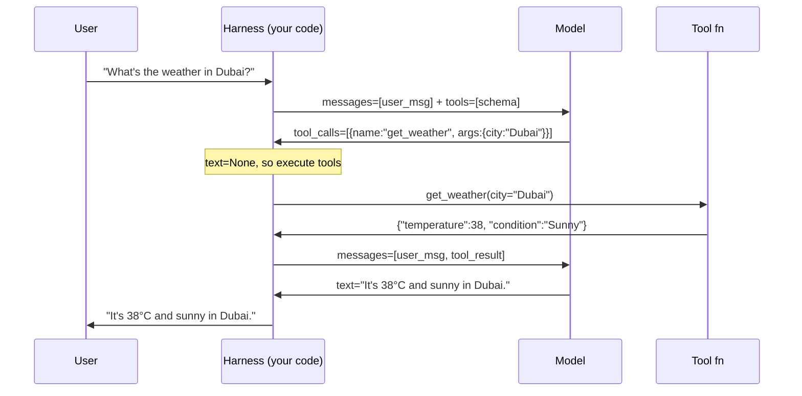

# ch01_llm_tool_calling

# LLM tool calling

Harness Agent tutorial — `ch01_llm_tool_calling.ipynb`


## Chapter objectives

- Understand **what a tool schema is** and how it is structured (JSON Schema).
- Trace every phase of a tool call: define → send → receive `tool_calls` → execute → return result → final answer.
- Run a **real end-to-end example** with a live provider (Compass / OpenAI-compatible).
- Know what the raw request and response objects look like at each step.

## Prerequisites

ch00; `pip install -e .`; API key recommended for live cells.


## Concept: What is tool calling?

By default a language model only returns text. **Tool calling** (also called *function calling*) lets the model request that your code runs a function and returns the result, instead of guessing the answer itself.

### Why does this matter?

| Without tools | With tools |
|---|---|
| Model guesses `{"AAPL": 189.5}` | Model calls `get_stock_price("AAPL")` → your code returns the real value |
| Hallucinated file contents | Model calls `read_file("config.yaml")` → real bytes |
| Made-up API response | Model calls `http_get(url)` → actual response |

### The protocol in plain English

1. You describe your functions as **JSON Schema** objects and send them alongside the conversation.
2. When the model needs a function, instead of answering it returns a structured `tool_calls` block — **no text, just a function name + arguments**.
3. Your code executes the function and sends the result back as a `tool` role message.
4. The model reads the result and produces the final user-facing answer.

The model never runs code itself — it just asks for results.

## Anatomy of a tool schema

Every tool is described as a JSON object with three parts:

```json
{
  "type": "function",
  "function": {
    "name": "get_weather",
    "description": "Return current weather for a city. Call this whenever the user asks about weather.",
    "parameters": {
      "type": "object",
      "properties": {
        "city": {
          "type": "string",
          "description": "City name, e.g. Dubai"
        },
        "unit": {
          "type": "string",
          "enum": ["celsius", "fahrenheit"],
          "description": "Temperature unit"
        }
      },
      "required": ["city"]
    }
  }
}
```

Key fields:

| Field | Purpose |
|---|---|
| `name` | Identifier the model uses to refer to the tool |
| `description` | **Most important** — tells the model *when* to use this tool |
| `parameters` | JSON Schema describing the arguments the model must fill in |
| `required` | Which parameters are mandatory |

> **Tip:** A vague description = wrong tool calls. Be explicit about when the tool should be invoked.

## Step 1 — Define a tool schema and its implementation

We'll build a simple `get_weather` tool. The schema tells the model what to call; the Python function is what actually runs.

```python
import json

# --- Tool schema (sent to the model) ---
weather_tool_schema = {
    "type": "function",
    "function": {
        "name": "get_weather",
        "description": (
            "Return the current temperature and condition for a city. "
            "Call this whenever the user asks about weather or temperature."
        ),
        "parameters": {
            "type": "object",
            "properties": {
                "city": {
                    "type": "string",
                    "description": "City name, e.g. Dubai",
                },
                "unit": {
                    "type": "string",
                    "enum": ["celsius", "fahrenheit"],
                    "description": "Temperature unit. Defaults to celsius.",
                },
            },
            "required": ["city"],
        },
    },
}

```

```python
# --- Tool implementation (runs locally, never sent to the model) ---
def get_weather(city: str, unit: str = "celsius") -> dict:
    """Fake weather data for demonstration."""
    data = {
        "Dubai":   {"celsius": 38, "condition": "Sunny"},
        "London":  {"celsius": 14, "condition": "Cloudy"},
        "Toronto": {"celsius":  8, "condition": "Rainy"},
    }
    info = data.get(city, {"celsius": 20, "condition": "Unknown"})
    temp = info["celsius"] if unit == "celsius" else round(info["celsius"] * 9/5 + 32)
    return {"city": city, "temperature": temp, "unit": unit, "condition": info["condition"]}

```

```python
# Quick sanity check
print(json.dumps(get_weather("Dubai")))
print(json.dumps(get_weather("London", "fahrenheit")))
print(json.dumps(get_weather("Mumbai")))
```

## Step 2 — Send the tool schema + user message to the model

The model sees the tool schema and the user message. Because the question requires weather data, it responds with a `tool_calls` block instead of answering directly.

```python
import os
from harness_agent.providers.compass_compat import CompassProvider
from harness_agent.types import Message

# Set your key (or use .env)
# os.environ["HARNESS_API_KEY"] = "your-key-here"

prov = CompassProvider()

user_message = Message(role="user", content="What's the weather like in Dubai right now?")

# First call: model decides to use a tool
response_text, tool_calls = prov.complete_with_tools(
    messages=[user_message],
    tools=[weather_tool_schema],
    model="gpt-4.1",
)


```

```python
print("=== Model response ===")
print(f"Text:       {response_text!r}")   # None — model chose to call a tool instead
print(f"Tool calls: {tool_calls}")
if tool_calls:
    tc = tool_calls[0]
    print(f"\nTool requested : {tc.name}")
    print(f"Arguments      : {json.dumps(tc.arguments, indent=2)}")
```

## Step 3 — Execute the tool and collect the observation

The model's `tool_calls` response tells us exactly which function to run and with what arguments. We run it locally and package the result as a `tool` role message.

```python
# Dispatch table: maps tool name → Python function
TOOL_REGISTRY = {
    "get_weather": get_weather,
}

# Execute each tool call the model requested
tool_results = []
for tc in tool_calls:
    fn = TOOL_REGISTRY[tc.name]
    result = fn(**tc.arguments)
    observation = json.dumps(result)

    print(f"Executed : {tc.name}({tc.arguments})")
    print(f"Result   : {observation}\n")

    # Package result as a tool role message (required by the API)
    tool_results.append(
        Message(role="tool", tool_call_id=tc.id, content=observation)
    )

    print(tool_results)
```

## Step 4 — Send the observation back; get the final answer

The second call must include the **full conversation history** in this exact order:

```
1. user        — the original question
2. assistant   — the model's prior response (with tool_calls attached)  ← easy to forget
3. tool        — the result of executing the tool
```

Sending `user → tool` without the intermediate `assistant` message causes a `BadRequestError`
because the API cannot match the `tool_call_id` in the tool message to any prior assistant turn.

The `tool_calls` field on the assistant `Message` must use the **OpenAI wire format**
(a list of dicts with `id`, `type`, `function.name`, `function.arguments`).
`ToolCall` dataclass objects are our internal representation — they must be converted.

```python
# Convert our ToolCall dataclass list → OpenAI wire format dicts
def tool_calls_to_openai(calls: list) -> list:
    return [
        {
            "id": tc.id,
            "type": "function",
            "function": {
                "name": tc.name,
                "arguments": json.dumps(tc.arguments),
            },
        }
        for tc in calls
    ]

print(tool_calls_to_openai(tool_calls))


# Reconstruct the assistant message that carried the tool_calls
assistant_message = Message(
    role="assistant",
    content=response_text,                          # None is fine
    tool_calls=tool_calls_to_openai(tool_calls),    # required by OpenAI API
)

# Correct order: user → assistant (with tool_calls) → tool results
second_messages = [user_message, assistant_message] + tool_results
print(f"Second messages : {second_messages}")

final_text, final_calls = prov.complete_with_tools(
    messages=second_messages,
    tools=[weather_tool_schema],
    model="gpt-4.1",
)

print("=== Final answer ===")
print(final_text)
print(f"\nfinal_calls (should be empty): {final_calls}")
```

## Full end-to-end agent loop

Real agents repeat Steps 2–4 in a loop until the model stops requesting tools and returns plain text. Here is the minimal version:

```python
def run_agent(user_query: str, tools: list, tool_registry: dict, model: str = "gpt-4.1") -> str:
    """Minimal agent loop: call model → execute tools → repeat until done."""
    messages = [Message(role="user", content=user_query)]

    for turn in range(10):  # safety limit
        text, calls = prov.complete_with_tools(messages, tools, model=model)

        if not calls:
            # Model returned plain text — we're done
            return text or ""

        # Append the assistant message BEFORE the tool results.
        # The API needs to match each tool_call_id to this assistant turn.
        messages.append(Message(
            role="assistant",
            content=text,
            tool_calls=tool_calls_to_openai(calls),
        ))

        # Execute every tool the model requested and append results
        for tc in calls:
            fn = tool_registry[tc.name]
            observation = json.dumps(fn(**tc.arguments))
            print(f"  [turn {turn+1}] {tc.name}({tc.arguments}) → {observation}")
            messages.append(Message(role="tool", tool_call_id=tc.id, content=observation))

    return "Max turns reached."


answer = run_agent(
    "What's the weather in London and Dubai? Give me both in fahrenheit.",
    tools=[weather_tool_schema],
    tool_registry=TOOL_REGISTRY,
)
print("\n=== Agent answer ===")
print(answer)
```

## Sequence diagram



Notice the model is called **twice**: once to decide which tool to call, once to compose the final answer.

## Common pitfalls

| Pitfall | Symptom | Fix |
|---------|---------|-----|
| Missing assistant message between user and tool | `BadRequestError` on the second call | Insert `Message(role="assistant", tool_calls=tool_calls_to_openai(calls))` before the tool result messages |
| `tool_calls` as `ToolCall` dataclasses instead of dicts | `BadRequestError` or silent wrong serialisation | Convert with `tool_calls_to_openai()` — OpenAI expects `{id, type, function: {name, arguments}}` |
| `text=None` and no `tool_calls` | Model stopped early | Stop reason is `length` — increase `max_tokens` |
| Model ignores the tool entirely | No `tool_calls` in response | Improve the `description` — it must say *when* to call the tool |
| `KeyError` on dispatch | `KeyError: 'tool_name'` | Ensure every tool name the model can return is in `TOOL_REGISTRY` |
| Arguments are a JSON string, not a dict | `TypeError` calling the function | Parse with `json.loads(tc.arguments)` — `openai_compat.py` already does this |
| Not looping until `tool_calls` is empty | Only one tool called in a multi-tool query | Always loop: check `if not calls: return text` |

## Checkpoint questions

1. When the model returns `tool_calls`, what is the value of `text`? Why?
2. What two things must be in the `function` object of a tool schema?
3. What message `role` carries the tool result back to the model?
4. Why is the model called a second time after tool execution?
5. What stops the agent loop from running forever?

## Summary & next chapter

What you built in this chapter:

- A tool schema with a name, description, and JSON Schema parameters
- A step-by-step trace: define → send → receive `tool_calls` → execute → return result → final answer
- A reusable `run_agent` loop that handles multiple sequential tool calls

**ch02** covers how `Message` objects are structured across different providers (OpenAI, Anthropic, Compass) and how the harness normalises them into a single format.
