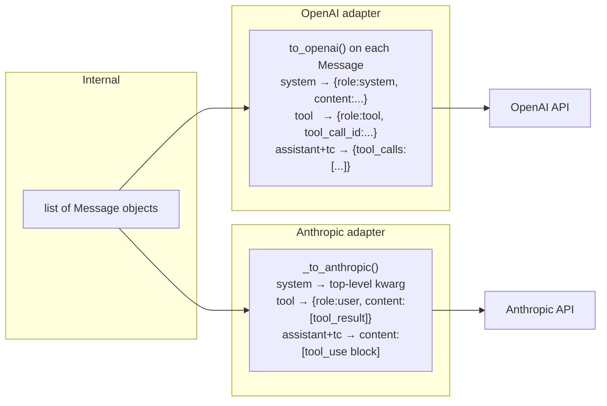

# ch02_messages_and_providers

# Messages and providers

Harness Agent tutorial — `ch02_messages_and_providers.ipynb`


## Chapter objectives

By the end of this chapter you will be able to:

- Name the **four message roles** (`system`, `user`, `assistant`, `tool`) and explain when each is used.
- Inspect the **OpenAI wire format** produced by `Message.to_openai()` for every role.
- Explain the **key differences** between OpenAI and Anthropic message formats (system field, tool blocks, content arrays).
- Trace how `AnthropicProvider._to_anthropic()` converts our internal `Message` objects into Anthropic's API shape.
- Use `get_provider_registry().resolve()` to select a provider + model at runtime.
- Register and retrieve all four providers (`openai`, `anthropic`, `deepseek`, `compass`).

## Prerequisites

Prior chapters through ch02; see SYLLABUS.md.


## Concept: Messages and providers

### The four message roles

Every LLM API organises a conversation as an ordered list of messages, each with a `role` field. Harness Agent uses four roles:

| Role | When used | Key fields |
|------|-----------|------------|
| `system` | First message in every conversation — sets persona, memory, skills | `content` |
| `user` | Human turn — the actual question or instruction | `content` |
| `assistant` | Model turn — either plain text or a tool-call request | `content`, `tool_calls` |
| `tool` | Harness turn — the result of executing a tool | `content`, `tool_call_id` |

A typical tool-using conversation looks like this in sequence:

```
system    → "You are Harness Agent. Memory: ..."
user      → "Write a FizzBuzz script and run it"
assistant → tool_calls: [{name:"write_file", args:{...}}]   ← model requests a tool
tool      → {"status":"success", "summary":"Wrote fizzbuzz.py"}
assistant → tool_calls: [{name:"run_shell", args:{...}}]    ← model requests another tool
tool      → {"status":"success", "detail":"1\n2\nFizz\n..."}
assistant → "Here is the FizzBuzz output: ..."              ← final text answer
```

---

### The `Message` dataclass

```python
@dataclass
class Message:
    role: Role                          # system | user | assistant | tool
    content: str | None = None          # text content (None when role=assistant + tool_calls)
    tool_calls: list[dict] | None = None  # OpenAI wire-format dicts (assistant only)
    tool_call_id: str | None = None     # matches tc["id"] from assistant turn (tool only)
    name: str | None = None             # tool name for the tool role (optional)
```

`to_openai()` serialises a `Message` to the dict OpenAI's API expects. It omits `None` fields to keep the payload minimal.

---

### Provider normalisation problem

Different LLM providers use incompatible wire formats for the same concept:

| Concept | OpenAI format | Anthropic format |
|---------|--------------|-----------------|
| System prompt | `{"role":"system","content":"..."}` in messages list | Top-level `system` kwarg, not in messages |
| Tool result | `{"role":"tool","tool_call_id":"...","content":"..."}` | `{"role":"user","content":[{"type":"tool_result","tool_use_id":"..."}]}` |
| Tool call | `tool_calls:[{"type":"function","function":{...}}]` | `content:[{"type":"tool_use","id":...,"input":{...}}]` |

Harness Agent solves this with **provider adapters**: each provider class converts our internal `Message` list into its own wire format before calling the API.

## How it works — the normalisation pipeline



The flow for every turn in `AIAgent.run_conversation()`:

```
1. Build messages list (system + history + new user message)
2. Resolve provider (openai / anthropic / deepseek / compass)
3. Provider adapter converts messages → API wire format
4. API call returns text and/or tool_calls
5. Harness converts tool_calls back to ToolCall dataclasses
6. Repeat from step 1 with tool results appended
```

## Reference implementation map

| Concern | Harness Agent | Nous Research agent | OpenClaw |
|---------|--------------|---------------------|----------|
| Message type | `harness_agent/types.py` — `Message` dataclass | internal message class in `run_agent.py` | workspace message model |
| OpenAI adapter | `providers/openai_compat.py` — `OpenAIProvider` | openai provider | openai gateway adapter |
| Anthropic adapter | `providers/anthropic_compat.py` — `AnthropicProvider` | anthropic provider | anthropic gateway adapter |
| DeepSeek adapter | `providers/deepseek_compat.py` — subclass of `OpenAIProvider` | n/a (openai-compat) | n/a |
| Provider registry | `providers/registry.py` — `ProviderRegistry` | provider map in config | provider config |

All four providers in Harness Agent:

| Provider name | Class | Base URL | Key env var |
|--------------|-------|----------|-------------|
| `openai` | `OpenAIProvider` | `api.openai.com` | `OPENAI_API_KEY` |
| `anthropic` | `AnthropicProvider` | `api.anthropic.com` | `ANTHROPIC_API_KEY` |
| `deepseek` | `DeepSeekProvider` (extends OpenAI) | `api.deepseek.com` | `DEEPSEEK_API_KEY` |
| `compass` | `CompassProvider` (extends OpenAI) | `api.core42.ai/v1` | `COMPASS_API_KEY` |

`HARNESS_API_KEY` is the universal fallback — any provider will accept it if its own key is absent.

## Design choices

### Why a single internal `Message` type?

Each provider API has slightly different conventions. Without a normalisation layer, you'd scatter format-specific logic throughout the codebase:

```python
# Without normalisation — messy
if provider == "anthropic":
    system = extract_system(messages)
    body = [convert_tool_result_to_anthropic(m) for m in messages]
elif provider == "openai":
    body = messages  # already correct
```

The `Message` dataclass + per-provider `_to_*()` methods keep all format knowledge in one place per provider.

### Why `tool_calls` stores OpenAI wire-format dicts, not `ToolCall` dataclasses?

`Message.to_openai()` is designed to round-trip directly to the API without conversion. The OpenAI wire format (`{id, type, function:{name, arguments}}`) is stored verbatim so `to_openai()` can pass it through unchanged.

`AnthropicProvider._to_anthropic()` then converts those dicts into Anthropic's `tool_use` block format.

### Why DeepSeek and Compass extend `OpenAIProvider`?

Both APIs are OpenAI-compatible (same request/response shape, different base URL and auth). Subclassing avoids duplicating the entire completion + tool-call parsing logic.

## Implementation walkthrough


```python
import json
import os
from pathlib import Path

os.environ.setdefault("HARNESS_AGENT_HOME", str(Path("labs").resolve()))

from harness_agent.types import Message, ToolCall

# ── 1. system message ──────────────────────────────────────────────────────
system_msg = Message(role="system", content="You are a helpful assistant.")
print("=== system message ===")
print(json.dumps(system_msg.to_openai(), indent=2))

# ── 2. user message ────────────────────────────────────────────────────────
user_msg = Message(role="user", content="What is the weather in Dubai?")
print("\n=== user message ===")
print(json.dumps(user_msg.to_openai(), indent=2))

# ── 3. assistant message WITH tool_calls (no text — model chose to call a tool)
assistant_tool_msg = Message(
    role="assistant",
    content=None,   # None is valid — model spoke only in tool calls
    tool_calls=[
        {
            "id": "call_abc123",
            "type": "function",
            "function": {
                "name": "get_weather",
                "arguments": '{"city": "Dubai", "unit": "celsius"}',
            },
        }
    ],
)
print("\n=== assistant message (tool call) ===")
print(json.dumps(assistant_tool_msg.to_openai(), indent=2))

# ── 4. tool message (harness returns the result) ───────────────────────────
tool_result_msg = Message(
    role="tool",
    tool_call_id="call_abc123",
    name="get_weather",
    content='{"city":"Dubai","temperature":38,"unit":"celsius","condition":"Sunny"}',
)
print("\n=== tool message ===")
print(json.dumps(tool_result_msg.to_openai(), indent=2))

# ── 5. assistant message with plain text (final answer) ────────────────────
final_msg = Message(role="assistant", content="It's 38°C and sunny in Dubai.")
print("\n=== assistant message (final text) ===")
print(json.dumps(final_msg.to_openai(), indent=2))
```

## Trace: provider registry — how a provider + model is resolved

`get_provider_registry()` holds all four providers and `resolve()` picks one based on:
1. Explicit `provider` argument  
2. `HARNESS_DEFAULT_PROVIDER` env var  
3. Fallback: `"openai"`

Same for model: explicit → `HARNESS_DEFAULT_MODEL` → `"gpt-4o-mini"`.

```python
import os
from harness_agent.providers.registry import get_provider_registry

registry = get_provider_registry()

# ── 1. List all registered providers ──────────────────────────────────────
print("=== Registered providers ===")
for name, prov in registry._providers.items():
    print(f"  {name:<12}  {type(prov).__name__}")

# ── 2. Default resolution (no arguments) ──────────────────────────────────
print("\n=== Default resolution ===")
prov, model = registry.resolve()
print(f"  provider : {prov.name}")
print(f"  model    : {model}")

# ── 3. Explicit provider + model ───────────────────────────────────────────
print("\n=== Explicit provider + model ===")
prov, model = registry.resolve("anthropic", "claude-haiku-4-5-20251001")
print(f"  provider : {prov.name}")
print(f"  model    : {model}")

# ── 4. Env-var override ────────────────────────────────────────────────────
os.environ["HARNESS_DEFAULT_PROVIDER"] = "deepseek"
os.environ["HARNESS_DEFAULT_MODEL"] = "deepseek-chat"
prov, model = registry.resolve()   # no explicit args
print("\n=== After setting HARNESS_DEFAULT_PROVIDER + HARNESS_DEFAULT_MODEL ===")
print(f"  provider : {prov.name}")
print(f"  model    : {model}")

# Clean up
del os.environ["HARNESS_DEFAULT_PROVIDER"]
del os.environ["HARNESS_DEFAULT_MODEL"]
```

## Hands-on exercises

### Exercise 1 — Add a `to_anthropic()` method to `Message`

Currently `to_openai()` is the only serialisation method on `Message`. Add `to_anthropic()` that returns:
- A plain string for `user` and `assistant` (no tool calls)  
- A list of content blocks for `assistant` with `tool_calls`
- A list with a `tool_result` block for `role="tool"`

Hint: look at `AnthropicProvider._to_anthropic()` for the target format.

### Exercise 2 — Register a custom provider

Add a new provider that points to a locally-running Ollama instance:

```python
from harness_agent.providers.openai_compat import OpenAIProvider
from harness_agent.providers.registry import get_provider_registry

class OllamaProvider(OpenAIProvider):
    name = "ollama"
    def __init__(self):
        super().__init__(api_key="ollama", base_url="http://localhost:11434/v1")

get_provider_registry().register(OllamaProvider())

# Verify
prov, model = get_provider_registry().resolve("ollama", "llama3.2")
print(prov.name, model)
```

### Exercise 3 — Inspect a real API error

Set `OPENAI_API_KEY` to an invalid string and call `prov.complete_with_tools(...)`. Catch the `AuthenticationError` and print its message. This teaches you the error surface of the provider layer.

### Exercise 4 — Multiple system messages

What happens if you put two `system` role messages in a conversation? Run the Anthropic conversion and observe how `_to_anthropic()` handles it (hint: look at `system_parts`).

## Common pitfalls

### 1. Sending a `tool` message without the preceding `assistant` message

**Symptom:** `BadRequestError: tool_call_id ... does not match any prior tool_calls`  
**Why:** The API requires: `assistant (tool_calls) → tool (tool_call_id)` in that order.  
**Fix:** Always append the assistant message with `tool_calls` before the tool result message. (This is what ch01 fixed.)

---

### 2. Sending a `system` message to Anthropic in the messages list

**Symptom:** `BadRequestError: messages.0.role must be "user" or "assistant"`  
**Why:** Anthropic doesn't accept `role:"system"` in the messages array — it goes in the top-level `system` kwarg.  
**Fix:** Always use `AnthropicProvider._to_anthropic()` which extracts system messages automatically.

---

### 3. `tool_calls` set to `[]` instead of `None` on non-tool-call messages

**Symptom:** `BadRequestError: tool_calls cannot be empty list`  
**Fix:** Use `tool_calls=None` (the default) when there are no tool calls. The `to_openai()` method already omits `None` fields, but an empty list `[]` would be included and rejected.

---

### 4. Using a provider name that isn't registered

**Symptom:** `KeyError: Unknown provider: ollama`  
**Fix:** Register the provider before calling `resolve()`:
```python
get_provider_registry().register(OllamaProvider())
```

---

### 5. Missing API key at runtime — no error until the first API call

**Symptom:** `AuthenticationError` only when `complete_with_tools()` is actually called.  
**Fix:** Call `harness-agent doctor` before your session — it validates all required env vars upfront.

---

### 6. DeepSeek / Compass returning `None` for text on tool calls

**Symptom:** `final_text = None` after the second model call.  
**Why:** Some models return `content=null` alongside `tool_calls` (this is valid OpenAI protocol).  
**Fix:** Always check `text or ""` — the harness does this already in `AIAgent.run_conversation()`.

## Checkpoint questions

**1. What are the four message roles and when is each used?**

<details>
<summary>Answer</summary>

- `system` — first message every turn; contains persona, memory, skills metadata
- `user` — the human's input
- `assistant` — the model's response; either plain text or a `tool_calls` request
- `tool` — the harness's response to a tool call; carries `tool_call_id` to match the assistant turn

</details>

---

**2. Why does `Message.to_openai()` emit `tool_calls` as raw dicts rather than `ToolCall` dataclasses?**

<details>
<summary>Answer</summary>

`to_openai()` round-trips directly to the OpenAI API. Storing the wire-format dicts (`{id, type, function:{name, arguments}}`) means no conversion is needed — the dict can be passed through unchanged. `ToolCall` dataclasses are the harness's internal representation used after parsing the API response.

</details>

---

**3. What are the three key format differences between OpenAI and Anthropic message APIs?**

<details>
<summary>Answer</summary>

1. **System prompt**: OpenAI puts it in the messages list as `role:"system"`; Anthropic takes it as a separate top-level `system` kwarg.
2. **Tool result**: OpenAI uses `role:"tool"` with `tool_call_id`; Anthropic uses `role:"user"` with a `tool_result` content block.
3. **Tool call in assistant**: OpenAI uses a `tool_calls` array at message level; Anthropic puts `tool_use` blocks inside a `content` array.

</details>

---

**4. How do you switch the entire harness to use Anthropic with Claude Haiku without changing code?**

<details>
<summary>Answer</summary>

Set two env vars in `.env`:
```
HARNESS_DEFAULT_PROVIDER=anthropic
HARNESS_DEFAULT_MODEL=claude-haiku-4-5-20251001
ANTHROPIC_API_KEY=sk-ant-...
```
`get_provider_registry().resolve()` will pick up these values automatically.

</details>

---

**5. Why do `DeepSeekProvider` and `CompassProvider` extend `OpenAIProvider` instead of `BaseProvider`?**

<details>
<summary>Answer</summary>

Both APIs are OpenAI-compatible — they use the same request and response JSON shapes. Only the `base_url` and auth key differ. Subclassing `OpenAIProvider` reuses all the tool-call parsing, streaming, and error-handling logic without duplication.

</details>

## Summary & next chapter

### What you covered

| Concept | Key takeaway |
|---------|-------------|
| Four roles | `system`, `user`, `assistant`, `tool` — every conversation is an ordered list of these |
| `Message.to_openai()` | Serialises any role to the OpenAI wire format; omits `None` fields |
| Anthropic differences | System → kwarg, tool result → `user`+`tool_result` block, tool call → `tool_use` block |
| `AnthropicProvider._to_anthropic()` | Converts our `Message` list into Anthropic's format in one pass |
| Provider registry | `resolve(provider, model)` selects provider + model via explicit args or env vars |
| OpenAI-compat providers | DeepSeek + Compass extend `OpenAIProvider` — only `base_url` changes |

### What you ran

- `Message.to_openai()` for all four roles — saw exact wire format
- `AnthropicProvider._to_anthropic()` — watched system become a kwarg and tool result become a content block
- `_tools_to_anthropic()` — saw `parameters` renamed to `input_schema`
- `get_provider_registry().resolve()` — explicit, default, and env-var override
- Full five-message conversation rendered for both OpenAI and Anthropic

### Next chapter — `ch03_agent_loop.ipynb`

**The agent loop** connects everything: it takes the message list, calls the provider, checks for tool calls, dispatches them, appends results, and loops. You will:

- Implement the core `for _ in range(max_turns)` loop from scratch
- Handle the `assistant → tool → assistant` message chain correctly
- Add a safety stop when `max_turns` is reached
- See how `AIAgent.run_conversation()` wraps this loop with sessions, compression, and learning

## Trace one request


```python
print(get_provider_registry().resolve())

```

## Hands-on exercise

1. Ensure `HARNESS_AGENT_HOME` points to `labs/`.
2. Run the implementation cells below.
3. Try the matching `harness-agent` command from README for **ch02_messages_and_providers**.


## Common pitfalls

- Skipping environment setup (`HARNESS_AGENT_HOME`, API keys for live LLM).
- Confusing our package name `harness_agent` with external product CLIs.
- Running cells out of order without installing the package editable.


## Checkpoint questions

1. What does **messages and providers** add to the full stack?
2. Which file implements it in Harness Agent?
3. How would Hermes or OpenClaw approximate the same feature?


## Summary & next chapter

Continue to **ch03**.

