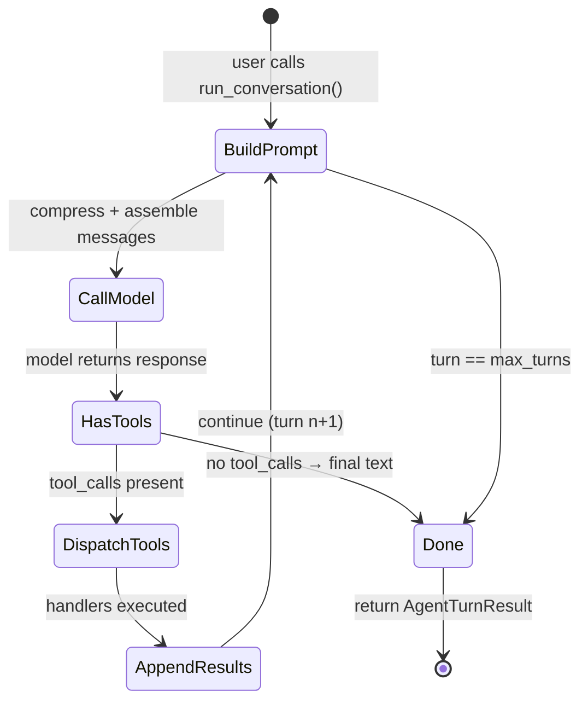

# ch03_agent_loop

# Agent loop

Harness Agent tutorial — `ch03_agent_loop.ipynb`


## Chapter objectives

By the end of this chapter you will be able to:

- Describe the **ReAct-style agent loop** and explain why iteration matters for tool-using agents.
- Trace every line of `AIAgent.run_conversation()` and explain its role.
- Name the **five phases** that execute each turn: *build → call → check → dispatch → append*.
- Identify the **two stop conditions**: model returns text-only *or* `max_turns` is exhausted.
- Explain what `isolated=True` changes about session persistence and the learning trigger.
- Predict when mid-loop **context compression** fires and what the compressed message looks like.
- Describe the **post-turn learning trigger** and when it writes a skill file to disk.

## Prerequisites

ch01–ch02; providers and `Message` types.


## Concept: The agent loop

### Why loop at all?

A single LLM call can answer many questions, but it cannot *act*. When a user asks
"what files are in my workspace and which is largest?", the model cannot answer
without reading the filesystem. It needs to:

1. Call `list_files` to discover what exists.
2. Call `read_file` (or check metadata) on each file.
3. Reason over the results and produce a final answer.

A **monolithic script** hard-codes those steps. An **agent loop** lets the model
decide which tools to call, in what order, and when it has enough information to stop
— without you writing a new script for every possible task.

### ReAct in one sentence

**Re**ason → **Ac**t → observe → repeat.

The model "reasons" in its response text, "acts" by emitting tool calls, and
"observes" results in the `tool` messages you append back. This pattern is the
foundation of nearly every agentic harness in production today.

### The five phases (one turn of the loop)

```text
Phase 1  BUILD     compress_messages() then assemble [system, history…, user] into a list
Phase 2  CALL      send messages + tool schemas → prov.complete_with_tools()
Phase 3  CHECK     did the model return tool_calls?
Phase 4  DISPATCH  for each ToolCall: registry.dispatch(name, arguments) → result string
Phase 5  APPEND    append assistant turn + tool result Messages; continue to Phase 1
          ↑──────────────────────────────────────────────────────────────────────────┘
          loop repeats until: (a) Phase 3 finds no tool_calls  →  break
                          or: (b) for-loop range exhausted     →  fall through
```

When Phase 3 finds **no tool calls**, the model has decided it has sufficient
information and returned its final answer text. The `for` loop breaks.

### Where it lives in Harness Agent

`harness_agent/agent.py` — `AIAgent.run_conversation()` (≈ 80 lines).

Production agents add streaming, async parallel dispatch, and live cancellation,
but the five-phase control flow is identical.

## State machine diagram



**Reading the diagram:**

| Arrow | Source code |
|-------|-------------|
| `BuildPrompt → CallModel` | `compress_messages(messages)` then `prov.complete_with_tools(...)` |
| `HasTools → DispatchTools` | `if calls:` branch — iterates `for tc in calls` |
| `DispatchTools → AppendResults` | `registry.dispatch(tc.name, tc.arguments)` |
| `AppendResults → BuildPrompt` | `continue` at the bottom of the `if calls:` block |
| `HasTools → Done` | `else` (implicit): `final_text = text; break` |
| `BuildPrompt → Done` | `for _ in range(max_turns)` runs out without a `break` |

> ⚠️ **Silent truncation risk**: if the loop exhausts `max_turns` without the model
> ever returning text-only output, `final_text` stays `""`. Callers must handle
> `AgentTurnResult.assistant_text == ""`.

## Annotated source: `run_conversation()`

The cell below prints the actual source of `AIAgent.run_conversation()` so you can
read it alongside the five-phase description. Each section maps directly to one of
the phases above.

Annotations to look for:
- **Phase 1** (`compress_messages` + `messages.extend(history)`) — lines 1–15
- **Phase 2** (`prov.complete_with_tools`) — the call inside the for-loop
- **Phase 3** (`if calls:`) — the branch that decides tool vs. text path
- **Phase 4** (`registry.dispatch`) — the tool execution
- **Phase 5** (`messages.append`) — accumulation before `continue`

### Phase → source line map

The table below maps each phase to the approximate line numbers you will see in the
printed output. Line numbers count from the **start of the method**, so line 1 is
`def run_conversation(...)`.

| Phase | Lines (approx) | Key expression | Purpose |
|-------|---------------|----------------|---------|
| Setup | 1–12 | `history = …`, `messages = [system]`, `messages.extend(history)` | Assemble the initial context: system prompt + persisted history + new user message |
| **1 BUILD** | 13–14 | `messages = compress_messages(messages)` | Collapse middle turns if token estimate > 12 000; always runs before the API call |
| **2 CALL** | 15–16 | `prov.complete_with_tools(messages, schemas, model=…)` | Send the full context to the LLM; returns `(text, calls)` |
| **3 CHECK** | 18 | `if calls:` | Branch: truthy list → tool path; falsy (empty list) → final text path |
| **4 DISPATCH** | 26–28 | `self.registry.dispatch(tc.name, tc.arguments)` | Call the Python handler for each `ToolCall`; returns a JSON result string |
| **5 APPEND** | 29–38 | `messages.append(tool_msg)` then `continue` | Add assistant + tool messages to context; `continue` restarts the loop at Phase 1 |
| Done (text) | 40–45 | `final_text = text; … break` | No tool calls → store answer and exit the loop |
| Done (max) | — | `for _ in range(max_turns)` exhausted | Loop falls through; `final_text` remains `""` — silent truncation |

> **Tip:** Run the cell below first, then come back to this table and match each row
> to the printed line numbers. The annotations in the simulation cell further down
> (`=== Agent Loop Simulation ===`) use the same phase labels.

```python
import inspect
from harness_agent.agent import AIAgent

src = inspect.getsource(AIAgent.run_conversation)
# Print with line numbers relative to method start
for i, line in enumerate(src.splitlines(), start=1):
    print(f"{i:3}  {line}")
```

## Reference implementation map

| Harness Agent | Nous Research agent | OpenClaw |
|---------------|---------------------|----------|
| `agent.py` `AIAgent` | `run_agent.py` `AIAgent` | agent session loop |
| `config.max_turns` | loop limits in agent config | turn policies |

If `REFERENCE_REPO_PATH` is set, search upstream for `run_conversation` or `AIAgent`.


## Design choices in harness_agent

### `isolated=True` — what it skips

```python
AIAgent(isolated=True)   # used for subagents, cron, and background tasks
AIAgent(isolated=False)  # default — full persistence + learning
```

| Feature | `isolated=False` | `isolated=True` |
|---------|-----------------|-----------------|
| Load history from `SessionStore` | ✓ | ✗ — starts with empty history |
| Persist each turn to `SessionStore` | ✓ | ✗ |
| Trigger learning loop post-turn | ✓ (if threshold met) | ✗ |

**Why isolate subagents?** A subagent called mid-conversation should not corrupt
the parent session's history. It also avoids double-counting tool calls toward
the learning threshold.

### `max_turns` — the safety valve

`HarnessConfig.max_turns = 25`. It prevents infinite loops when a tool always
errors and the model keeps retrying. The real risk is *silent* truncation:
unlike a timeout exception, `max_turns` silently produces an empty `assistant_text`.

### Learning trigger — the closed loop

After the conversation `for` loop, `run_conversation()` checks:

```python
if not self.isolated and self.learning.should_author_skill(tool_call_count, had_error):
    maybe_write_skill(...)
```

`LearningLoop.should_author_skill()` returns `True` when either:
- `tool_call_count >= 5`  (default threshold), or
- `had_error_recovery is True` and `tool_call_count >= 2`

This writes a `SKILL.md` to `<HARNESS_AGENT_HOME>/skills/` so complex multi-tool
workflows can be reused in future sessions.

## Implementation walkthrough

The cells below walk through `AIAgent.run_conversation()` phase by phase using
real objects from the harness — no API key required. We use a `MockProvider`
that simulates the model making two tool calls before returning final text.

## Real example: finding the largest Python file

To make the five phases concrete, we trace a full three-turn conversation for this
user request:

> **"Search for Python files in my project and read the largest one."**

The model cannot answer from memory — it must act. Here is the plan it follows:

| Turn | Phase 3 result | Tool called | Why |
|------|---------------|-------------|-----|
| 1 | `tool_calls` present | `search_files(pattern="*.py")` | Discover which `.py` files exist |
| 2 | `tool_calls` present | `read_file(path="agent.py")` | Read the largest file found in turn 1 |
| 3 | no `tool_calls` | — | Model has enough information; returns the final answer |

**What makes this a good teaching example:**

- Two tool calls means the loop iterates at least twice — you can see Phase 5's
  `continue` fire and watch the message list grow turn by turn.
- `search_files` and `read_file` are both real, registered tools in Harness Agent
  (`harness_agent/tools/file_tools.py`), so the argument shapes and result format
  match what a live API call would produce.
- The final answer is text-only, so you can observe the clean `break` path rather
  than the silent `max_turns` truncation path.

The cell below uses a `RealisticMockProvider` — every `Message`, every `append`,
and every phase comment is real. Only the LLM decision itself is scripted. No API
key is required.

```python
import json
from harness_agent.types import Message, ToolCall
from harness_agent.tools.registry import get_registry
from harness_agent.compression.summarize import estimate_tokens

# ── Scripted mock provider ────────────────────────────────────────────────
class RealisticMockProvider:
    """
    Simulates the model responding to:
      "Search for Python files in my project and read the largest one."

    Turn 1 → calls search_files(pattern="*.py") to discover .py files
    Turn 2 → calls read_file(path="agent.py") on the largest result
    Turn 3 → returns a plain-text final answer (empty calls list → loop breaks)
    """

    _script = [
        # Turn 1: search for Python files
        ("", [ToolCall(id="call_001", name="search_files", arguments={"pattern": "*.py"})]),
        # Turn 2: read the largest file
        ("", [ToolCall(id="call_002", name="read_file",    arguments={"path": "agent.py"})]),
        # Turn 3: final answer — no tool_calls
        (
            "I found 3 Python files. The largest is agent.py (123 lines). "
            "It defines AIAgent, the core conversation loop class.",
            [],
        ),
    ]

    def __init__(self):
        self._turn = 0

    def complete_with_tools(self, messages, schemas, model=None):
        text, calls = self._script[self._turn]
        self._turn += 1
        return text, calls


# ── Pre-scripted tool results (no API key or live filesystem needed) ───────
# These mirror what the real search_files and read_file handlers would return.
MOCK_RESULTS = {
    "search_files": json.dumps({
        "status": "success",
        "summary": "Found 3 files",
        "artifacts": ["agent.py", "config.py", "types.py"],
    }),
    "read_file": json.dumps({
        "status": "success",
        "summary": "Read 4821 chars from agent.py",
        "detail": (
            '"""AIAgent — core conversation loop for Harness Agent."""\n\n'
            "from __future__ import annotations\n\nimport json\nfrom typing import Any\n\n"
            "from harness_agent.compression.summarize import compress_messages, estimate_tokens\n"
            "...(truncated at 200 chars for display)"
        ),
    }),
}

# ── Run the realistic loop ────────────────────────────────────────────────
prov   = RealisticMockProvider()
max_turns      = 5
tool_call_count = 0
had_error       = False
final_text      = ""

messages: list[Message] = [
    Message(role="system", content="You are a helpful Python project assistant."),
    Message(role="user",   content="Search for Python files in my project and read the largest one."),
]

print("User query:", messages[-1].content)
print("=" * 65)

for turn_num in range(max_turns):
    # ── Phase 1: BUILD ────────────────────────────────────────────────
    print(f"\n{'─' * 65}")
    print(f"Turn {turn_num + 1} | Phase 1 BUILD  | {len(messages)} msgs, ~{estimate_tokens(messages)} tokens")

    # ── Phase 2: CALL ─────────────────────────────────────────────────
    schemas = get_registry().openai_schemas()
    text, calls = prov.complete_with_tools(messages, schemas)

    if calls:
        tc = calls[0]

        # ── Phase 3: CHECK → tool_calls present ───────────────────────
        print(f"       | Phase 3 CHECK   | tool_call detected → {tc.name}({tc.arguments})")

        # ── Phase 4: DISPATCH (using scripted result) ─────────────────
        result = MOCK_RESULTS[tc.name]
        tool_call_count += 1
        if '"status": "error"' in result:
            had_error = True
        parsed = json.loads(result)
        print(f"       | Phase 4 DISPATCH| {parsed['summary']}")
        if parsed.get("artifacts"):
            print(f"                        artifacts: {parsed['artifacts']}")

        # ── Phase 5: APPEND ───────────────────────────────────────────
        asst_msg = Message(
            role="assistant",
            content=text or None,          # None is valid when model only emits tool_calls
            tool_calls=[{
                "id": tc.id,
                "type": "function",
                "function": {"name": tc.name, "arguments": json.dumps(tc.arguments)},
            }],
        )
        tool_msg = Message(role="tool", content=result, tool_call_id=tc.id, name=tc.name)
        messages.extend([asst_msg, tool_msg])
        print(f"       | Phase 5 APPEND  | messages now: {len(messages)} (+assistant +tool)")
        continue  # ← back to Phase 1

    # ── Phase 3: CHECK → no tool_calls → final text ───────────────────
    final_text = text
    asst_msg = Message(role="assistant", content=final_text)
    messages.append(asst_msg)
    print(f"       | Phase 3 CHECK   | no tool_calls → BREAK")
    break

print(f"\n{'=' * 65}")
print(f"Turns run      : {turn_num + 1}")
print(f"Tool calls     : {tool_call_count}")
print(f"had_error      : {had_error}")
print(f"Final answer   : {final_text}")
print(f"Context        : {len(messages)} messages, ~{estimate_tokens(messages)} tokens")

# ── Print the full message list ───────────────────────────────────────────
print(f"\n{'─' * 65}")
print("Full message list at conversation end:")
for i, m in enumerate(messages):
    tc_label = ""
    if m.tool_calls:
        tc_label = f"  tool_calls=[{m.tool_calls[0]['function']['name']}(...)]"
    id_label = f"  tool_call_id={m.tool_call_id!r}" if m.tool_call_id else ""
    snippet  = (m.content or "")[:55].replace("\n", "↵")
    ellipsis = "…" if len(m.content or "") > 55 else ""
    print(f"  [{i}] role={m.role:<12}{tc_label}{id_label}")
    if snippet:
        print(f"       content: {snippet!r}{ellipsis}")
```

### What the trace above shows

**Turn 1 — tool call only.**
The model emits a `tool_calls` entry for `search_files` with `content=None`.
This is valid per the OpenAI spec: when the model "speaks" entirely in tool
calls it produces no text. Phase 5 appends two messages and `continue`s back
to Phase 1.

**Turn 2 — tool call only.**
The model now knows which files exist. It calls `read_file` on the largest
result. The same two-message append pattern repeats.

**Turn 3 — final text.**
The model has all the information it needs and returns a plain string with an
empty `calls` list. Phase 3 detects `if calls:` is `False`, sets `final_text`,
appends the final assistant message, and `break`s.

**Final message list invariant:**

```text
[0] role=system       — unchanged throughout all turns
[1] role=user         — original request
[2] role=assistant    — tool_calls=[search_files({"pattern":"*.py"})]
[3] role=tool         — result of search_files; tool_call_id matches [2]
[4] role=assistant    — tool_calls=[read_file({"path":"agent.py"})]
[5] role=tool         — result of read_file; tool_call_id matches [4]
[6] role=assistant    — final answer text; no tool_calls
```

**Key rule to memorise:** every `tool_call_id` that appears in an `assistant`
message must be matched by a `tool` message with the *same* `tool_call_id`
immediately following. The provider API rejects any sequence that breaks this
pairing (you will see `BadRequestError: tool_call_id does not match any prior
tool_calls`).

## Message structure

The agent loop grows a single `list[Message]` each turn. Understanding the exact
shape of each message role is critical — the provider API rejects malformed sequences.

The invariant is: **every `tool_calls` entry in an assistant message must be followed
by a `tool` message with the matching `tool_call_id`.**

## Turn limits and the silent truncation risk

`HarnessConfig.max_turns = 25` is the safety valve. When a buggy tool always
returns errors and the model keeps retrying, the loop will eventually exhaust
`max_turns` and **fall through** the `for` loop without ever hitting `break`.

At that point `final_text` is still `""` and `AgentTurnResult.assistant_text`
is an empty string — **no exception is raised**.

This is intentional: the agent should not crash the caller. But callers that
blindly display `assistant_text` will show the user a blank response. Always
guard the result.

```python
from harness_agent.config import get_config
from harness_agent.types import Message, ToolCall
from harness_agent.tools.registry import get_registry

config = get_config()
print(f"max_turns = {config.max_turns}")
print()

class StuckProvider:
    """Simulates a model that never stops calling tools."""
    def complete_with_tools(self, messages, schemas, model=None):
        return "", [ToolCall(id="call_x", name="list_files", arguments={"path": "."})]

stuck = StuckProvider()
registry = get_registry()
final_text = ""
turns_run = 0

for turn in range(config.max_turns):
    _, calls = stuck.complete_with_tools([], [])
    if calls:
        registry.dispatch("list_files", {"path": "."})
        turns_run += 1
        continue
    final_text = "done"
    break

print(f"Turns executed : {turns_run}")
print(f"final_text     : {final_text!r}")
print()
if not final_text:
    print("⚠️  Loop hit max_turns — final_text is EMPTY.")
    print("   AgentTurnResult.assistant_text == ''")
    print("   Callers must guard against this:")
    print("     if not result.assistant_text:")
    print('         raise RuntimeError("Agent did not produce a response (max_turns hit)")')
```

## API keys and live runs

All code cells in this chapter run **without an API key** by using scripted mock
providers. If you want to run `run_conversation()` against a real LLM, you need
to supply credentials. This section explains the full key setup.

### Which key do I need?

Harness Agent resolves credentials in this order for each provider:

| Priority | Variable | Applies to |
|----------|----------|-----------|
| 1 | Provider-specific key (e.g. `OPENAI_API_KEY`) | That provider only |
| 2 | `HARNESS_API_KEY` | Any provider that hasn't found its own key |
| 3 | No key → `AuthenticationError` on first API call | — |

Set provider-specific keys for production. Use `HARNESS_API_KEY` as a universal
fallback during development when you switch providers frequently.

### Where to set variables

**Option A — `.env` file (recommended for local dev)**

Create `labs/.env` (already in `.gitignore`):

```dotenv
# Pick one provider and set its key
OPENAI_API_KEY=sk-...
ANTHROPIC_API_KEY=sk-ant-...
DEEPSEEK_API_KEY=sk-...

# Or use the universal fallback
HARNESS_API_KEY=sk-...

# Which provider and model to use by default
HARNESS_DEFAULT_PROVIDER=openai
HARNESS_DEFAULT_MODEL=gpt-4o-mini
```

Load it before running the agent:

```python
from dotenv import load_dotenv
load_dotenv("labs/.env")
```

**Option B — shell environment (CI / one-off runs)**

```bash
export OPENAI_API_KEY="sk-..."
export HARNESS_DEFAULT_PROVIDER="openai"
export HARNESS_DEFAULT_MODEL="gpt-4o-mini"
```

**Option C — inline in the notebook (never commit this)**

```python
import os
os.environ["OPENAI_API_KEY"] = "sk-..."   # ← do NOT commit; use .env instead
```

### Verify your setup before the first live call

```python
from harness_agent.providers.registry import get_provider_registry

prov, model = get_provider_registry().resolve()
print(f"Active provider : {prov.name}")
print(f"Active model    : {model}")

# Quick smoke-test — send one message, no tools
text, calls = prov.complete_with_tools(
    messages=[
        {"role": "system",  "content": "You are a helpful assistant."},
        {"role": "user",    "content": "Reply with exactly: HARNESS_OK"},
    ],
    schemas=[],
    model=model,
)
print(f"Response        : {text!r}")   # expect "HARNESS_OK"
assert text.strip() == "HARNESS_OK", "Provider did not respond as expected"
print("✓ API key and provider are working correctly.")
```

### Running `run_conversation()` live

Once the above smoke-test passes:

```python
from harness_agent.agent import AIAgent

agent = AIAgent(isolated=True)   # isolated=True: no session DB, safe for notebooks
result = agent.run_conversation(
    "Search for Python files in my project and read the largest one."
)

print("Final answer:", result.assistant_text)
print(f"Tool calls used: {result.tool_call_count}")
print(f"Session ID: {result.session_id}")
```

`isolated=True` skips session persistence and the learning trigger, making it
safe to call repeatedly in a notebook without accumulating history.

### Provider-specific notes

| Provider | Key variable | Free tier? | Notes |
|----------|-------------|-----------|-------|
| OpenAI | `OPENAI_API_KEY` | No (pay-as-you-go) | `gpt-4o-mini` is cheapest for testing |
| Anthropic | `ANTHROPIC_API_KEY` | No (pay-as-you-go) | `claude-haiku-4-5-20251001` is cheapest |
| DeepSeek | `DEEPSEEK_API_KEY` | Limited free credits | Very low cost per token |
| Compass (Core42) | `COMPASS_API_KEY` | Enterprise | UAE-hosted; requires account |

> **Cost tip:** For this tutorial, `gpt-4o-mini` (OpenAI) or `claude-haiku-4-5-20251001`
> (Anthropic) cost fractions of a cent per chapter run. The mock-provider cells cost
> nothing and cover 95% of the concepts.

## Mid-loop: Context compression

Every turn, **before** the model API call, `compress_messages()` checks the
estimated token count. If it exceeds **12 000 tokens**, the middle turns are
collapsed into a single summary message so the context fits within the model's
window.

**Algorithm (`harness_agent/compression/summarize.py`):**
- Keep `messages[:2]` (system + first user) verbatim — the "head"
- Keep `messages[-4:]` verbatim — the "tail" (recent context)
- Summarize everything in between as snippets (first 200 chars each)
- Token estimate: `len(content) // 4 + 100 * len(tool_calls)`

```python
from harness_agent.compression.summarize import compress_messages, estimate_tokens
from harness_agent.types import Message

# Build a message list large enough to trigger compression (> 12 000 estimated tokens)
system_msg = Message(role="system", content="You are helpful. " * 100)
user_msg   = Message(role="user",   content="Do a complex task.")
middle = []
for i in range(40):
    middle.append(Message(role="assistant", content=f"Step {i}: analysing... " * 60))
    middle.append(Message(role="user",      content=f"Continue with step {i+1}..."))

msgs = [system_msg, user_msg] + middle

tokens_before = estimate_tokens(msgs)
print(f"Before compression:")
print(f"  messages : {len(msgs)}")
print(f"  tokens   : ~{tokens_before:,}  (threshold = 12,000)\n")

compressed = compress_messages(msgs)
tokens_after = estimate_tokens(compressed)
print(f"After compression:")
print(f"  messages : {len(compressed)}")
print(f"  tokens   : ~{tokens_after:,}\n")

# Find and show the summary message
for m in compressed:
    if "[Compressed" in (m.content or ""):
        print(f"Compressed summary message (role={m.role!r}):")
        print(m.content[:400])
        break

print()
print("Rule: head[:2] and tail[-4:] are kept verbatim; middle turns become a single summary.")
```

```python
from harness_agent.agent import AIAgent
from harness_agent.config import get_config

# isolated=True: no session DB, no learning — safe to run offline
agent = AIAgent(isolated=True)
config = get_config()

print("=== AIAgent attributes ===")
print(f"  config.max_turns        : {config.max_turns}")
print(f"  config.default_provider : {config.default_provider}")
print(f"  config.default_model    : {config.default_model}")
print(f"  isolated                : {agent.isolated}")
print(f"  toolsets filter         : {agent.toolsets}")
print()

print("=== Registered tools (first 8) ===")
tools = agent.registry.list_available()
for t in tools[:8]:
    print(f"  {t}")
if len(tools) > 8:
    print(f"  … and {len(tools) - 8} more")
print()
print("AIAgent ready — live run_conversation() requires an API key (see ch02).")
```

```python
from harness_agent.types import Message
import json

# Build the exact message list that exists after one tool-call turn
msgs = [
    Message(role="system", content="You are a helpful file-system agent."),
    Message(role="user",   content="What files are in my workspace?"),
    # assistant with tool_calls (no content text)
    Message(role="assistant", content=None, tool_calls=[{
        "id": "call_001", "type": "function",
        "function": {"name": "list_files", "arguments": '{"path": "."}'}
    }]),
    # tool result
    Message(role="tool", content='{"status": "ok", "files": ["main.py", "utils.py"]}',
            tool_call_id="call_001", name="list_files"),
    # final assistant text (no tool_calls)
    Message(role="assistant", content="Your workspace contains: main.py, utils.py"),
]

print("Messages after one complete tool-call turn:\n")
for i, m in enumerate(msgs):
    print(f"  [{i}] role={m.role!r}")
    if m.content:
        print(f"       content : {m.content[:70]!r}")
    if m.tool_calls:
        tc = m.tool_calls[0]["function"]
        print(f"       tool_call: name={tc['name']!r}, args={tc['arguments']!r}")
    if m.tool_call_id:
        print(f"       tool_call_id={m.tool_call_id!r}  name={m.name!r}")
    print()

print("Key rule: every tool_call_id in an assistant message MUST have a")
print("matching tool message with the same tool_call_id — or the API will reject the request.")
```

## Post-turn: Learning trigger

After the loop returns, `run_conversation()` checks whether the session produced
enough tool activity to be worth capturing as a reusable skill. This is the
**closed learning loop** — the agent improves itself over time.

## Mock loop simulation

The cell below replays the five-phase loop using a `MockProvider` that simulates
a model making two tool calls before returning final text. Every object is real
except the LLM call itself.

```python
import json
from harness_agent.types import Message, ToolCall
from harness_agent.tools.registry import get_registry
from harness_agent.compression.summarize import compress_messages, estimate_tokens

class MockProvider:
    """Simulates a model: makes N tool calls then returns assistant text."""
    def __init__(self, turns_with_tools: int = 2):
        self._call = 0
        self._turns_with_tools = turns_with_tools

    def complete_with_tools(self, messages, schemas, model=None):
        self._call += 1
        if self._call <= self._turns_with_tools:
            tc = ToolCall(id=f"call_{self._call:03d}", name="list_files", arguments={"path": "."})
            print(f"  [Turn {self._call}] Phase 2→3: model returns TOOL CALL → {tc.name}({tc.arguments})")
            return "", [tc]
        answer = f"I found files from {self._call - 1} tool call(s). Task complete."
        print(f"  [Turn {self._call}] Phase 2→3: model returns TEXT (no tools) → final answer")
        return answer, []

# ── Simulation ──────────────────────────────────────────────────────────────
registry = get_registry()
prov = MockProvider(turns_with_tools=2)
max_turns = 5
tool_call_count = 0
had_error = False
final_text = ""

messages: list[Message] = [
    Message(role="system", content="You are a helpful file-system agent."),
    Message(role="user",   content="What files are in my workspace?"),
]

print("=== Agent Loop Simulation (5 phases per turn) ===\n")

for turn in range(max_turns):
    # ── Phase 1: BUILD (compress if needed) ──────────────────────────────
    tokens = estimate_tokens(messages)
    print(f"Turn {turn + 1} | Phase 1 BUILD  | {len(messages)} messages, ~{tokens} tokens")
    messages = compress_messages(messages)

    # ── Phase 2: CALL ────────────────────────────────────────────────────
    schemas = registry.openai_schemas()
    text, calls = prov.complete_with_tools(messages, schemas)

    if calls:
        # ── Phase 3: CHECK → has tools ───────────────────────────────────
        # ── Phase 4: DISPATCH ────────────────────────────────────────────
        tc = calls[0]
        tool_call_count += 1
        result = registry.dispatch(tc.name, tc.arguments)
        error_flag = '"status": "error"' in result
        if error_flag:
            had_error = True

        # ── Phase 5: APPEND ──────────────────────────────────────────────
        asst = Message(
            role="assistant", content=text,
            tool_calls=[{"id": tc.id, "type": "function",
                         "function": {"name": tc.name, "arguments": json.dumps(tc.arguments)}}]
        )
        tool_msg = Message(role="tool", content=result[:120], tool_call_id=tc.id, name=tc.name)
        messages.extend([asst, tool_msg])
        print(f"         | Phase 4 DISPATCH | result (truncated): {result[:60]!r}")
        print(f"         | Phase 5 APPEND  | messages now: {len(messages)}\n")
        continue  # ← back to Phase 1

    # ── Phase 3: CHECK → no tools ────────────────────────────────────────
    final_text = text
    asst = Message(role="assistant", content=final_text)
    messages.append(asst)
    print(f"         | Phase 3 CHECK   | no tools → BREAK\n")
    break

print("=" * 60)
print(f"Loop ended after {turn + 1} turn(s), {tool_call_count} tool call(s)")
print(f"had_error = {had_error}")
print(f"Final text: {final_text!r}")
print(f"Context: {len(messages)} messages, ~{estimate_tokens(messages)} tokens")
```

### Reading the simulation output

The `=== Agent Loop Simulation ===` printout you just ran maps directly to the
five phases for each turn. Here is how to read each line:

| Output line | Phase | What it means |
|-------------|-------|--------------|
| `Turn N \| Phase 1 BUILD \| M messages, ~T tokens` | BUILD | M messages entered the compressor; T is the token estimate *before* the API call |
| `[Turn N] Phase 2→3: model returns TOOL CALL → name(args)` | CALL + CHECK | `MockProvider` returned a non-empty `calls` list; `if calls:` is `True` |
| `Phase 4 DISPATCH \| result (truncated): …` | DISPATCH | `registry.dispatch(name, args)` ran; first 60 chars of the JSON result shown |
| `Phase 5 APPEND \| messages now: N` | APPEND | Two messages added (assistant with `tool_calls` + tool result); `continue` fires |
| `[Turn N] Phase 2→3: model returns TEXT (no tools)` | CALL + CHECK | `calls` is empty; `if calls:` is `False`; falls through to text path |
| `Phase 3 CHECK \| no tools → BREAK` | CHECK → done | `final_text = text`; loop exits via `break` |

**Why does the message count grow by 2 each tool turn?**
Each `continue` appends an `assistant` message (carrying `tool_calls`) and a
`tool` message (carrying the result). After two tool turns the context holds:
`system + user + assistant₁ + tool₁ + assistant₂ + tool₂ = 6 messages`.

**Why does compression not fire here?**
The token estimate stays well below the 12 000-token threshold because the mock
messages are tiny. In a real session where `read_file` returns 8 000 chars of file
content, compression would fire within a few turns.

**Why does Turn 3 break the loop?**
`MockProvider` was constructed with `turns_with_tools=2`. On the third `complete_with_tools`
call it returns `(text, [])` — an empty `calls` list — so Phase 3 detects no tool
calls and breaks.

```python
from harness_agent.learning.skill_writer import LearningLoop

loop = LearningLoop()
print(f"LearningLoop.tool_call_threshold = {loop.tool_call_threshold}\n")

test_cases = [
    (0, False, "zero tool calls, no error"),
    (2, False, "2 tool calls, no error"),
    (2, True,  "2 tool calls + error recovery"),
    (5, False, "5 tool calls (hits threshold)"),
    (10, True, "10 tool calls + error recovery"),
]

print(f"{'calls':>6}  {'error':>6}  {'write_skill':>11}  description")
print("-" * 55)
for n, err, label in test_cases:
    result = loop.should_author_skill(n, err)
    marker = "✓ WRITE" if result else "  skip "
    print(f"{n:>6}  {str(err):>6}  {marker:>11}  {label}")

print()
print("Skill writing only happens for non-isolated sessions (isolated=False).")
print("Skill file path: <HARNESS_AGENT_HOME>/skills/<session-id[:8]>/SKILL.md")
```

## Hands-on exercises

**Exercise 1 — Change the number of tool turns**

In the `MockProvider` above, change `turns_with_tools=2` to `turns_with_tools=6`.
Re-run the simulation cell. Observe:
- How many turns does the loop take?
- What does `tool_call_count` reach?
- Does `had_error` change?

**Exercise 2 — Force a max_turns hit**

Set `turns_with_tools=99` (more than `max_turns`). Re-run.
- What is `final_text` after the loop?
- What would `AgentTurnResult.assistant_text` contain in the real agent?
- How should a caller detect and handle this case?

**Exercise 3 — Live run (requires API key)**

Set your `HARNESS_DEFAULT_PROVIDER` and API key environment variables, then:

```python
from harness_agent.agent import AIAgent
agent = AIAgent(isolated=True)
result = agent.run_conversation("List the files in the current directory.")
print(result.assistant_text)
print(f"tool_calls used: {result.tool_call_count}")
```

**Exercise 4 — Inspect a real session**

Run with `isolated=False` and a real API key. After the call, open the SQLite DB:

```bash
sqlite3 labs/sessions/harness_agent.db "SELECT role, substr(content,1,80) FROM messages ORDER BY id;"
```

Verify that system, user, assistant (with `tool_calls`), tool, and final assistant
messages are all present in the correct order.

## Common pitfalls

| Pitfall | Root cause | Fix |
|---------|-----------|-----|
| **Infinite loop** | Tool always errors; model keeps calling it | `max_turns` cap exists for this — also fix the tool |
| **Empty `assistant_text`** | Loop hit `max_turns` without a text-only response | Check `result.assistant_text` before using it; raise if empty |
| **Session history bloat** | Not compressing; context grows unbounded | `compress_messages()` runs automatically each turn |
| **Mutating the system prompt mid-turn** | Re-building `system` each iteration | Build system prompt once before the loop (as `AIAgent` does) |
| **Subagent pollutes parent session** | Using `isolated=False` for delegate calls | Always construct subagents with `AIAgent(isolated=True)` |
| **Tool results not persisted** | Calling `append_turn` only for assistant, not tool messages | `agent.py` appends both — replicate this pattern if extending |
| **Learning fires on subagent sessions** | `isolated=True` not set | The `if not self.isolated` guard prevents this |
| **`had_error` never detected** | Tool result format changed | The check is `'"status": "error"' in result` — keep `wrap_result` format |

## Checkpoint questions

1. **Stop conditions** — Name both conditions that end the agent loop. Which one produces an empty `assistant_text`, and why?

2. **Phase order** — In which phase does `compress_messages()` run relative to the model API call? Why must it run *before*, not after?

3. **`isolated=True`** — List three behaviors that `isolated=True` suppresses. Why is this flag important for subagent dispatch?

4. **Message roles** — After two tool-call turns, list the `role` of every `Message` in the context in order (starting from `system`).

5. **Error detection** — How does `run_conversation()` detect that a tool returned an error? What string does it look for, and where does that string come from?

6. **Learning threshold** — Under what two conditions does `LearningLoop.should_author_skill()` return `True`? Where is the skill file written?

7. **`max_turns` default** — What is the default `max_turns` and where is it set? How would you override it at runtime without changing source code?

## Summary & next chapter

**What we covered:**

| Topic | Key takeaway |
|-------|-------------|
| ReAct loop | Reason → Act → observe → repeat; the loop ends when the model returns text without tools |
| Five phases | BUILD → CALL → CHECK → DISPATCH → APPEND, repeating each turn |
| Stop conditions | Text-only response (`break`) or `max_turns` exhausted (silent empty text) |
| `isolated` flag | Skips session persistence and learning; required for subagents |
| Compression | Fires when estimated tokens exceed 12 000; collapses middle turns into a summary |
| Learning trigger | Writes a `SKILL.md` when `tool_call_count ≥ 5` or error recovery with `≥ 2` calls |
| `AgentTurnResult` | Returns `assistant_text`, full `messages` list, `tool_call_count`, and `session_id` |

**ch04** introduces the **tool registry** — how tools self-register at import time,
how schemas are collected, and how `dispatch()` maps a model's tool-call name to
a Python handler.
