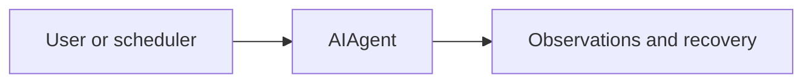

# ch05_observations_and_recovery

# Observations and recovery

Harness Agent tutorial — `ch05_observations_and_recovery.ipynb`


## Chapter objectives

By the end of this chapter you will be able to:

- Explain why raw Python tracebacks are harmful in tool responses and what to use instead.
- Describe the four fields of an `Observation`: `status`, `summary`, `next_actions`, `artifacts`.
- Use `wrap_result()` to produce structured success, warning, and error observations.
- Use `wrap_exception()` to convert any Python exception into a model-readable observation.
- Identify how `agent.py` detects tool errors using string matching on the result.
- Design a tool return value that gives the model clear recovery instructions.

## Prerequisites

Prior chapters through ch05; see SYLLABUS.md.


## Concept: Observations and recovery

### The problem with raw output

Without structure, a tool that fails returns something like:

```
Traceback (most recent call last):
  File "/usr/lib/python3.12/pathlib.py", line 1044, in open
FileNotFoundError: [Errno 2] No such file or directory: 'missing.txt'
```

The model has to parse this. It might retry with the same bad argument, hallucinate
a fix, or just give up. The **Observation** format solves this by giving the model
machine-readable fields it can act on immediately.

### The Observation dataclass

```python
@dataclass
class Observation:
    status: Literal["success", "warning", "error"]
    summary: str          # one-line human-readable result
    next_actions: list[str]  # what the model should do next
    artifacts: list[str]     # files written, session IDs produced, etc.
    detail: str | None = None  # full output, traceback, or body
```

### `next_actions` — the recovery protocol

The most important field for agentic recovery. Examples:

| Status | next_actions example |
|--------|---------------------|
| success | `["Continue with the next step."]` |
| warning | `["Verify the file content before proceeding."]` |
| error | `["Fix the inputs and retry once.", "Use list_files to check the path."]` |

The model reads `next_actions` and, without any special system-prompt engineering,
tends to follow these instructions. This replaces fragile prompt-level retry logic
with self-contained tool output.

### Error detection in agent.py

`run_conversation()` checks each tool result for:

```python
if '"status": "error"' in result:
    had_error = True
```

This string-match is intentional — it avoids parsing JSON on every result.
`had_error` later feeds the learning trigger threshold.

## How it works

`wrap_result` / `wrap_exception`; models see JSON not raw stack traces.



Trace cells below execute real code paths offline where possible.


## Reference implementation map

| Harness Agent | Nous Research agent (`REFERENCE_REPO_PATH`) | OpenClaw |
|---------------|---------------------------------------------|----------|
| ``observations.py`` | search architecture guide | SOUL/gateway patterns |

Open upstream files only under your optional clone — not bundled in this tutorial.


## Design choices in harness_agent

Tutorial implementation prioritizes readable Python over feature parity. Extend ``observations.py`` as exercises.


## Implementation walkthrough


```python
import json
from harness_agent.observations import wrap_result, wrap_exception, Observation

# --- Success ---
success = wrap_result(
    status="success",
    summary="Read 42 lines from main.py",
    artifacts=["main.py"],
    detail="def hello():\n    print('world')\n..."
)
print("=== success ===")
print(success)
print()

# --- Warning ---
warning = wrap_result(
    status="warning",
    summary="File written but directory did not exist — created it",
    next_actions=["Verify the file is in the expected location."],
    artifacts=["output/result.txt"],
)
print("=== warning ===")
print(warning)
print()

# --- Error ---
error = wrap_result(
    status="error",
    summary="Path is outside the workspace root",
    next_actions=["Use a relative path inside the workspace.", "Call list_files to see available paths."],
)
print("=== error ===")
print(error)
print()

# --- Exception ---
try:
    1 / 0
except Exception as exc:
    exc_obs = wrap_exception(exc, retry_hint="Ensure the divisor is non-zero.")
    print("=== wrap_exception ===")
    print(exc_obs)

# --- Verify error detection string ---
print()
print(f"Contains '\"status\": \"error\"': {'\"status\": \"error\"' in error}")
```

## Trace one request


```python
from harness_agent.tools.registry import get_registry
import harness_agent.tools.file_tools

r = get_registry()

# Dispatch a tool that will fail (file doesn't exist)
result = r.dispatch("read_file", {"path": "definitely_missing.txt"})
print("Tool result when file missing:")
print(result)
print()

import json
parsed = json.loads(result)
print(f"status       : {parsed['status']}")
print(f"summary      : {parsed['summary']}")
print(f"next_actions : {parsed['next_actions']}")

# Confirm agent.py error detection works
print()
print(f"Error detected by agent.py: {'\"status\": \"error\"' in result}")
```

## Hands-on exercises

**Exercise 1 — Write a compliant tool**

Implement a `divide` tool that returns a structured observation:

```python
def divide(a: float, b: float) -> str:
    from harness_agent.observations import wrap_result
    if b == 0:
        return wrap_result(
            status="error",
            summary="Division by zero",
            next_actions=["Provide a non-zero divisor.", "Retry with corrected arguments."],
        )
    return wrap_result(
        status="success",
        summary=f"{a} / {b} = {a/b}",
        detail=str(a / b),
    )
```

Test it with `divide(10, 0)` and `divide(10, 3)`. Verify the outputs.

**Exercise 2 — wrap_exception with retry_hint**

Call `wrap_exception(ValueError("bad input"), retry_hint="Check the parameter type.")`.
How does the `next_actions` list look different from the default?

**Exercise 3 — Design next_actions for a real tool**

Imagine a `send_email` tool. Write `next_actions` for:
- success: email sent
- error: invalid recipient address
- error: SMTP server unreachable

## Common pitfalls

| Pitfall | Root cause | Fix |
|---------|-----------|-----|
| Returning raw string from tool | Model cannot parse status | Always use `wrap_result()` |
| Empty `next_actions` on error | Model has no recovery hint | Always provide at least one actionable next step |
| `detail` too large | Fills context window | Truncate to < 4 000 chars; summarise in `summary` |
| Missing `artifacts` on write operations | Model doesn't know what was created | List file paths or session IDs in `artifacts` |
| `'"status": "error"'` substring not in output | Custom tool bypasses `wrap_result` | Use `wrap_result()` in every code path |
| Raising exceptions from tool handlers | `dispatch()` catches them, but the error message may be cryptic | Catch expected exceptions, produce friendly `wrap_result` before the registry catch-all |

## Checkpoint questions

1. **Observation fields** — Name all five fields of the `Observation` dataclass. Which is optional and why?

2. **Recovery protocol** — A tool fails because the file path is wrong. Write a `next_actions` list that gives the model a clear path to recovery.

3. **Error detection** — What exact string does `run_conversation()` check for in tool results? Where is this string produced?

4. **wrap_exception** — What does `wrap_exception(exc)` set for `status` and `detail`? How is `detail` different from `summary`?

5. **Default next_actions** — What does `wrap_exception` put in `next_actions` by default (no `retry_hint`)? Where does this string come from in the source code?

6. **Tool output size** — Why must you truncate large outputs (e.g. a file body) in `detail`? What happens to the context window if you don't?

## Summary & next chapter

| Topic | Key takeaway |
|-------|-------------|
| `Observation` dataclass | `status` + `summary` + `next_actions` + `artifacts` + optional `detail` |
| `wrap_result()` | Constructs and serialises an `Observation` to JSON string |
| `wrap_exception()` | Converts any Python exception to a model-readable error observation |
| `next_actions` | The recovery protocol — tells the model exactly what to do after an error |
| Error detection | `agent.py` checks `'"status": "error"' in result` to set `had_error` flag |
| Tool contract | Every tool handler must return a `str` produced by `wrap_result()` |

**ch06** covers **session storage** — how conversations are persisted in SQLite and
retrieved with full-text search across all prior sessions.
