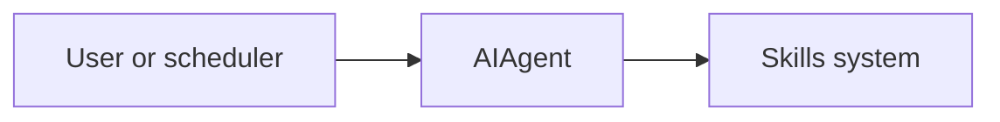

# ch08_skills_system

# Skills system

Harness Agent tutorial — `ch08_skills_system.ipynb`


## Chapter objectives

By the end of this chapter you will be able to:

- Describe the `SKILL.md` file format (YAML frontmatter + Markdown body).
- Trace `SkillCatalog.discover()` → `metadata_block()` → `load_full()`.
- Explain **progressive disclosure**: why only metadata appears in the system prompt.
- Use the `load_skill` tool to fetch a full skill body on demand.
- Create a `SKILL.md` manually and verify it appears in the catalog.
- Identify which field in frontmatter `discover()` uses for the description.

## Prerequisites

Prior chapters through ch08; see SYLLABUS.md.


## Concept: Skills system

### What is a skill?

A `SKILL.md` is a **procedural memory file** — a step-by-step workflow the agent
can retrieve and follow. Unlike MEMORY.md (static facts), skills are task-specific:

```markdown
---
name: deploy-backend
description: Steps to deploy the FastAPI backend to production
created: 2025-05-01T12:00:00Z
---

# Deploy Backend

1. Run tests: `pytest tests/`
2. Build Docker image: `docker build -t api:latest .`
3. Push to registry: `docker push …`
4. Restart service: `systemctl restart api`
```

### SKILL.md format

```text
---
name: <skill-name>      # slug, kebab-case
description: <one line> # shown in prompt metadata
created: <ISO timestamp>
---

# <Skill title>

<Steps, code blocks, verification hints>
```

`discover()` reads the `description:` field from YAML frontmatter. Fallback: first
`# Heading` line.

### Progressive disclosure — three levels

```text
Level 1  System prompt  "- **deploy-backend**: Steps to deploy the backend"  (always loaded)
Level 2  load_skill     Full SKILL.md body returned as tool result           (on demand)
Level 3  Agent follows  Model reads steps and executes them with tools       (execution)
```

Loading all skill bodies into every prompt would consume thousands of tokens per skill.
Progressive disclosure means the model only pays the cost when it actually needs a skill.

### File layout

```
<HARNESS_AGENT_HOME>/skills/
  deploy-backend/
    SKILL.md
  data-pipeline/
    SKILL.md
```

`discover()` globs `skills_dir/**/SKILL.md` — any depth, one per directory.

## How it works

Metadata in prompt; `load_skill` tool loads full body on demand.



Trace cells below execute real code paths offline where possible.


## Reference implementation map

| Harness Agent | Nous Research agent (`REFERENCE_REPO_PATH`) | OpenClaw |
|---------------|---------------------------------------------|----------|
| ``skills/loader.py`` | search architecture guide | SOUL/gateway patterns |

Open upstream files only under your optional clone — not bundled in this tutorial.


## Design choices in harness_agent

Tutorial implementation prioritizes readable Python over feature parity. Extend ``skills/loader.py`` as exercises.


## Implementation walkthrough


```python
from harness_agent.skills.loader import SkillCatalog, load_skill
from harness_agent.config import get_config
from pathlib import Path

config = get_config()
catalog = SkillCatalog(config.skills_dir)

# --- Create a demo skill ---
skill_dir = config.skills_dir / "demo-skill"
skill_dir.mkdir(parents=True, exist_ok=True)
(skill_dir / "SKILL.md").write_text("""---
name: demo-skill
description: A demonstration skill for ch08
---

# Demo Skill

1. Step one: verify environment
2. Step two: run the task
3. Step three: confirm result

**Verification**: check that output file exists.
""", encoding="utf-8")

# --- Discover ---
skills = catalog.discover()
print(f"Skills discovered: {len(skills)}")
for s in skills:
    print(f"  name={s.name!r}  desc={s.description!r}")

# --- Metadata block (what the system prompt includes) ---
print()
print("=== metadata_block() (system prompt content) ===")
print(catalog.metadata_block())

# --- Load full body ---
print()
print("=== load_full('demo-skill') ===")
body = catalog.load_full("demo-skill")
print(body[:400] if body else "NOT FOUND")
```

## Trace one request


```python
import json

# load_skill tool (what the model calls to get the full body)
result = load_skill("demo-skill")
print("load_skill('demo-skill') result:")
print(result)
print()

parsed = json.loads(result)
print(f"status  : {parsed['status']}")
print(f"summary : {parsed['summary']}")
print(f"detail  : {parsed.get('detail', '')[:200]!r}")

print()
# load_skill for a non-existent skill
result_bad = load_skill("nonexistent-skill")
print("load_skill('nonexistent-skill'):")
print(result_bad)
```

## Hands-on exercises

**Exercise 1 — Create a real skill**

Write a skill that describes how to run the Harness Agent test suite:

```
name: run-tests
description: Run the full harness_agent test suite with pytest
```

Body should include: how to activate the venv, run `pytest`, check coverage.
Verify it appears in `catalog.metadata_block()`.

**Exercise 2 — Frontmatter fallback**

Create a skill with NO `description:` in the frontmatter, but with a `# Heading`
as the first line. Verify `discover()` uses the heading as the description.

**Exercise 3 — Learning loop creates skills**

From ch10 you know `maybe_write_skill()` creates `SKILL.md` files. Call it directly:

```python
from harness_agent.learning.skill_writer import maybe_write_skill
path = maybe_write_skill(
    skill_name="my-workflow",
    description="An auto-generated skill",
    body="## Steps\n1. Do X\n2. Do Y",
    tool_call_count=6,
)
print(path)
```

Then run `catalog.discover()` again — does the new skill appear?

**Exercise 4 — Token cost of loading all skills**

```python
from harness_agent.compression.summarize import estimate_tokens
from harness_agent.types import Message
# Load all skill bodies and measure token cost
total = sum(len(catalog.load_full(s.name) or "") for s in catalog.discover())
print(f"Total chars across all skill bodies: {total}")
print(f"Estimated tokens if loaded in full: ~{total // 4}")
```

## Common pitfalls

| Pitfall | Root cause | Fix |
|---------|-----------|-----|
| Skill not discovered | File named `skill.md` (wrong case) or wrong directory | Must be `SKILL.md` in a subdirectory of `skills_dir` |
| Description shows `(no description)` | No `description:` field and no `#` heading | Add `description:` to YAML frontmatter |
| `load_full` returns `None` | Skill name doesn't match directory name | Name = parent directory of `SKILL.md`, not the `name:` field |
| Full body loaded every turn | Adding `load_full` to prompt assembly | Use `metadata_block()` in prompt; body only via `load_skill` tool |
| Skills dir wrong | `HARNESS_AGENT_HOME` not set | Check `config.skills_dir` points to correct location |
| `load_skill` tool not registered | Skills module not imported | `AIAgent._ensure_tools_loaded()` imports `skills.loader` |

## Checkpoint questions

1. **File format** — Write the YAML frontmatter for a skill named `backup-db` with a one-line description. What is the exact directory structure on disk?

2. **discover()** — `discover()` globs for what pattern? What does it use as the skill name (the directory name or the `name:` field)?

3. **Progressive disclosure** — Why is only `metadata_block()` included in the system prompt rather than all skill bodies? What's the trade-off?

4. **load_skill** — What observation fields does `load_skill()` return on success? Where does the skill body appear (`summary` or `detail`)?

5. **Description fallback** — A SKILL.md has no `description:` frontmatter field. How does `discover()` determine the description?

6. **Learning loop** — Which function automatically creates SKILL.md files? What threshold triggers it?

## Summary & next chapter

| Topic | Key takeaway |
|-------|-------------|
| `SKILL.md` format | YAML frontmatter (`name`, `description`, `created`) + Markdown body |
| `discover()` | Globs `skills_dir/**/SKILL.md`; reads `description:` from frontmatter |
| `metadata_block()` | One-line summary per skill — included in system prompt |
| `load_full()` | Returns complete file body — only fetched on demand |
| `load_skill` tool | Registered at import; the model calls this to access a full skill |
| Progressive disclosure | 3 levels: metadata in prompt → load_skill → agent follows steps |

**ch09** covers **memory and user model** — the two persistent markdown files that
inject long-term environmental facts and user preferences into the system prompt.
