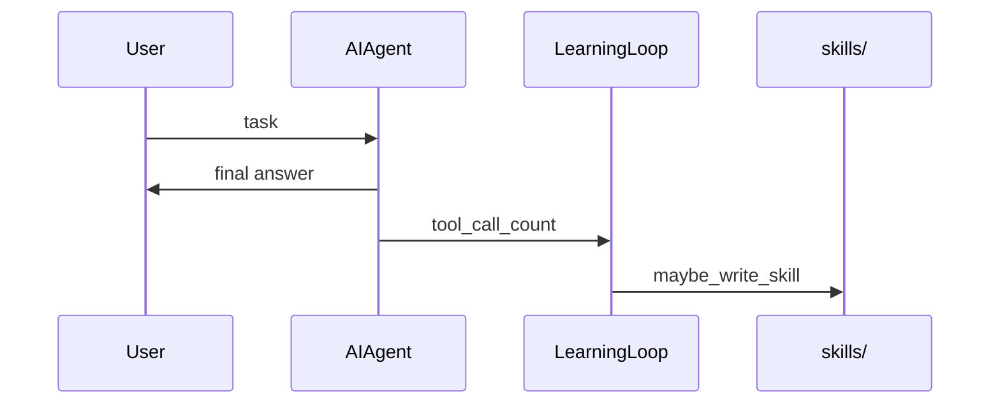

# ch10_closed_learning_loop

# Closed learning loop

Harness Agent tutorial — `ch10_closed_learning_loop.ipynb`


## Chapter objectives

- Explain the **closed learning loop** (post-turn evaluation).
- Implement skill authoring heuristics (`LearningLoop`, `maybe_write_skill`).
- Compare Harness Agent learning to Nous Research agent skill creation and OpenClaw workspace memory.


## Prerequisites

ch08 skills, ch09 memory; agent loop persisting sessions.


## Concept: Closed learning loop

Most agents forget when the process exits. A **closed learning loop** adds steps after the user sees the answer:

1. **Nudge** — remind the agent that durable knowledge is valuable.
2. **Evaluate** — was the task complex enough to save? (e.g. many tool calls, error recovery).
3. **Author** — write a `SKILL.md` with steps and verification hints.
4. **Index** — skill metadata appears in future prompts (progressive disclosure).

Harness Agent uses simple heuristics; production systems may use separate model calls or evolution pipelines (mentioned only in reference docs).


## How it works



Files: `harness_agent/learning/skill_writer.py`. Threshold default: 5+ tool calls.


## Reference implementation map

| Harness Agent | Nous Research agent | OpenClaw |
|---------------|---------------------|----------|
| `learning/skill_writer.py` | post-turn skill tools in agent loop | workspace AGENTS.md updates |
| `labs/skills/*/SKILL.md` | `~/.hermes/skills` (external) | user skill folders |

External docs: "Skills System" and learning loop blog posts.


## Design choices in harness_agent

We write skills under `HARNESS_AGENT_HOME/skills/` with YAML frontmatter. No GEPA/DSPy automation in this tutorial.


## Implementation walkthrough


```python
from harness_agent.learning.skill_writer import LearningLoop, maybe_write_skill
from harness_agent.config import get_config
from pathlib import Path

loop = LearningLoop()

print(f"tool_call_threshold = {loop.tool_call_threshold}")
print()

# --- Threshold logic ---
test_cases = [
    (0, False), (2, False), (2, True), (4, False), (5, False), (5, True), (10, True),
]
print(f"{'calls':>6}  {'error':>6}  {'should_author':>13}")
print("-" * 30)
for n, err in test_cases:
    result = loop.should_author_skill(n, err)
    print(f"{n:>6}  {str(err):>6}  {'✓' if result else '✗':>13}")

# --- Nudge message ---
print()
print("Nudge message:")
print(f"  {loop.nudge_message()!r}")
```

## Trace one request


```python
from harness_agent.learning.skill_writer import maybe_write_skill
from harness_agent.config import get_config
from pathlib import Path
import json

config = get_config()

# --- Write a skill (threshold met) ---
path = maybe_write_skill(
    skill_name="ch10 demo workflow",
    description="Demonstrated in ch10 notebook",
    body="## Steps\n1. Read files\n2. Analyse content\n3. Write summary",
    tool_call_count=6,
)

if path:
    print(f"Skill written to: {path}")
    print()
    print("=== SKILL.md content ===")
    print(path.read_text(encoding="utf-8"))
else:
    print("Skill NOT written (threshold not met)")

# --- Below threshold ---
path2 = maybe_write_skill(
    skill_name="too-simple",
    description="Only 2 tool calls",
    body="",
    tool_call_count=2,
)
print(f"\nBelow threshold → path returned: {path2}")
```

## Hands-on exercises

**Exercise 1 — Full learning loop integration**

Run the mock loop simulation from ch03, but with `MockProvider(turns_with_tools=5)`.
Then call `loop.should_author_skill(tool_call_count, had_error)` with the result.
Would a skill be written? Why?

**Exercise 2 — Skill name sanitisation**

`maybe_write_skill` runs the skill name through:

```python
safe = re.sub(r"[^a-zA-Z0-9_-]+", "-", skill_name).strip("-").lower()
```

Predict the sanitised name for these inputs:
- `"Deploy to Production!"`
- `"2024/05 Update"`
- `"---invalid---"`

Verify by running `maybe_write_skill` with each and checking the directory created.

**Exercise 3 — Skill appears in system prompt**

After writing a skill in Exercise 1, rebuild the system prompt with `PromptBuilder()`.
Verify the new skill appears in the metadata block.

**Exercise 4 — Lower the threshold**

Change `LearningLoop(tool_call_threshold=2)` and verify `should_author_skill(2, False)`
returns `True`. How would you use this to create skills for simpler workflows?

## Common pitfalls

| Pitfall | Root cause | Fix |
|---------|-----------|-----|
| Skill not written after complex task | `isolated=True` on the agent | Use `isolated=False` for sessions that should learn |
| Skill directory has cryptic name | Skill name sanitisation replaces special chars | Use clean kebab-case names in `skill_name` |
| Skill body is just the user prompt | No synthesis of what was learned | Pass a summarised outcome, not the raw input |
| Trivial tasks creating skills | Threshold too low | Default is 5 tool calls; raise it for your use case |
| Skills accumulate noise | Every multi-tool session writes a skill | Review skill quality; delete low-value ones |
| SKILL.md overwrites prior skill | `maybe_write_skill` uses `path.write_text` | Skill names must be unique or the previous is overwritten |

## Checkpoint questions

1. **Trigger conditions** — `should_author_skill()` has two conditions. Write the Python boolean expression for both and describe when each fires.

2. **Skill path** — `maybe_write_skill(skill_name="Deploy API", ...)` produces a file at what path relative to `HARNESS_AGENT_HOME`?

3. **SKILL.md format** — `maybe_write_skill` writes a specific YAML frontmatter. List all three frontmatter fields it writes.

4. **isolated=True** — A subagent makes 10 tool calls. Will it write a skill? Why not?

5. **had_error** — What does `had_error=True` change about the threshold? Give a scenario where this lower threshold is useful.

6. **Noise prevention** — Why is the threshold set to 5 tool calls rather than 1? What kind of task does this filter out?

## Summary & next chapter

| Topic | Key takeaway |
|-------|-------------|
| `LearningLoop.should_author_skill()` | Returns `True` when `tool_calls ≥ 5` OR (`had_error` AND `tool_calls ≥ 2`) |
| `maybe_write_skill()` | Writes `SKILL.md` with YAML frontmatter to `skills_dir/<safe_name>/` |
| Skill name sanitisation | `re.sub(r"[^a-zA-Z0-9_-]+", "-", name)` — safe for filesystem |
| `isolated=True` bypass | The `if not self.isolated` guard prevents skill writing in subagents |
| Closed loop | Execution → learning → skill catalog → future system prompt → reuse |

**ch11** covers **context compression** — the algorithm that keeps the context
window bounded during long multi-tool sessions.
