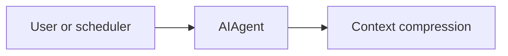

# ch11_context_compression

# Context compression

Harness Agent tutorial — `ch11_context_compression.ipynb`


## Chapter objectives

By the end of this chapter you will be able to:

- Explain the `estimate_tokens()` approximation formula and its limitations.
- Trace `compress_messages()` head/middle/tail algorithm with concrete examples.
- State the default token threshold (12 000) and the minimum message count (4).
- Predict which messages are kept verbatim and which are summarised.
- Demonstrate that compression fires automatically each turn via `agent.py`.
- Describe the trade-off between compression and context fidelity.

## Prerequisites

Prior chapters through ch11; see SYLLABUS.md.


## Concept: Context compression

### The problem

After many tool-call turns, the message list grows. A 25-turn session with tool
results can easily exceed a model's context window. Without compression, the API
returns a context-length error and the session dies.

### Token estimation

```python
def estimate_tokens(messages: list[Message]) -> int:
    total = 0
    for m in messages:
        total += len(m.content or "") // 4   # ~4 chars per token
        if m.tool_calls:
            total += 100 * len(m.tool_calls) # tool_calls payload estimate
    return total
```

This is a fast **approximation** — not exact. The real tokeniser would be slower
and provider-specific. The estimate is deliberately conservative (text-heavy messages
may have fewer real tokens).

### compress_messages() algorithm

```text
If estimate_tokens(messages) ≤ max_tokens (12 000):  return unchanged
If len(messages) ≤ 4:                                 return unchanged (safety guard)

head   = messages[:2]           # system + first user — always preserved
tail   = messages[-4:]          # last 4 messages — always preserved
middle = messages[2:-4]         # everything in between

summary_bits = [f"{m.role}: {(m.content or '')[:200]}" for m in middle]
summary = Message(role="user", content="[Compressed middle history]\n" + "\n".join(summary_bits))

return head + [summary] + tail
```

### Why head and tail?

- **Head (messages[:2])**: system prompt + original user request — the task definition
  must never be lost.
- **Tail (messages[-4:])**: the most recent context — the model needs this to understand
  the current state of the conversation.
- **Middle**: older turns, already acted on — a snippet summary is sufficient.

### When it fires in agent.py

```python
for _ in range(self.config.max_turns):
    messages = compress_messages(messages)   # ← Phase 1, every turn
    ...
```

It runs before every API call. If tokens are under the threshold, it's a no-op
(returns the original list unchanged).

## How it works

Keep head + tail messages; insert compressed summary user message.



Trace cells below execute real code paths offline where possible.


## Reference implementation map

| Harness Agent | Nous Research agent (`REFERENCE_REPO_PATH`) | OpenClaw |
|---------------|---------------------------------------------|----------|
| ``compression/summarize.py`` | search architecture guide | SOUL/gateway patterns |

Open upstream files only under your optional clone — not bundled in this tutorial.


## Design choices in harness_agent

Tutorial implementation prioritizes readable Python over feature parity. Extend ``compression/summarize.py`` as exercises.


## Implementation walkthrough


```python
from harness_agent.compression.summarize import compress_messages, estimate_tokens
from harness_agent.types import Message

# --- Token estimation ---
msgs_small = [
    Message(role="system", content="You are helpful."),
    Message(role="user", content="What is 2+2?"),
    Message(role="assistant", content="4"),
]
print(f"estimate_tokens (3 short messages): {estimate_tokens(msgs_small)}")

# Message with tool_calls
msg_with_tools = Message(role="assistant", content="", tool_calls=[
    {"id": "c1", "type": "function", "function": {"name": "list_files", "arguments": "{}"}},
    {"id": "c2", "type": "function", "function": {"name": "read_file",  "arguments": '{"path":"x"}'}},
])
print(f"estimate_tokens (1 msg, 2 tool_calls): {estimate_tokens([msg_with_tools])}")
print()

# --- Demonstrate compression threshold ---
msgs_large = [Message(role="system", content="You are helpful."),
              Message(role="user",   content="Start a complex task.")]
for i in range(30):
    msgs_large.append(Message(role="assistant", content=f"Turn {i}: analysing... " * 80))
    msgs_large.append(Message(role="user",      content=f"Continue step {i+1}."))

tokens_before = estimate_tokens(msgs_large)
print(f"Messages before: {len(msgs_large)},  tokens: ~{tokens_before:,}")

compressed = compress_messages(msgs_large)
tokens_after = estimate_tokens(compressed)
print(f"Messages after:  {len(compressed)},  tokens: ~{tokens_after:,}")
print()

# --- Show structure of compressed list ---
for i, m in enumerate(compressed):
    snippet = (m.content or "")[:60].replace("\n", " ")
    marker = "▶ COMPRESSED" if "[Compressed" in (m.content or "") else ""
    print(f"  [{i:2d}] role={m.role:9s}  {snippet!r}  {marker}")
```

## Trace one request


```python
# Show the compressed summary message content
for m in compress_messages(msgs_large):
    if "[Compressed" in (m.content or ""):
        print("=== Compressed summary message ===")
        print(m.content[:600])
        break

print()
# Show no-op when below threshold
small = [Message(role="system", content="Short."), Message(role="user", content="Hi.")]
result = compress_messages(small, max_tokens=1500)
print(f"Below threshold → same object returned: {result is small}")

# Show guard for ≤4 messages
four_msgs = [Message(role=r, content="x" * 5000) for r in ["system", "user", "assistant", "user"]]
tokens_4 = estimate_tokens(four_msgs)
compressed_4 = compress_messages(four_msgs, max_tokens=100)
print(f"≤4 messages, even with {tokens_4} tokens → unchanged: {compressed_4 is four_msgs}")
```

## Hands-on exercises

**Exercise 1 — Custom threshold**

```python
# Use a very small threshold to force compression on a short list
msgs = [Message(role="system", content="You are helpful."),
        Message(role="user",   content="Hi."),
        Message(role="assistant", content="Hello! How can I help you today?"),
        Message(role="user",   content="Tell me about compression."),
        Message(role="assistant", content="Compression reduces context size."),
        Message(role="user",   content="Thank you!")]

compressed = compress_messages(msgs, max_tokens=10)  # tiny threshold
print(len(compressed), "messages after forced compression")
```

What are head, middle, and tail in this case?

**Exercise 2 — tool_calls token estimate**

Create a message with 5 tool calls. Calculate `estimate_tokens([msg])` manually
using the formula (`len(content)//4 + 100*len(tool_calls)`). Verify against the
function output.

**Exercise 3 — Information loss**

Build a message list where the middle contains a critical tool result. After
compression, can the model still see that result? What does this imply for how
you design tool response sizes?

**Exercise 4 — Real token count**

Install `tiktoken` and compare its token count to `estimate_tokens`:

```python
import tiktoken
enc = tiktoken.encoding_for_model("gpt-4o")
real = len(enc.encode(msgs_large[5].content or ""))
estimated = len(msgs_large[5].content or "") // 4
print(f"tiktoken: {real}, estimate: {estimated}, ratio: {real/estimated:.2f}")
```

## Common pitfalls

| Pitfall | Root cause | Fix |
|---------|-----------|-----|
| Critical tool result compressed away | In the middle, not the tail | Structure conversations so key results are in recent turns |
| Compression fires unexpectedly | Token estimate over-counts tool_calls | Reduce tool_calls per turn; compress large tool results |
| Compression never fires | Messages stay under 12 000 estimated tokens | Normal — it's a no-op until needed |
| Compression triggered on tiny lists | `len(messages) ≤ 4` guard prevents this | Minimum 5 messages before compression can fire |
| System prompt lost | Should be in head[:2] | Always add system as messages[0] before user — it's included in head |
| Estimate too inaccurate | `len // 4` diverges for code or multilingual text | Use for rough budgeting only; don't rely on it for exact counting |

## Checkpoint questions

1. **Token formula** — Write the `estimate_tokens` formula for a single `Message`. What does each term estimate?

2. **Algorithm** — A list has 20 messages and 15 000 estimated tokens. Which messages end up in head, which in middle, which in tail after compression?

3. **Guard condition** — What happens when `compress_messages` is called with exactly 4 messages that exceed the token threshold? What about 5 messages?

4. **No-op** — Under what two conditions does `compress_messages` return the original list unchanged?

5. **Summary format** — The compressed middle becomes a `Message`. What is its `role`? What does its `content` start with?

6. **Phase placement** — In which phase of the agent loop does compression run? Why must it run before, not after, the model API call?

## Summary & next chapter

| Topic | Key takeaway |
|-------|-------------|
| `estimate_tokens()` | `len(content)//4 + 100*len(tool_calls)` — fast approximation |
| Default threshold | 12 000 estimated tokens before compression fires |
| head / tail | `messages[:2]` (system+first user) and `messages[-4:]` always preserved |
| Middle summary | Role + first 200 chars of each middle message, joined as a user message |
| Guard condition | Lists with ≤ 4 messages are never compressed regardless of token count |
| No-op path | Returns the original list object if under threshold — zero cost |

**ch12** covers **subagents and delegation** — how the parent agent spawns isolated
child agents with fresh context to handle sub-tasks.
