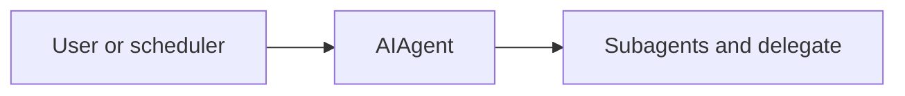

# ch12_subagents_and_delegate

# Subagents and delegate

Harness Agent tutorial — `ch12_subagents_and_delegate.ipynb`


## Chapter objectives

By the end of this chapter you will be able to:

- Explain why subagents must use `isolated=True` and what they skip.
- Trace `delegate_subagent()` from tool call through `AIAgent(isolated=True).run_conversation()` to result.
- Describe the parent-child session relationship and why child sessions don't pollute the parent.
- Identify the observation fields returned by `delegate_subagent`.
- Understand when to use delegation vs. a single-agent multi-tool approach.
- Check whether `delegate_subagent` is registered in the tool registry.

## Prerequisites

Prior chapters through ch12; see SYLLABUS.md.


## Concept: Subagents and delegate

### When delegation helps

A single agent loop can handle most tasks. Delegation helps when:

1. **Context isolation is needed**: a sub-task should start with a clean slate,
   not inherit the parent's long history.
2. **Parallel work**: multiple subagents can run concurrently (not implemented in
   the tutorial, but the architecture supports it).
3. **Specialisation**: a subagent can be configured with a different `toolsets` list.
4. **Composability**: the parent describes what, the child figures out how.

### How delegate_subagent works

```python
def delegate_subagent(task: str) -> str:
    child = AIAgent(isolated=True)           # fresh context, no persistence
    result = child.run_conversation(task, session_id=None)
    return wrap_result(
        status="success",
        summary="Subagent completed",
        detail=result.assistant_text,        # child's final answer
        artifacts=[result.session_id] if result.session_id else [],
    )
```

The parent receives the child's final `assistant_text` as the `detail` field of
an observation. The parent never sees the child's intermediate tool calls.

### Why isolated=True?

| Without isolated=True | With isolated=True |
|----------------------|-------------------|
| Loads parent session history | Empty history |
| Persists all turns to DB | No DB writes |
| Triggers learning loop | No skill authoring |
| Double-counts tool calls | Separate counter |

### Toolset scoping

A subagent can be restricted to specific tools:

```python
child = AIAgent(isolated=True, toolsets=["files"])  # only file tools
```

This prevents a subagent from accidentally calling `delegate_subagent` recursively
(infinite delegation) by not exposing the `delegate` toolset to the child.

## How it works

`delegate_subagent` tool spawns `AIAgent(isolated=True)`.



Trace cells below execute real code paths offline where possible.


## Reference implementation map

| Harness Agent | Nous Research agent (`REFERENCE_REPO_PATH`) | OpenClaw |
|---------------|---------------------------------------------|----------|
| ``delegate.py`` | search architecture guide | SOUL/gateway patterns |

Open upstream files only under your optional clone — not bundled in this tutorial.


## Design choices in harness_agent

Tutorial implementation prioritizes readable Python over feature parity. Extend ``delegate.py`` as exercises.


## Implementation walkthrough


```python
from harness_agent.tools.registry import get_registry
import harness_agent.delegate  # trigger registration
import json

r = get_registry()

# Confirm delegate_subagent is registered
available = r.list_available()
print(f"'delegate_subagent' in registry: {'delegate_subagent' in available}")

# Show the tool spec
spec = r._tools.get("delegate_subagent")
if spec:
    print(f"\nToolSpec:")
    print(f"  name     : {spec.name!r}")
    print(f"  toolset  : {spec.toolset!r}")
    print(f"  handler  : {spec.handler.__module__}.{spec.handler.__name__}")
    print(f"  params   : {json.dumps(spec.parameters, indent=4)}")
```

## Trace one request


```python
import json

# Show what a delegate_subagent result looks like (requires API key for real run)
# Here we simulate the output format
simulated_result = json.dumps({
    "status": "success",
    "summary": "Subagent completed",
    "next_actions": [],
    "artifacts": ["550e8400-e29b-41d4-a716-446655440000"],
    "detail": "The workspace contains 3 files: main.py, utils.py, tests/test_main.py"
}, indent=2)

print("Simulated delegate_subagent result:")
print(simulated_result)
print()

# Show what the parent agent sees
parsed = json.loads(simulated_result)
print(f"Parent reads child result via: result['detail']")
print(f"  → {parsed['detail']!r}")
print()
print("The parent never sees the child's tool calls — only the final text.")
print()

# Show AIAgent with isolated=True (offline check)
from harness_agent.agent import AIAgent
child = AIAgent(isolated=True)
print(f"Child agent: isolated={child.isolated}, toolsets={child.toolsets}")
print("Child skips: session load, session persist, learning trigger")
```

## Hands-on exercises

**Exercise 1 — Live delegation (requires API key)**

```python
from harness_agent.delegate import delegate_subagent
import json

result = delegate_subagent("List the files in the workspace and return their names.")
parsed = json.loads(result)
print(f"status : {parsed['status']}")
print(f"detail : {parsed['detail']}")
```

What tool calls did the child make? You won't see them in the result — only the answer.

**Exercise 2 — Prevent recursive delegation**

Create a `AIAgent(isolated=True, toolsets=["files"])` and verify that
`delegate_subagent` is NOT in `agent.registry.list_available(toolsets=["files"])`.

What happens if you try to dispatch it directly?

**Exercise 3 — Delegate with specialised child**

Modify `delegate_subagent` (in a local copy) to accept a `toolsets: list[str]` parameter:

```python
def delegate_subagent(task: str, toolsets: list[str] | None = None) -> str:
    child = AIAgent(isolated=True, toolsets=toolsets)
    ...
```

Register this custom version and test it.

**Exercise 4 — Parent-child session IDs**

Call `delegate_subagent` with a live agent. Check:
- Does the child's `session_id` appear in `artifacts`?
- Open the DB — is the child session in `sessions`? What `parent_id` does it have?

## Common pitfalls

| Pitfall | Root cause | Fix |
|---------|-----------|-----|
| Child inherits parent history | `isolated=False` on child agent | Always use `AIAgent(isolated=True)` for subagents |
| Recursive delegation | Child has access to `delegate` toolset | Use `toolsets=["files"]` to restrict the child |
| Subagent result lost | Parent doesn't read `detail` from observation | Parse the JSON; the answer is in `parsed["detail"]` |
| Learning fires for subagent | `isolated=True` not set | The guard in `run_conversation` prevents this |
| Child makes no tool calls | Prompt too vague | Give the child a specific, actionable task description |
| `delegate_subagent` not in registry | `harness_agent.delegate` not imported | `AIAgent._ensure_tools_loaded()` imports it |

## Checkpoint questions

1. **isolated=True effects** — List all three behaviours that `isolated=True` suppresses in a child agent.

2. **Result structure** — What observation fields does `delegate_subagent` return? Where does the child's final answer appear?

3. **Toolset scoping** — Why should a subagent be created with `toolsets=["files"]` rather than the default? What risk does this mitigate?

4. **Child vs parent session** — The child creates a new `session_id`. What `parent_id` does this session have in the database?

5. **When to delegate** — Give two situations where delegation is clearly better than calling more tools in the parent loop.

6. **Observation detail** — The child's `result.assistant_text` becomes `detail` in the parent's observation. What happens if the child's `assistant_text` is empty (max_turns hit)?

## Summary & next chapter

| Topic | Key takeaway |
|-------|-------------|
| `delegate_subagent` | Tool that spawns `AIAgent(isolated=True)` for a sub-task |
| `isolated=True` | Skips history load, DB persist, and learning — clean slate |
| Result format | `wrap_result(detail=child.assistant_text)` — parent reads `detail` |
| `artifacts` | Contains child's `session_id` if one was created |
| Toolset scoping | Restrict child with `toolsets=["files"]` to prevent recursive delegation |
| Session isolation | Child session has no `parent_id` (None) — it's independent |

**ch13** covers **MCP integration** — how external Model Context Protocol servers
extend the tool registry with dynamically registered `mcp_*` tools.
