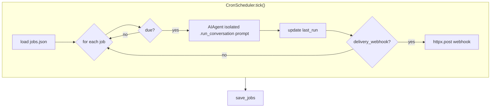

# ch14_cron_scheduler

# Cron scheduler

Harness Agent tutorial — `ch14_cron_scheduler.ipynb`


## Chapter objectives

- Understand the **cron scheduler** subsystem that runs agent jobs on a time-based schedule.
- Inspect `CronJob` fields and `CronScheduler.tick()` execution flow.
- Create a job definition file and observe the scheduling decision logic.
- Appreciate how isolated agents enable safe, side-effect-free scheduled runs.


## Prerequisites

Prior chapters through ch14; see SYLLABUS.md.


## Concept: Cron scheduler

The cron scheduler lets you run **agent jobs on a time-based schedule** without a system cron daemon. Instead of running a shell command, each job carries a `prompt` — an instruction given to a fresh isolated `AIAgent` when the job is due.

### CronJob fields

```python
@dataclass
class CronJob:
    id: str                        # unique job identifier
    prompt: str                    # instruction sent to the agent
    schedule_minutes: int          # how often to run (in minutes)
    last_run: str | None = None    # ISO-8601 UTC timestamp of last execution
    delivery_webhook: str | None = None  # optional URL to POST the result
```

Jobs are stored in `<HARNESS_AGENT_HOME>/cron/jobs.json`:

```json
{
  "jobs": [
    {
      "id": "daily-digest",
      "prompt": "Summarise the latest tool call activity in the session store.",
      "schedule_minutes": 60,
      "last_run": null,
      "delivery_webhook": null
    }
  ]
}
```

### Tick execution flow (`cron/scheduler.py:39-65`)

```
tick()
  now = datetime.now(UTC)
  jobs = load_jobs()             # read jobs.json
  agent = AIAgent(isolated=True) # single agent for the whole tick
  for job in jobs:
    last = parse(job.last_run) or None
    due  = last is None  OR  (now - last).total_seconds() >= schedule_minutes * 60
    if not due: skip
    turn = agent.run_conversation(job.prompt)
    job.last_run = now.isoformat()
    if job.delivery_webhook:
        httpx.post(webhook, json={job_id, text})
  save_jobs(jobs)                # persist updated last_run timestamps
  return results
```

**Why isolated=True?** Isolated agents skip session persistence and memory loading — each tick is a clean, side-effect-free invocation. Results are returned synchronously and optionally pushed to a webhook.

| Concern | Detail |
|---------|--------|
| Job storage | `<HOME>/cron/jobs.json` (plain JSON, editable) |
| Due check | `(now − last_run) ≥ schedule_minutes × 60 s` |
| Agent per tick | One shared isolated agent dispatches all due jobs |
| Delivery | Optional HTTP POST via `httpx` (ignored on failure) |
| Persistence | `save_jobs()` updates `last_run` after every run |


## How it works — annotated source

```python
# cron/scheduler.py — CronScheduler.tick()

def tick(self) -> list[dict]:
    now = datetime.now(timezone.utc)         # (1) snapshot current time
    results = []
    jobs = self.load_jobs()                  # (2) deserialize jobs.json
    agent = AIAgent(isolated=True)           # (3) one clean agent for the tick

    for job in jobs:
        # (4) calculate due status
        last = datetime.fromisoformat(job.last_run) if job.last_run else None
        due  = last is None or (now - last).total_seconds() >= job.schedule_minutes * 60

        if not due:
            continue                         # (5) skip not-yet-due jobs

        try:
            turn = agent.run_conversation(job.prompt)  # (6) run the agent
            text = turn.assistant_text
        except Exception as exc:
            text = f"[cron error] {exc}"     # (7) soft error — tick continues

        job.last_run = now.isoformat()       # (8) update timestamp
        entry = {"job_id": job.id, "text": text}
        results.append(entry)

        if job.delivery_webhook:             # (9) optional HTTP delivery
            httpx.post(job.delivery_webhook, json=entry, timeout=10)

    self.save_jobs(jobs)                     # (10) persist updated timestamps
    return results
```




## Reference implementation map

| Harness Agent | Nous Research agent (`REFERENCE_REPO_PATH`) | OpenClaw |
|---------------|---------------------------------------------|----------|
| ``cron/scheduler.py`` | search architecture guide | SOUL/gateway patterns |

Open upstream files only under your optional clone — not bundled in this tutorial.


## Design choices

| Choice | Rationale |
|--------|-----------|
| Plain JSON job file | Human-editable, no DB dependency for scheduling config |
| One isolated agent per tick | Each tick is clean — no cross-job state leakage |
| Soft error handling | One failing job doesn't abort the others; error text is returned |
| `httpx` for webhooks | Synchronous, minimal — no async event loop needed |
| No threading | `tick()` is single-threaded; call it from a loop or system timer |
| `last_run` stored in jobs.json | Self-contained state — no separate clock DB |

**Extension points:**
- Add `delivery_webhook` to ship results to Slack, email, or any HTTP endpoint.
- Wrap `tick()` in a loop with `time.sleep(60)` to build a simple in-process scheduler.
- Replace `httpx.post` with a queue publish for durable delivery.


## Implementation walkthrough


```python
import os, json, dataclasses
os.environ.setdefault('HARNESS_AGENT_HOME', 'labs')

from harness_agent.cron.scheduler import CronJob, CronScheduler

# Inspect the CronJob dataclass
print("CronJob fields:")
for f in dataclasses.fields(CronJob):
    print(f"  {f.name}: {f.type}  default={f.default!r}")

# Show an example job definition
example_job = CronJob(
    id="hourly-summary",
    prompt="List the tools called in the last session.",
    schedule_minutes=60,
)
print("\nExample CronJob:", json.dumps(dataclasses.asdict(example_job), indent=2))

# Load whatever jobs exist (empty list if no jobs.json yet)
scheduler = CronScheduler()
jobs = scheduler.load_jobs()
print(f"\nLoaded {len(jobs)} jobs from {scheduler.jobs_path}")

```

## Trace: the due-check logic


```python
from datetime import datetime, timezone, timedelta
from harness_agent.cron.scheduler import CronJob

now = datetime.now(timezone.utc)

def is_due(job: CronJob, now: datetime) -> bool:
    last = datetime.fromisoformat(job.last_run) if job.last_run else None
    return last is None or (now - last).total_seconds() >= job.schedule_minutes * 60

# Never run before
job_new = CronJob(id="a", prompt="ping", schedule_minutes=60)
print(f"Never run before → due: {is_due(job_new, now)}")

# Run 30 minutes ago, interval 60 → not due
job_recent = CronJob(
    id="b", prompt="check", schedule_minutes=60,
    last_run=(now - timedelta(minutes=30)).isoformat()
)
print(f"30 min ago, interval 60 → due: {is_due(job_recent, now)}")

# Run 90 minutes ago, interval 60 → due
job_overdue = CronJob(
    id="c", prompt="report", schedule_minutes=60,
    last_run=(now - timedelta(minutes=90)).isoformat()
)
print(f"90 min ago, interval 60 → due: {is_due(job_overdue, now)}")

# Demonstrate tick() without API (no live LLM needed when no jobs are due)
import json, tempfile, pathlib

tmp = pathlib.Path(tempfile.mkdtemp()) / "jobs.json"
tmp.write_text(json.dumps({"jobs": [
    {"id": "c", "prompt": "hello", "schedule_minutes": 60,
     "last_run": (now - timedelta(minutes=90)).isoformat(), "delivery_webhook": None}
]}))

# CronScheduler with custom path — will try to run the due job
# (wraps AIAgent; will fail if no API key, but demonstrates the flow)
from harness_agent.cron.scheduler import CronScheduler
sched = CronScheduler(jobs_path=tmp)
print("\nDue jobs before tick:", [j.id for j in sched.load_jobs() if is_due(j, now)])
# Uncomment to run (requires API key):
# results = sched.tick()
# print("Tick results:", results)

```

## Hands-on exercises

1. **Create a job file**: Write `labs/cron/jobs.json` with two jobs — one with `schedule_minutes=1` (due immediately since `last_run=null`) and one with `schedule_minutes=10080` (weekly). Call `CronScheduler().load_jobs()` and use `is_due()` to confirm which one is due.

2. **Inspect tick() internals**: Add a `print()` statement after `agent = AIAgent(isolated=True)` in `scheduler.py`, run `tick()` in this notebook (with a valid API key), and observe the output. Remove the print after you understand the flow.

3. **Soft error handling**: Create a `CronJob` with `prompt="[deliberate fail]"` and a `CronScheduler` that wraps a mock agent that raises. Verify that `tick()` returns a result entry with `[cron error]` prefix instead of propagating the exception.

4. **Delivery webhook simulation**: Set up a local `http.server` on port 9999 in one terminal, add a job with `delivery_webhook="http://127.0.0.1:9999"`, and call `tick()`. Observe the POST hit your server.

5. **Continuous scheduler**: Wrap `tick()` in a loop:
   ```python
   import time
   while True:
       results = CronScheduler().tick()
       if results:
           print("Ran:", results)
       time.sleep(60)
   ```
   This is a production-usable in-process scheduler requiring no system cron.


## Common pitfalls

| Pitfall | Symptom | Fix |
|---------|---------|-----|
| `HARNESS_AGENT_HOME` not set | `jobs.json` written to wrong directory | `export HARNESS_AGENT_HOME=labs` before running |
| No API key for due job | `[cron error] ...` in result text | Set `HARNESS_API_KEY` or a provider-specific key |
| Job never marked due | `last_run` keeps getting updated even on error | Check: `last_run` is always updated, regardless of agent success |
| Missing `httpx` package | `ImportError` on delivery webhook | `pip install httpx` — it's optional but needed for webhooks |
| `schedule_minutes=0` | Job runs on every tick | Use at least 1 minute to avoid a busy loop |
| Jobs file is invalid JSON | `json.JSONDecodeError` in `load_jobs()` | Validate with `python -m json.tool labs/cron/jobs.json` |
| Expecting parallel job execution | Only one job runs at a time | `tick()` is sequential; for parallelism, use threads or async |


## Checkpoint questions

1. What is the difference between a cron job in Harness Agent and a traditional system `cron` entry?
2. List all five fields of `CronJob`. Which one is optional and only relevant for remote delivery?
3. How does `tick()` determine whether a job is due? Write the Python boolean expression.
4. Why is `AIAgent(isolated=True)` used inside `tick()` instead of a shared agent?
5. What happens to other jobs in the tick if one job's `run_conversation()` raises an exception?
6. Where is `last_run` stored after `tick()` completes? When is it written — before or after the agent call?
7. What must you configure to have job results delivered to a Slack webhook after each tick?


## Summary

| Concept | Key detail |
|---------|-----------|
| `CronJob` | Dataclass: `id`, `prompt`, `schedule_minutes`, `last_run`, `delivery_webhook` |
| Job storage | `<HARNESS_AGENT_HOME>/cron/jobs.json` — plain JSON, human-editable |
| Due check | `last is None or (now − last).total_seconds() ≥ schedule_minutes × 60` |
| Agent isolation | `AIAgent(isolated=True)` — no session persistence, no memory load |
| Error handling | Soft — `[cron error]` text returned; tick continues for other jobs |
| Delivery | Optional HTTP POST via `httpx` to `delivery_webhook` |
| Persistence | `save_jobs()` writes updated `last_run` after every tick |
| CLI command | `harness-agent cron tick` |

**ch15** covers the gateway and CLI entry points that connect external users to the same `AIAgent`.

