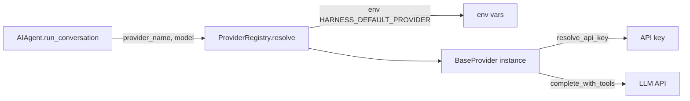

# ch16_provider_resolution

# Provider resolution

Harness Agent tutorial — `ch16_provider_resolution.ipynb`


## Chapter objectives

- Understand how `ProviderRegistry` decouples the agent from any single LLM vendor.
- Trace the env-var fallback chain in `resolve()` and `resolve_api_key()`.
- Register and resolve all four built-in providers: openai, anthropic, deepseek, compass.
- Switch providers at runtime using the `/model` chat command.


## Prerequisites

Prior chapters through ch16; see SYLLABUS.md.


## Concept: Provider resolution

Every call to `AIAgent.run_conversation()` must resolve **which LLM adapter** to use and **which model name** to pass. This is done by `ProviderRegistry.resolve()`.

### Resolution chain (`providers/registry.py:26-29`)

```python
def resolve(self, provider_name=None, model=None):
    cfg_provider = provider_name or os.environ.get("HARNESS_DEFAULT_PROVIDER", "openai")
    cfg_model    = model         or os.environ.get("HARNESS_DEFAULT_MODEL",    "gpt-4o-mini")
    return self.get(cfg_provider), cfg_model
```

Priority order:
1. Explicit argument (e.g. from `/model openai gpt-4o`)
2. `HARNESS_DEFAULT_PROVIDER` / `HARNESS_DEFAULT_MODEL` env vars
3. Hard-coded defaults: `"openai"` / `"gpt-4o-mini"`

### API key resolution (`providers/base.py:12-23`)

Each provider calls `resolve_api_key(*provider_env_vars)`:

```python
def resolve_api_key(*provider_env_vars):
    for var in provider_env_vars:          # e.g. OPENAI_API_KEY
        value = os.environ.get(var)
        if value:
            return value
    return os.environ.get("HARNESS_API_KEY")  # universal fallback
```

This means you can set **one key** (`HARNESS_API_KEY`) and it will work for every provider, or use provider-specific keys for more control.

### Built-in providers

| Provider name | Adapter file | Env var (preferred) |
|---------------|-------------|---------------------|
| `openai` | `openai_compat.py` | `OPENAI_API_KEY` |
| `anthropic` | `anthropic_compat.py` | `ANTHROPIC_API_KEY` |
| `deepseek` | `deepseek_compat.py` | `DEEPSEEK_API_KEY` |
| `compass` | `compass_compat.py` | `COMPASS_API_KEY` |

### `BaseProvider` contract

Every adapter must implement:

```python
def complete_with_tools(
    self,
    messages: list[Message],
    tools: list[dict],
    *,
    model: str,
) -> tuple[str | None, list[ToolCall]]:
    """Return assistant text (if any) and tool calls."""
```

This single method is all the agent needs — swapping providers requires zero changes to `AIAgent`.


## How it works — annotated source

```python
# providers/registry.py — ProviderRegistry

class ProviderRegistry:
    def __init__(self):
        self._providers: dict[str, BaseProvider] = {}

    def register(self, provider: BaseProvider) -> None:
        self._providers[provider.name] = provider   # keyed by provider.name

    def get(self, name: str) -> BaseProvider:
        if name not in self._providers:
            raise KeyError(f"Unknown provider: {name}")
        return self._providers[name]

    def resolve(self, provider_name=None, model=None) -> tuple[BaseProvider, str]:
        cfg_provider = provider_name or os.environ.get("HARNESS_DEFAULT_PROVIDER", "openai")
        cfg_model    = model         or os.environ.get("HARNESS_DEFAULT_MODEL",    "gpt-4o-mini")
        return self.get(cfg_provider), cfg_model    # → (adapter_instance, model_string)
```

```python
# providers/base.py — key-resolution helper

def resolve_api_key(*provider_env_vars: str) -> str | None:
    for var in provider_env_vars:           # provider-specific first
        if value := os.environ.get(var):
            return value
    return os.environ.get("HARNESS_API_KEY")  # universal fallback
```

```python
# providers/registry.py — singleton initialisation

def get_provider_registry() -> ProviderRegistry:
    global _registry
    if _registry is None:
        _registry = ProviderRegistry()
        _registry.register(OpenAIProvider())      # name = "openai"
        _registry.register(AnthropicProvider())   # name = "anthropic"
        _registry.register(DeepSeekProvider())    # name = "deepseek"
        _registry.register(CompassProvider())     # name = "compass"
    return _registry
```




## Reference implementation map

| Harness Agent | Nous Research agent (`REFERENCE_REPO_PATH`) | OpenClaw |
|---------------|---------------------------------------------|----------|
| ``providers/registry.py`, `config.py`` | search architecture guide | SOUL/gateway patterns |

Open upstream files only under your optional clone — not bundled in this tutorial.


## Design choices

| Choice | Rationale |
|--------|-----------|
| Registry pattern | Providers are plug-in; adding a new one requires no agent changes |
| `HARNESS_API_KEY` fallback | One env var works for all providers — convenient for CI |
| Lazy singleton (`_registry`) | Registry initialised only when first needed |
| `provider.name` as dict key | String comparison — easy to switch via CLI `/model` command |
| No provider caching per request | Stateless; each call gets a fresh adapter instance check |

**Adding a new provider:**
1. Create `providers/myprovider_compat.py` with a class that subclasses `BaseProvider`.
2. Set `name = "myprovider"` on the class.
3. Implement `complete_with_tools()`.
4. Register in `get_provider_registry()`: `_registry.register(MyProvider())`.
5. Use via `HARNESS_DEFAULT_PROVIDER=myprovider` or `/model myprovider mymodel-v1`.


## Implementation walkthrough


```python
import os
os.environ.setdefault('HARNESS_AGENT_HOME', 'labs')

from harness_agent.providers.registry import get_provider_registry

reg = get_provider_registry()

# List all registered providers
print("Registered providers:", list(reg._providers.keys()))

# Demonstrate resolve() with defaults
provider, model = reg.resolve()
print(f"\nDefault resolution:")
print(f"  provider : {provider.name}")
print(f"  model    : {model}")

# Override with env vars
os.environ["HARNESS_DEFAULT_PROVIDER"] = "anthropic"
os.environ["HARNESS_DEFAULT_MODEL"]    = "claude-haiku-4-5-20251001"
p2, m2 = reg.resolve()
print(f"\nAfter setting env vars:")
print(f"  provider : {p2.name}")
print(f"  model    : {m2}")

# Explicit override takes priority over env
p3, m3 = reg.resolve(provider_name="deepseek", model="deepseek-chat")
print(f"\nExplicit override:")
print(f"  provider : {p3.name}")
print(f"  model    : {m3}")

# Clean up
del os.environ["HARNESS_DEFAULT_PROVIDER"]
del os.environ["HARNESS_DEFAULT_MODEL"]

```

## Trace: API key resolution


```python
import os
from harness_agent.providers.base import resolve_api_key

# Demonstrate the key resolution fallback chain

# Case 1: provider-specific key set
os.environ["OPENAI_API_KEY"] = "sk-openai-example"
os.environ.pop("HARNESS_API_KEY", None)
key = resolve_api_key("OPENAI_API_KEY")
print(f"Case 1 (provider key set): {key[:15]}...")

# Case 2: only universal fallback
del os.environ["OPENAI_API_KEY"]
os.environ["HARNESS_API_KEY"] = "harness-universal-key"
key = resolve_api_key("OPENAI_API_KEY")
print(f"Case 2 (HARNESS_API_KEY fallback): {key}")

# Case 3: provider key takes priority over universal
os.environ["OPENAI_API_KEY"] = "sk-openai-specific"
key = resolve_api_key("OPENAI_API_KEY")
print(f"Case 3 (provider wins over universal): {key}")

# Case 4: no key found
del os.environ["OPENAI_API_KEY"]
del os.environ["HARNESS_API_KEY"]
key = resolve_api_key("OPENAI_API_KEY", "OPENAI_API_KEY_ALT")
print(f"Case 4 (no key): {key!r}")

print("\nConclusion: set HARNESS_API_KEY once and all providers will find it.")

```

## Hands-on exercises

1. **Switch providers in chat**: Run `harness-agent chat` and type `/model anthropic claude-haiku-4-5-20251001`. Ask a question and verify a response arrives (requires `ANTHROPIC_API_KEY` or `HARNESS_API_KEY`).

2. **Universal key test**: Unset all provider-specific keys but set `HARNESS_API_KEY`. Confirm `resolve_api_key("OPENAI_API_KEY")` returns the universal key.

3. **Add a mock provider**:
   ```python
   from harness_agent.providers.base import BaseProvider
   class EchoProvider(BaseProvider):
       name = "echo"
       def complete_with_tools(self, messages, tools, *, model):
           last = messages[-1].content if messages else "?"
           return f"[echo] {last}", []
   
   from harness_agent.providers.registry import get_provider_registry
   get_provider_registry().register(EchoProvider())
   p, m = get_provider_registry().resolve("echo", "echo-v1")
   print(p.complete_with_tools([], [], model=m))
   ```

4. **Model string inspection**: Call `reg.resolve()` under different env-var combinations and confirm the priority order (explicit > env > default).

5. **Error on unknown provider**: Call `get_provider_registry().get("nonexistent")` and confirm it raises `KeyError` with a clear message.


## Common pitfalls

| Pitfall | Symptom | Fix |
|---------|---------|-----|
| `HARNESS_DEFAULT_PROVIDER` typo | `KeyError: Unknown provider: openia` | Check spelling; list keys with `reg._providers.keys()` |
| No API key set | `AuthenticationError` from provider | Set `HARNESS_API_KEY` or provider-specific key |
| Env var set after registry init | Old provider still used | Registry is a singleton; re-create or restart the process |
| Provider-specific key overrides universal | Expected universal, got provider key | This is correct behaviour — provider key always wins |
| Model name unsupported by provider | `InvalidModelError` from API | Consult provider docs; model strings are not validated locally |
| `resolve()` called with wrong arg order | Gets wrong provider | Arguments are positional: `resolve(provider_name, model)` |
| Registry mutated across tests | Unexpected provider in test | Call `get_provider_registry()` in a fresh process, or reset `_registry = None` |


## Checkpoint questions

1. What is the priority order for `ProviderRegistry.resolve()` when choosing a provider? Name all three levels.
2. Which env var is the universal API key fallback? In which file is it resolved?
3. Name the four built-in providers and their corresponding env var names.
4. What single method must every `BaseProvider` subclass implement? What does it return?
5. If `HARNESS_DEFAULT_PROVIDER` is set to `"anthropic"` and `resolve("openai")` is called explicitly, which wins?
6. Why is `_registry` a module-level singleton instead of being created fresh per request?
7. How would you add a new provider for a hypothetical `xyz-llm` API?


## Summary

| Concept | Key detail |
|---------|-----------|
| `ProviderRegistry` | Dict of `{name: BaseProvider}`; singleton via `get_provider_registry()` |
| `resolve()` priority | explicit arg > `HARNESS_DEFAULT_PROVIDER` env > `"openai"` default |
| `resolve_api_key()` | Provider-specific env var > `HARNESS_API_KEY` universal fallback |
| Built-in providers | `openai`, `anthropic`, `deepseek`, `compass` |
| `BaseProvider` contract | `complete_with_tools(messages, tools, *, model) → (str|None, list[ToolCall])` |
| Model string | Opaque to the registry — passed directly to the provider adapter |
| CLI switch | `/model <provider> <model>` changes both provider and model mid-chat |

**ch17** covers terminal backends — how the agent safely executes shell commands in local or Docker environments.

