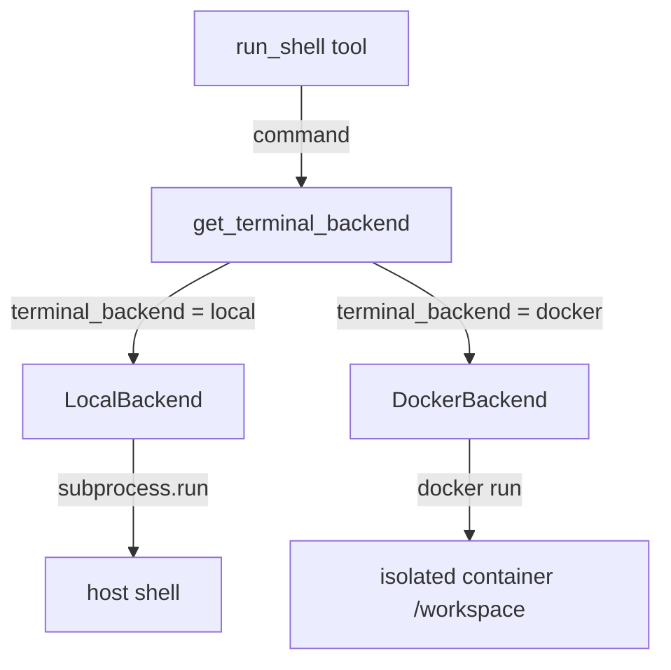

# ch17_terminal_backends

# Terminal backends

Harness Agent tutorial — `ch17_terminal_backends.ipynb`


## Chapter objectives

- Understand the `TerminalBackend` abstraction that isolates shell execution from the rest of the agent.
- Inspect the `LocalBackend` (subprocess) and `DockerBackend` (container) implementations.
- Use `get_terminal_backend()` factory and run a command through it.
- Understand how the Docker backend mounts the workspace at `/workspace`.


## Prerequisites

Prior chapters through ch17; see SYLLABUS.md.


## Concept: Terminal backends

The agent can execute shell commands as tool calls. To keep this testable and safe, shell execution is routed through a **`TerminalBackend` abstraction** (`tools/environments/base.py`).

### The ABC (`base.py:10-13`)

```python
class TerminalBackend(ABC):
    @abstractmethod
    def run(
        self,
        command: str,
        *,
        cwd: str | None = None,
        timeout: int = 60,
    ) -> tuple[int, str, str]:
        """Return exit code, stdout, stderr."""
```

The return type `(exit_code, stdout, stderr)` is identical across backends — the agent tool that calls `run()` never needs to know whether it's talking to a local process or a Docker container.

### LocalBackend

Runs commands via `subprocess.run(command, shell=True, ...)` in the current process. The working directory defaults to `HARNESS_AGENT_HOME`. Output is captured and returned as strings.

### DockerBackend

Starts a Docker container with the workspace directory mounted at `/workspace`:

```
docker run --rm -v <HARNESS_AGENT_HOME>:/workspace <image> sh -c "<command>"
```

This provides **isolation**: the agent's shell commands cannot access the host filesystem outside the workspace.

### Factory (`base.py:16-23`)

```python
def get_terminal_backend() -> TerminalBackend:
    name = get_config().terminal_backend   # "local" or "docker"
    if name == "docker":
        return DockerBackend()
    return LocalBackend()
```

Set `HARNESS_TERMINAL_BACKEND=docker` (or configure in code) to switch without touching tool code.

| Aspect | LocalBackend | DockerBackend |
|--------|-------------|---------------|
| Isolation | none (host access) | container filesystem |
| Dependencies | none | Docker daemon |
| Speed | fast | slower (container start) |
| Use case | dev / trusted env | sandboxed execution |


## How it works — annotated source

```python
# tools/environments/base.py

class TerminalBackend(ABC):
    @abstractmethod
    def run(
        self,
        command: str,
        *,
        cwd: str | None = None,
        timeout: int = 60,
    ) -> tuple[int, str, str]:
        """Return exit code, stdout, stderr."""

def get_terminal_backend() -> TerminalBackend:
    name = get_config().terminal_backend   # "local" | "docker"
    if name == "docker":
        return DockerBackend()
    return LocalBackend()                  # default
```

```python
# tools/environments/local.py (approximate)

class LocalBackend(TerminalBackend):
    def run(self, command, *, cwd=None, timeout=60):
        result = subprocess.run(
            command,
            shell=True,
            capture_output=True,
            text=True,
            cwd=cwd or str(get_config().home),
            timeout=timeout,
        )
        return result.returncode, result.stdout, result.stderr
```

```python
# tools/environments/docker_backend.py (approximate)

class DockerBackend(TerminalBackend):
    def run(self, command, *, cwd=None, timeout=60):
        workspace = str(get_config().home)
        docker_cmd = (
            f'docker run --rm -v "{workspace}:/workspace" '
            f'harness-agent:latest sh -c "{command}"'
        )
        result = subprocess.run(docker_cmd, shell=True, ...)
        return result.returncode, result.stdout, result.stderr
```




## Reference implementation map

| Harness Agent | Nous Research agent (`REFERENCE_REPO_PATH`) | OpenClaw |
|---------------|---------------------------------------------|----------|
| ``tools/environments/`` | search architecture guide | SOUL/gateway patterns |

Open upstream files only under your optional clone — not bundled in this tutorial.


## Design choices

| Choice | Rationale |
|--------|-----------|
| ABC with `run()` signature | Tools never import a concrete backend — dependency inversion |
| `(exit_code, stdout, stderr)` tuple | Mirrors `subprocess.CompletedProcess` — familiar, explicit |
| `timeout=60` default | Prevents runaway commands from blocking the agent loop |
| `cwd` parameter | Tools can direct commands into specific subdirectories |
| Factory reads config | Switch backend with env var, no code change |
| Docker mounts workspace at `/workspace` | Agent sees the same paths regardless of host layout |

**Adding a new backend:**
1. Create `tools/environments/my_backend.py` with a class extending `TerminalBackend`.
2. Implement `run(command, *, cwd, timeout) -> (int, str, str)`.
3. Add an `elif name == "my_backend"` branch in `get_terminal_backend()`.
4. Set `terminal_backend = "my_backend"` in config or env.


## Implementation walkthrough


```python
import os
os.environ.setdefault('HARNESS_AGENT_HOME', 'labs')

from harness_agent.tools.environments.base import get_terminal_backend, TerminalBackend

# Inspect the ABC
import inspect
print("TerminalBackend.run signature:")
print(inspect.signature(TerminalBackend.run))

# Get the local backend (default)
backend = get_terminal_backend()
print(f"\nBackend type: {type(backend).__name__}")

# Run a simple command
exit_code, stdout, stderr = backend.run("echo harness-agent works!")
print(f"\nCommand result:")
print(f"  exit_code : {exit_code}")
print(f"  stdout    : {stdout.strip()!r}")
print(f"  stderr    : {stderr.strip()!r}")

# Run a failing command
code, out, err = backend.run("python -c \"raise ValueError('test error')\"")
print(f"\nFailing command:")
print(f"  exit_code : {code}  (non-zero means error)")
print(f"  stderr    : {err.strip()[:80]!r}")

```

## Trace: building a custom backend


```python
from harness_agent.tools.environments.base import TerminalBackend

# Create a mock backend for testing — no subprocess needed
class MockBackend(TerminalBackend):
    def __init__(self):
        self.calls: list[str] = []

    def run(self, command: str, *, cwd=None, timeout=60) -> tuple[int, str, str]:
        self.calls.append(command)
        # Simulate echo
        if command.startswith("echo "):
            return 0, command[5:] + "\n", ""
        # Simulate failure
        if "fail" in command:
            return 1, "", f"command failed: {command}"
        return 0, f"[mock output for: {command}]\n", ""

mock = MockBackend()

# Run some commands
ec, out, err = mock.run("echo hello world")
print(f"echo: exit={ec}, out={out.strip()!r}")

ec, out, err = mock.run("python -m pytest tests/")
print(f"pytest: exit={ec}, out={out.strip()!r}")

ec, out, err = mock.run("this will fail")
print(f"fail:  exit={ec}, err={err!r}")

print(f"\nAll recorded calls: {mock.calls}")
print("\nKey insight: tools that use TerminalBackend can be unit-tested")
print("with MockBackend — no filesystem access, no subprocess overhead.")

```

## Hands-on exercises

1. **Run real commands**: Use `get_terminal_backend().run("python --version")` and inspect `(exit_code, stdout, stderr)`. Try `run("dir")` (Windows) or `run("ls -la")` (Unix).

2. **Timeout handling**: Run a command that sleeps longer than the timeout:
   ```python
   backend.run("python -c \"import time; time.sleep(5)\"", timeout=2)
   ```
   Observe the `subprocess.TimeoutExpired` exception (or wrapped error).

3. **Non-zero exit codes**: Run `backend.run("python -c \"import sys; sys.exit(42)\"")` and confirm `exit_code == 42`. This is how the agent detects command failures.

4. **Mock backend for tools**: Write a unit test that uses `MockBackend` to test a hypothetical `run_tests` tool without actually running pytest.

5. **Docker backend**: If Docker is available, set `terminal_backend = "docker"` in config and run `backend.run("cat /workspace/README.md")`. Confirm the workspace files are visible inside the container.

6. **`cwd` parameter**: Run `backend.run("pwd", cwd="/tmp")` (Unix) or `backend.run("cd", cwd="C:\\")` (Windows). Observe the working directory change reflected in output.


## Common pitfalls

| Pitfall | Symptom | Fix |
|---------|---------|-----|
| `shell=True` injection risk | Malicious command escapes sandbox | Validate/sanitize command strings before passing to backend |
| Timeout too short | `TimeoutExpired` on slow commands | Increase `timeout` arg or split into smaller commands |
| Docker not running | `DockerBackend` fails immediately | Use `LocalBackend` for dev; ensure Docker daemon is running for Docker backend |
| No output captured | `stdout=""` even though command ran | Ensure `capture_output=True` in subprocess call (already in LocalBackend) |
| `cwd` doesn't exist | `FileNotFoundError` or silent failure | Verify the path exists before passing; use absolute paths |
| Exit code not checked by tool | Command fails silently | Tools should inspect `exit_code != 0` and return error to agent |
| Unicode in output | `UnicodeDecodeError` | Add `errors="replace"` to subprocess `text=True` decoding |


## Checkpoint questions

1. What is the return type of `TerminalBackend.run()`? What does each element represent?
2. What is the default value of `timeout` in the `run()` method?
3. How does `get_terminal_backend()` decide which concrete class to instantiate?
4. At what path does `DockerBackend` mount the workspace directory inside the container?
5. Why is the `TerminalBackend` an ABC instead of a concrete class used directly?
6. If a command returns `exit_code=1`, what should the agent tool do with that information?
7. Name two reasons why using `MockBackend` in unit tests is preferable to running real subprocesses.


## Summary

| Concept | Key detail |
|---------|-----------|
| `TerminalBackend` ABC | Single method: `run(command, *, cwd, timeout) → (exit_code, stdout, stderr)` |
| `LocalBackend` | `subprocess.run(shell=True)` in host process; no isolation |
| `DockerBackend` | Container run with workspace at `/workspace`; strong isolation |
| `get_terminal_backend()` | Factory reads `config.terminal_backend`; returns correct implementation |
| `timeout` default | 60 seconds — prevents runaway commands from blocking the loop |
| Exit code contract | Non-zero means failure; tools must inspect and report to agent |
| Testing | `MockBackend` subclass enables unit testing without subprocess overhead |

**ch18** covers ACP integration — the stdio JSON-RPC server that lets IDEs communicate with the agent.

