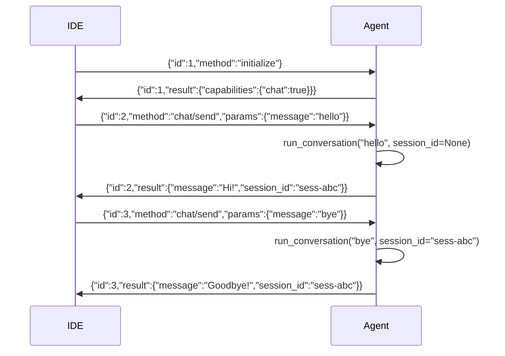

# ch18_acp_integration

# ACP integration

Harness Agent tutorial — `ch18_acp_integration.ipynb`


## Chapter objectives

- Understand the **ACP (Agent Communication Protocol)** stdio JSON-RPC server.
- Trace the two supported methods: `initialize` and `chat/send`.
- Simulate ACP message exchange without running the full server.
- Understand how IDEs like VS Code use ACP to integrate Harness Agent.


## Prerequisites

Prior chapters through ch18; see SYLLABUS.md.


## Concept: ACP integration

**ACP (Agent Communication Protocol)** is a lightweight stdio JSON-RPC protocol that lets IDE extensions communicate with an agent process. Harness Agent exposes a minimal ACP server at `acp/server.py`.

### Communication model

The IDE extension launches `harness-agent acp` as a subprocess and communicates via **stdin/stdout** using newline-delimited JSON:

```
IDE → agent:   {"id": 1, "method": "initialize", "params": {}}
agent → IDE:   {"id": 1, "result": {"capabilities": {"chat": true}}}

IDE → agent:   {"id": 2, "method": "chat/send", "params": {"message": "What is 2+2?"}}
agent → IDE:   {"id": 2, "result": {"message": "4", "session_id": "sess-abc123"}}
```

### Supported methods (`acp/server.py`)

| Method | Request params | Response result |
|--------|---------------|-----------------|
| `initialize` | `{}` | `{"capabilities": {"chat": true}}` |
| `chat/send` | `{"message": "<text>"}` | `{"message": "<reply>", "session_id": "<id>"}` |
| anything else | — | `{"error": "unknown method: <name>"}` |

### Session management

The ACP server maintains **one session per process**. The `session_id` returned by the first `chat/send` call is stored in a local variable and reused for all subsequent calls in the same stdio stream:

```python
session_id: str | None = None   # module-level in run_acp_stdio()

# After first chat/send:
result = agent.run_conversation(text, session_id=session_id)
session_id = result.session_id  # stored for next call
```

### Why stdio JSON-RPC?

- **No port management**: IDE extensions spawn a subprocess; no port conflicts.
- **Language-agnostic**: Any IDE can read/write JSON lines regardless of language.
- **Process isolation**: Each IDE window gets its own agent process and session.
- **Simple protocol**: `{id, method, params}` in, `{id, result}` out — 40 lines of Python.


## How it works — annotated source

```python
# acp/server.py — run_acp_stdio()

def run_acp_stdio() -> None:
    agent = AIAgent()                    # (1) one agent, one session per process
    session_id: str | None = None

    for line in sys.stdin:              # (2) read one JSON line at a time
        line = line.strip()
        if not line:
            continue
        req = json.loads(line)          # (3) parse request
        method = req.get("method")
        req_id = req.get("id")

        if method == "initialize":      # (4) handshake — announce capabilities
            _reply(req_id, {"capabilities": {"chat": True}})
            continue

        if method == "chat/send":       # (5) forward message to agent
            text = req.get("params", {}).get("message", "")
            result = agent.run_conversation(text, session_id=session_id)
            session_id = result.session_id   # (6) sticky session
            _reply(req_id, {
                "message": result.assistant_text,
                "session_id": session_id,
            })
            continue

        _reply(req_id, {"error": f"unknown method: {method}"})  # (7) fallback


def _reply(req_id, result):
    sys.stdout.write(json.dumps({"id": req_id, "result": result}) + "\n")
    sys.stdout.flush()                  # (8) flush immediately — no buffering
```




## Reference implementation map

| Harness Agent | Nous Research agent (`REFERENCE_REPO_PATH`) | OpenClaw |
|---------------|---------------------------------------------|----------|
| ``acp/server.py`` | search architecture guide | SOUL/gateway patterns |

Open upstream files only under your optional clone — not bundled in this tutorial.


## Design choices

| Choice | Rationale |
|--------|-----------|
| Stdio JSON-RPC | No port conflicts, works in any IDE sandbox |
| One session per process | Matches IDE model — one window = one agent = one history |
| `sys.stdout.flush()` after each reply | Prevents buffering delays in interactive use |
| Unknown methods return `{error: ...}` | Graceful — IDE won't hang waiting for a response |
| `initialize` handshake | Lets IDE confirm server is up before sending user messages |
| No async | Blocking `for line in sys.stdin` keeps code simple; IDE sends one request at a time |

**Extension points:**
- Add new methods (e.g. `tools/list`, `session/reset`) by extending the `if method == ...` chain.
- Log all requests to a file for debugging by wrapping the `for line` loop.
- Add authentication by checking a token in `initialize` params.


## Implementation walkthrough


```python
import json

# Simulate the ACP server's _reply() function
def _reply(req_id, result):
    line = json.dumps({"id": req_id, "result": result})
    print(f"→ {line}")
    return line

# Simulate the server-side message handling
session_id = None
capabilities_announced = False

def handle_request(raw_line: str) -> str:
    global session_id, capabilities_announced
    req = json.loads(raw_line)
    method = req.get("method")
    req_id = req.get("id")

    if method == "initialize":
        capabilities_announced = True
        return _reply(req_id, {"capabilities": {"chat": True}})

    if method == "chat/send":
        params = req.get("params", {})
        text = params.get("message", "")
        # In real server: result = agent.run_conversation(text, session_id=session_id)
        # Here we simulate the response
        simulated_reply = f"[simulated reply to: {text!r}]"
        simulated_sid   = session_id or "sess-new-001"
        session_id = simulated_sid
        return _reply(req_id, {"message": simulated_reply, "session_id": simulated_sid})

    return _reply(req_id, {"error": f"unknown method: {method}"})

# Trace the full handshake + conversation
print("=== ACP Session Trace ===\n")

msgs = [
    {"id": 1, "method": "initialize", "params": {}},
    {"id": 2, "method": "chat/send",  "params": {"message": "Hello!"}},
    {"id": 3, "method": "chat/send",  "params": {"message": "What tools do you have?"}},
    {"id": 4, "method": "unknown_method", "params": {}},
]

for msg in msgs:
    print(f"← {json.dumps(msg)}")
    handle_request(json.dumps(msg))
    print()

print(f"\nFinal session_id: {session_id!r}")
print(f"Capabilities announced: {capabilities_announced}")

```

## Trace: simulating the full ACP stdio stream


```python
import json, io, sys

# Simulate the full ACP server using StringIO instead of real stdin/stdout
# This mirrors run_acp_stdio() without needing a live agent

def run_acp_simulation(input_lines: list[dict]) -> list[dict]:
    """Simulate run_acp_stdio() on a list of request dicts."""
    responses = []
    session_id = None

    for req in input_lines:
        method = req.get("method")
        req_id = req.get("id")

        if method == "initialize":
            responses.append({"id": req_id, "result": {"capabilities": {"chat": True}}})

        elif method == "chat/send":
            text = req.get("params", {}).get("message", "")
            session_id = session_id or "sess-sim-001"
            # Simulated agent response (no LLM needed)
            responses.append({"id": req_id, "result": {
                "message": f"Echo: {text}",
                "session_id": session_id,
            }})

        else:
            responses.append({"id": req_id, "result": {"error": f"unknown method: {method}"}})

    return responses

# A typical IDE startup sequence
requests = [
    {"id": 1, "method": "initialize", "params": {}},
    {"id": 2, "method": "chat/send",  "params": {"message": "What can you do?"}},
    {"id": 3, "method": "chat/send",  "params": {"message": "List my tools"}},
    {"id": 4, "method": "bad_method", "params": {}},
]

responses = run_acp_simulation(requests)
print("ACP exchange (newline-delimited JSON):\n")
for req, resp in zip(requests, responses):
    print(f"→ {json.dumps(req)}")
    print(f"← {json.dumps(resp)}\n")

# Verify session_id continuity
sids = [r["result"].get("session_id") for r in responses if "session_id" in r.get("result", {})]
print(f"Session IDs across turns: {sids}")
print(f"All same? {len(set(sids)) == 1}")

```

## Hands-on exercises

1. **Start the ACP server**: Run `harness-agent acp` in a terminal. In another terminal, send JSON lines via `echo '{"id":1,"method":"initialize","params":{}}' | nc 127.0.0.1 <port>` or pipe directly to the process stdin.

2. **Add a new method**: Extend `run_acp_stdio()` to support `{"method": "session/reset"}` which sets `session_id = None`, forcing the next `chat/send` to start a fresh session.

3. **Verify session continuity**: Send `initialize` then 3 `chat/send` requests and confirm all three responses contain the same `session_id`.

4. **Simulate large input**: Write a loop that sends 100 `chat/send` requests through `run_acp_simulation()` and confirms all responses have `"message"` keys.

5. **Add `tools/list` method**: Implement a new handler that returns `{"tools": list(get_registry().list_available())}` so IDE extensions can show available tools in autocomplete.

6. **Error recovery**: Send malformed JSON (missing closing brace). Observe that the `json.JSONDecodeError` causes `continue` — the server skips the bad line and remains alive for the next message.


## Common pitfalls

| Pitfall | Symptom | Fix |
|---------|---------|-----|
| stdout buffering | IDE hangs waiting for reply | Always call `sys.stdout.flush()` after writing — already in `_reply()` |
| Newline missing in output | IDE parser gets garbled messages | Ensure each reply ends with `\n` |
| `initialize` not sent first | Some IDEs reject `chat/send` before handshake | Always send `initialize` as the first message |
| Malformed JSON from IDE | `json.JSONDecodeError` crashes server | Wrap `json.loads` in try/except and `continue` on error |
| Session lost between invocations | Each `harness-agent acp` invocation starts fresh | For persistent sessions, store `session_id` in a file between runs |
| Unknown method not handled | Server hangs (no response) | Always include a fallback `_reply(req_id, {"error": ...})` |
| Binary or mixed-encoding input | `UnicodeDecodeError` | ACP uses UTF-8; ensure IDE sends UTF-8 encoded lines |


## Checkpoint questions

1. What communication channel does ACP use instead of HTTP? Why is this suitable for IDE integration?
2. List the two supported methods in `run_acp_stdio()`. What does each one return?
3. How does the ACP server maintain session continuity across multiple `chat/send` calls?
4. What happens if the IDE sends a `chat/send` before `initialize`?
5. What does `sys.stdout.flush()` do after each reply, and why is it critical?
6. If the IDE sends malformed JSON, what does the server do? Does it crash or continue?
7. How many `AIAgent` instances does one `run_acp_stdio()` invocation create?


## Summary

| Concept | Key detail |
|---------|-----------|
| ACP protocol | Stdio newline-delimited JSON-RPC: `{id, method, params}` in, `{id, result}` out |
| `initialize` | Handshake — returns `{"capabilities": {"chat": true}}` |
| `chat/send` | Passes `params.message` to agent, returns `{message, session_id}` |
| Session | One per process — `session_id` stored in local var, reused across calls |
| Unknown methods | Return `{"error": "unknown method: <name>"}` — no hang |
| `sys.stdout.flush()` | Critical — prevents IDE from blocking on buffered output |
| CLI command | `harness-agent acp` |

**ch19** covers trajectory export — converting stored sessions into fine-tuning datasets.

