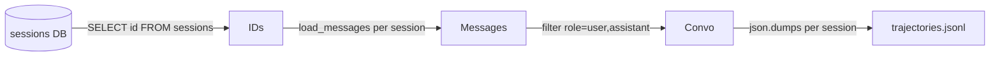

# ch19_trajectories_and_batch

# Trajectories and batch

Harness Agent tutorial — `ch19_trajectories_and_batch.ipynb`


## Chapter objectives

- Understand how `export_trajectories()` converts SQLite sessions to ShareGPT JSONL.
- Inspect the ShareGPT format and understand why it's the standard for fine-tuning.
- Run a trajectory export and read the output file.
- Understand which message roles are exported and how tool calls are handled.


## Prerequisites

Prior chapters through ch19; see SYLLABUS.md.


## Concept: Trajectories and batch export

A **trajectory** is a complete conversation — a sequence of user messages and agent replies — stored in SQLite. `export_trajectories()` converts those stored sessions into **ShareGPT-format JSONL**, the most widely supported format for supervised fine-tuning.

### ShareGPT format

Each line in the JSONL file is one session:

```json
{
  "conversations": [
    {"from": "human", "value": "What is 2+2?"},
    {"from": "gpt",   "value": "4"},
    {"from": "human", "value": "And 3+3?"},
    {"from": "gpt",   "value": "6"}
  ],
  "session_id": "sess-abc123"
}
```

- `"human"` = user messages (`role == "user"`)
- `"gpt"` = assistant messages (`role == "assistant"`)
- Tool calls and tool results are **excluded** — only conversational turns are exported

### Export logic (`trajectories/export.py:12-29`)

```python
def export_trajectories(output: Path) -> int:
    store = SessionStore()
    sessions = conn.execute("SELECT id FROM sessions").fetchall()
    with output.open("w") as fh:
        for row in sessions:
            messages = store.load_messages(row["id"])
            convo = []
            for m in messages:
                if m.role in ("user", "assistant") and m.content:
                    convo.append({
                        "from": "human" if m.role == "user" else "gpt",
                        "value": m.content,
                    })
            if convo:
                fh.write(json.dumps({"conversations": convo, "session_id": ...}) + "\n")
    return count   # number of sessions exported
```

### Why ShareGPT?

| Tool | ShareGPT support |
|------|-----------------|
| LLaMA-Factory | ✅ native |
| Axolotl | ✅ native |
| Unsloth | ✅ native |
| OpenAI fine-tuning | close (needs minor conversion) |
| HuggingFace TRL SFTTrainer | ✅ with `dataset_text_field` |

**CLI command:** `harness-agent export-trajectories --output trajectories.jsonl`


## How it works — annotated source

```python
# trajectories/export.py — export_trajectories()

def export_trajectories(output: Path) -> int:
    store = SessionStore()
    count = 0

    # (1) fetch all session IDs
    with store._connect() as conn:
        sessions = conn.execute("SELECT id FROM sessions").fetchall()

    output.parent.mkdir(parents=True, exist_ok=True)

    with output.open("w", encoding="utf-8") as fh:
        for row in sessions:
            sid = row["id"]
            messages = store.load_messages(sid)  # (2) full message history

            convo = []
            for m in messages:
                # (3) filter: user + assistant only; skip tool calls/results
                if m.role in ("user", "assistant") and m.content:
                    convo.append({
                        "from": "human" if m.role == "user" else "gpt",
                        "value": m.content,
                    })

            if convo:                            # (4) skip sessions with no messages
                fh.write(json.dumps({
                    "conversations": convo,
                    "session_id": sid,
                }) + "\n")                       # (5) one JSON line per session
                count += 1

    return count                                 # (6) number of sessions exported
```



**Role mapping:**

| SQLite `role` | ShareGPT `from` | Included? |
|--------------|----------------|-----------|
| `user` | `"human"` | ✅ yes |
| `assistant` | `"gpt"` | ✅ yes (if content non-empty) |
| `tool` | — | ❌ excluded |
| `system` | — | ❌ excluded |


## Reference implementation map

| Harness Agent | Nous Research agent (`REFERENCE_REPO_PATH`) | OpenClaw |
|---------------|---------------------------------------------|----------|
| ``trajectories/export.py`` | search architecture guide | SOUL/gateway patterns |

Open upstream files only under your optional clone — not bundled in this tutorial.


## Design choices

| Choice | Rationale |
|--------|-----------|
| ShareGPT format | Widest tool support: LLaMA-Factory, Axolotl, Unsloth, TRL |
| User + assistant only | Tool calls are intermediate steps, not training targets |
| Skip empty content | Assistant messages with only tool calls have `content=None`; excluded cleanly |
| One line per session | JSONL is streaming-friendly — append new sessions without rewriting |
| `session_id` in output | Enables tracing a training example back to its source conversation |
| All sessions exported | No filtering — curate manually or with a post-processing script |

**Post-processing tips:**
- Filter by session length: `[c for c in data if len(c["conversations"]) >= 4]`
- Filter out error sessions: skip any where the last assistant turn starts with `[cron error]`
- Convert to OpenAI format: map `human`→`user`, `gpt`→`assistant` under `{"messages": [...]}`


## Implementation walkthrough


```python
import os, json, tempfile
from pathlib import Path
os.environ.setdefault('HARNESS_AGENT_HOME', 'labs')

from harness_agent.trajectories.export import export_trajectories

# Export whatever sessions exist in labs/sessions.db
out = Path('labs/trajectories.jsonl')
count = export_trajectories(out)
print(f"Exported {count} session(s) to {out}")

# Show the structure of what was exported
if out.exists() and out.stat().st_size > 0:
    with out.open() as f:
        first_line = f.readline().strip()
    data = json.loads(first_line)
    print(f"\nFirst session structure:")
    print(f"  session_id   : {data.get('session_id', 'N/A')}")
    print(f"  conversations: {len(data.get('conversations', []))} turns")
    for i, turn in enumerate(data.get('conversations', [])[:4]):
        preview = turn['value'][:60].replace('\n', ' ')
        print(f"  [{i}] from={turn['from']!r}  value={preview!r}...")
else:
    print("\nNo sessions found. Run some chat turns first (ch06 or ch21).")
    # Demonstrate the format with a synthetic example
    synthetic = {
        "conversations": [
            {"from": "human", "value": "What is 2+2?"},
            {"from": "gpt",   "value": "4"},
            {"from": "human", "value": "And 3+3?"},
            {"from": "gpt",   "value": "6"},
        ],
        "session_id": "example-sess-001"
    }
    print("\nExpected output format (one line per session):")
    print(json.dumps(synthetic, indent=2))

```

## Trace: post-processing exported trajectories


```python
import json
from pathlib import Path

# Simulate what the export produces and show post-processing patterns
synthetic_export = [
    {
        "conversations": [
            {"from": "human", "value": "What is 2+2?"},
            {"from": "gpt",   "value": "4"},
            {"from": "human", "value": "And 3+3?"},
            {"from": "gpt",   "value": "6"},
        ],
        "session_id": "sess-001"
    },
    {
        "conversations": [
            {"from": "human", "value": "hi"},
            {"from": "gpt",   "value": "[cron error] No API key"},
        ],
        "session_id": "sess-002"
    },
    {
        "conversations": [
            {"from": "human", "value": "Explain Python decorators in depth"},
            {"from": "gpt",   "value": "A decorator is a function that..."},
            {"from": "human", "value": "Can you give an example?"},
            {"from": "gpt",   "value": "Sure! Here's @property..."},
            {"from": "human", "value": "What about stacking decorators?"},
            {"from": "gpt",   "value": "Yes, decorators are applied bottom-up..."},
        ],
        "session_id": "sess-003"
    },
]

# Filter: keep only sessions with ≥ 4 turns
good = [s for s in synthetic_export if len(s["conversations"]) >= 4]
print(f"Sessions with ≥ 4 turns: {len(good)}/{len(synthetic_export)}")

# Filter: remove sessions with cron errors
no_errors = [s for s in synthetic_export
             if not any("[cron error]" in t["value"] for t in s["conversations"])]
print(f"Sessions without errors: {len(no_errors)}/{len(synthetic_export)}")

# Convert to OpenAI fine-tuning format
def to_openai_format(session: dict) -> dict:
    role_map = {"human": "user", "gpt": "assistant"}
    messages = [{"role": role_map[t["from"]], "content": t["value"]}
                for t in session["conversations"]]
    return {"messages": messages}

print(f"\nOpenAI format for first good session:")
print(json.dumps(to_openai_format(good[0]), indent=2))

```

## Hands-on exercises

1. **Export after chat**: Run a few turns via `harness-agent chat`, then call `export_trajectories(Path("labs/trajectories.jsonl"))`. Read and inspect the output file.

2. **Count exported turns**: Load the JSONL file and compute the average number of turns per session:
   ```python
   import json
   data = [json.loads(l) for l in Path("labs/trajectories.jsonl").read_text().splitlines()]
   avg = sum(len(s["conversations"]) for s in data) / len(data)
   print(f"Average turns per session: {avg:.1f}")
   ```

3. **Filter by quality**: Keep only sessions with ≥ 4 turns and no error messages. Write the filtered sessions to a separate JSONL file.

4. **Convert to OpenAI format**: Use the `to_openai_format()` function from cell-10 to convert a session to the OpenAI fine-tuning format and write it to `openai_finetuning.jsonl`.

5. **CLI export**: Run `harness-agent export-trajectories --output labs/cli_export.jsonl` and compare the output to the programmatic export.

6. **Inspect tool-call turns**: Add a debug flag to `export_trajectories()` that also exports `tool` role messages, to understand what the model was doing during a session.


## Common pitfalls

| Pitfall | Symptom | Fix |
|---------|---------|-----|
| No sessions in DB | Exported 0 sessions | Run at least one `chat` or `gateway` session first |
| Empty `content` on assistant turns | Turn excluded from export | These are tool-call-only turns — expected behaviour |
| JSONL not newline-terminated | Last line missing from downstream parsers | Use `.write(...+ "\n")` — already in the implementation |
| Exporting all sessions including errors | Noisy training data | Post-filter: skip sessions with `[cron error]` in any turn |
| Large DB | Export takes a long time | Add `WHERE created > ?` to the SQL query to export recent sessions only |
| Training on system prompts | Model learns prompt format, not task | System and tool messages are excluded — only user/assistant are exported |
| Duplicate sessions | Same conversation exported twice | Each session has a unique `session_id`; check for ID collisions if merging exports |


## Checkpoint questions

1. What is the output format of `export_trajectories()`? How many JSON objects are on each line?
2. Which message roles are exported? Which are excluded and why?
3. What does `"from": "human"` correspond to in terms of `Message.role`?
4. What does `export_trajectories()` return — a path, a count, or the data itself?
5. What would happen to a session where every assistant turn is a tool call with no text content?
6. Name three fine-tuning frameworks that natively support the ShareGPT format.
7. How would you filter the JSONL export to keep only sessions with at least 6 turns?


## Summary

| Concept | Key detail |
|---------|-----------|
| `export_trajectories(output)` | Reads all SQLite sessions, writes ShareGPT JSONL |
| ShareGPT format | `{"conversations": [{"from": "human"/"gpt", "value": "..."}], "session_id": "..."}` |
| Role mapping | `user` → `"human"`, `assistant` → `"gpt"` |
| Excluded roles | `system`, `tool` — intermediate steps, not training targets |
| Return value | `int` — number of sessions exported |
| CLI command | `harness-agent export-trajectories --output <path>` |
| Fine-tuning targets | LLaMA-Factory, Axolotl, Unsloth, HuggingFace TRL |

**ch20** covers plugins and hooks — extending the agent with new tools without touching the core package.

