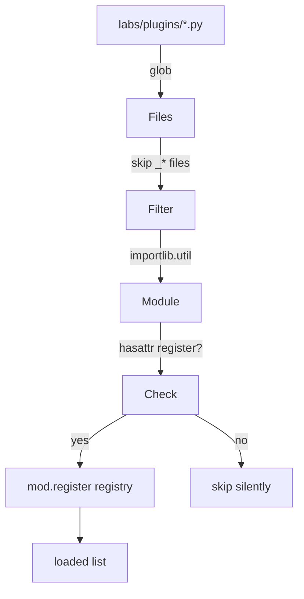

# ch20_plugins_and_hooks

# Plugins and hooks

Harness Agent tutorial — `ch20_plugins_and_hooks.ipynb`


## Chapter objectives

- Understand how `discover_plugins()` dynamically loads tool plugins from the filesystem.
- Trace the import mechanism using `importlib.util`.
- Write and load a minimal plugin that registers a new tool.
- Understand the `register(registry)` contract that all plugins must satisfy.


## Prerequisites

Prior chapters through ch20; see SYLLABUS.md.


## Concept: Plugins and hooks

Plugins let you add new tools to Harness Agent **without modifying the core package**. They are plain Python files dropped into `<HARNESS_AGENT_HOME>/plugins/` that call `register(registry)` to install their tools.

### Discovery mechanism (`plugins/loader.py`)

```python
def discover_plugins() -> list[str]:
    plugins_dir = cfg.home / "plugins"
    plugins_dir.mkdir(parents=True, exist_ok=True)
    loaded = []
    for path in plugins_dir.glob("*.py"):
        if path.name.startswith("_"):    # skip __init__.py etc.
            continue
        spec = importlib.util.spec_from_file_location(path.stem, path)
        mod  = importlib.util.module_from_spec(spec)
        spec.loader.exec_module(mod)     # dynamic import by file path
        if hasattr(mod, "register"):     # optional — skip if absent
            mod.register(get_registry())
            loaded.append(path.stem)
    return loaded                        # list of loaded plugin names
```

### Plugin contract

A minimal plugin file:

```python
# labs/plugins/hello_plugin.py

def hello(name: str = "world") -> str:
    """Say hello."""
    return f"Hello, {name}!"

def register(registry) -> None:
    registry.register(
        name="hello",
        description="Greet a name",
        parameters={"type": "object", "properties": {"name": {"type": "string"}},
                    "required": []},
        fn=hello,
    )
```

### When plugins are loaded

`discover_plugins()` is called once during `AIAgent.__init__()` when the agent starts. Plugins discovered after startup are not hot-reloaded — restart the agent to pick up new files.

| Concern | Detail |
|---------|--------|
| Location | `<HARNESS_AGENT_HOME>/plugins/*.py` |
| Discovery | `importlib.util.spec_from_file_location()` (no `sys.path` pollution) |
| Contract | Module must have a `register(registry)` function |
| Skip rule | Files starting with `_` are ignored |
| Return | List of successfully loaded plugin module names |


## How it works — annotated source

```python
# plugins/loader.py — discover_plugins()

def discover_plugins() -> list[str]:
    cfg = get_config()
    plugins_dir = cfg.home / "plugins"
    plugins_dir.mkdir(parents=True, exist_ok=True)  # (1) ensure directory exists
    loaded: list[str] = []

    for path in plugins_dir.glob("*.py"):           # (2) find all .py files
        if path.name.startswith("_"):               # (3) skip __init__.py, _helpers.py
            continue

        spec = importlib.util.spec_from_file_location(path.stem, path)  # (4) create spec
        if not spec or not spec.loader:
            continue
        mod = importlib.util.module_from_spec(spec)  # (5) create module object
        spec.loader.exec_module(mod)                  # (6) execute the file

        if hasattr(mod, "register"):                 # (7) check for contract function
            mod.register(get_registry())              # (8) call register(registry)
            loaded.append(path.stem)                 # (9) record success

    return loaded
```



**Why `importlib.util` instead of `import`?**

- `spec_from_file_location()` loads by **file path**, not by Python module name — no `sys.path` modification needed.
- Each plugin gets its own module object, preventing name collisions between plugins.
- If loading fails (syntax error), it raises immediately with a clear traceback pointing to the plugin file.


## Reference implementation map

| Harness Agent | Nous Research agent (`REFERENCE_REPO_PATH`) | OpenClaw |
|---------------|---------------------------------------------|----------|
| ``plugins/loader.py`` | search architecture guide | SOUL/gateway patterns |

Open upstream files only under your optional clone — not bundled in this tutorial.


## Design choices

| Choice | Rationale |
|--------|-----------|
| File-path import via `importlib.util` | No `sys.path` mutation; clean isolation per plugin |
| `register(registry)` convention | Single entry point; easy to verify and document |
| Skip `_*` files | Avoids accidentally loading private helpers or `__init__.py` |
| No hot reload | Simplicity; production agents restart on config change |
| `plugins_dir.mkdir(parents=True, exist_ok=True)` | Directory is auto-created — zero setup for new users |
| Return list of loaded names | Callers can log/verify what was loaded; empty list means no plugins |

**Extension points:**
- Add a `teardown(registry)` convention for plugins that need cleanup.
- Support subdirectories by replacing `glob("*.py")` with `rglob("*.py")`.
- Add error isolation: catch exceptions per plugin so one broken plugin doesn't block others.


## Implementation walkthrough


```python
import os, pathlib
os.environ.setdefault('HARNESS_AGENT_HOME', 'labs')

# Ensure the plugins directory exists
plugins_dir = pathlib.Path('labs/plugins')
plugins_dir.mkdir(parents=True, exist_ok=True)

# Write a minimal example plugin
plugin_code = '''
def greet(name: str = "world") -> str:
    """Greet a name — example plugin tool."""
    return f"Hello, {name}! (from hello_plugin)"

def register(registry) -> None:
    registry.register(
        name="greet",
        description="Greet a name",
        parameters={
            "type": "object",
            "properties": {"name": {"type": "string", "description": "Name to greet"}},
            "required": [],
        },
        fn=greet,
    )
'''
(plugins_dir / "hello_plugin.py").write_text(plugin_code)
print(f"Wrote hello_plugin.py to {plugins_dir}")

# Discover plugins
from harness_agent.plugins.loader import discover_plugins
loaded = discover_plugins()
print(f"\nDiscovered plugins: {loaded}")

# Confirm the tool is now in the registry
from harness_agent.tools.registry import get_registry
registry = get_registry()
available = registry.list_available()
print(f"\n'greet' in registry: {'greet' in available}")

# Call the tool directly
if 'greet' in available:
    result = registry.dispatch("greet", {"name": "Harness"})
    print(f"registry.dispatch('greet', {{name: 'Harness'}}): {result!r}")

```

## Trace: inspecting the plugin import mechanism


```python
import importlib.util, pathlib, tempfile

# Demonstrate importlib.util loading without sys.path changes
tmp_dir = pathlib.Path(tempfile.mkdtemp())
plugin_path = tmp_dir / "weather_plugin.py"

plugin_path.write_text('''
TOOL_NAME = "get_weather"

def get_weather(city: str) -> str:
    """Return fake weather for a city."""
    return f"Sunny, 22°C in {city}"

def register(registry) -> None:
    registry.register(
        name=TOOL_NAME,
        description="Get current weather for a city",
        parameters={"type": "object", "properties": {
            "city": {"type": "string"}}, "required": ["city"]},
        fn=get_weather,
    )

print(f"  [weather_plugin] loaded — tool name: {TOOL_NAME}")
''')

print(f"Plugin file: {plugin_path}")
print(f"sys.path unchanged during load\n")

# Step-by-step import
spec = importlib.util.spec_from_file_location("weather_plugin", plugin_path)
print(f"1. spec created: {spec}")
mod  = importlib.util.module_from_spec(spec)
print(f"2. module object: {mod}")
print(f"3. executing module:")
spec.loader.exec_module(mod)
print(f"4. has 'register': {hasattr(mod, 'register')}")
print(f"5. TOOL_NAME = {mod.TOOL_NAME!r}")

# Test the tool function directly before registering
result = mod.get_weather("Paris")
print(f"6. Direct call: get_weather('Paris') = {result!r}")

```

## Hands-on exercises

1. **Create a real plugin**: Write `labs/plugins/timestamp_plugin.py` with a `get_timestamp()` tool that returns `datetime.now().isoformat()`. Call `discover_plugins()` and verify the tool appears in the registry.

2. **Plugin without `register`**: Create `labs/plugins/no_register.py` with only a `def helper(): pass`. Confirm it loads without error and is **not** included in the returned list.

3. **Skip `_*` files**: Create `labs/plugins/_private.py` and call `discover_plugins()`. Confirm `_private` is not in the result.

4. **Multi-tool plugin**: Write a plugin that registers two tools (`add_numbers` and `multiply_numbers`) in one `register()` call.

5. **Broken plugin**: Add a syntax error to a plugin file. Observe the `SyntaxError` traceback — it names the file and line, making debugging easy. Fix the plugin.

6. **Plugin ordering**: Add two plugins that both register a tool named `"greet"`. Observe that the second registration overwrites the first. Use unique tool names to avoid conflicts.

7. **Inspect registry before/after**: Print `registry.list_available()` before and after `discover_plugins()` to see exactly which tools were added.


## Common pitfalls

| Pitfall | Symptom | Fix |
|---------|---------|-----|
| Syntax error in plugin | `SyntaxError` at load time | Fix the plugin file; error includes filename and line number |
| Plugin registered after `AIAgent` init | Tool not visible to agent | Call `discover_plugins()` before creating `AIAgent`, or restart |
| Two plugins with same tool name | Second overwrites first silently | Use unique, namespaced tool names (e.g. `myapp_greet`) |
| `register` not called by loader | Plugin loaded but tool not in registry | Verify `hasattr(mod, "register")` — function must exist and be named exactly `register` |
| `_private.py` accidentally exposes tools | — | Files starting with `_` are skipped by `discover_plugins()` |
| Plugin imports a missing dependency | `ImportError` at `exec_module` | Add try/except in `discover_plugins()` or install the missing package |
| Hot reload expected | Plugin changes not picked up | No hot reload — restart agent or call `discover_plugins()` again |


## Checkpoint questions

1. Where does `discover_plugins()` look for plugin files? What determines the search path?
2. What two conditions must be true for a plugin file to be loaded?
3. What function name must a plugin module define to have its tools registered?
4. Why does `discover_plugins()` use `importlib.util` rather than a regular `import` statement?
5. What does `discover_plugins()` return — the loaded modules, tool names, or plugin file names?
6. What happens if a plugin file contains a syntax error?
7. If you drop a new plugin into `labs/plugins/` while the agent is running, when does it take effect?


## Summary

| Concept | Key detail |
|---------|-----------|
| `discover_plugins()` | Globs `<HARNESS_AGENT_HOME>/plugins/*.py`, imports each, calls `register()` |
| Plugin location | `labs/plugins/<name>.py` (or any `HARNESS_AGENT_HOME`) |
| Skip rule | Files starting with `_` are ignored |
| `importlib.util` | File-path import — no `sys.path` modification |
| Plugin contract | Module must define `register(registry)` function |
| Return value | `list[str]` of loaded plugin module stems |
| Load timing | Once at `AIAgent.__init__()` — no hot reload |

**ch21** brings everything together in the full system integration capstone.

