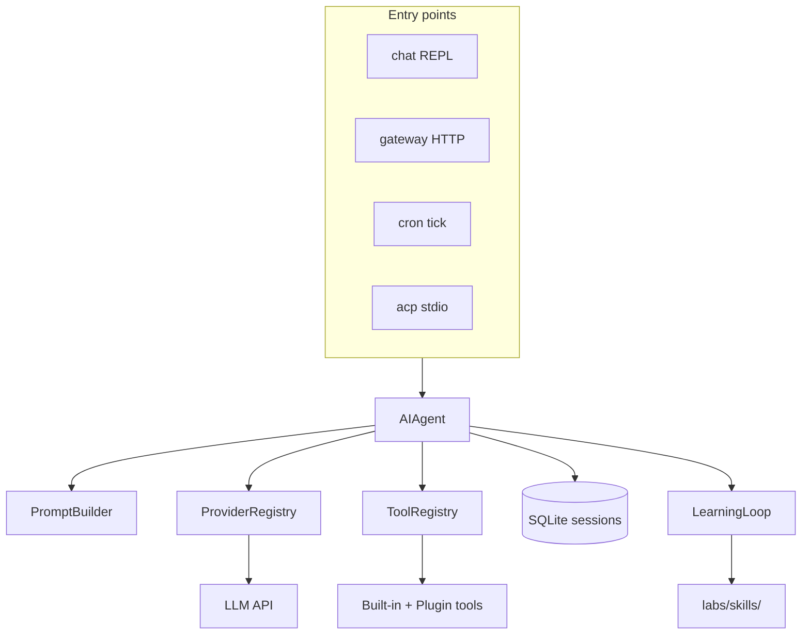

# ch21_full_system_integration

# Full system integration

Harness Agent tutorial — `ch21_full_system_integration.ipynb`


## Chapter objectives

- Run the **complete Harness Agent stack** and verify each subsystem works.
- Complete the capstone checklist: doctor, chat, session search, skill authoring, export, cron, plugins.
- Understand how all subsystems compose — entry points → agent → tools → session → prompt → provider.
- Debug cross-subsystem issues using the sessions DB and structured observations.


## Prerequisites

ch00–ch20 completed or package installed; API key for live agent runs.


## Concept: Operating Harness Agent as a full system

A complete Harness Agent deployment is **subsystems composed**. Each chapter has covered one subsystem. This chapter shows how they connect at runtime.

### Subsystem map

| Subsystem | Entry point | Chapter |
|-----------|------------|---------|
| Interactive chat | `harness-agent chat` | ch15 |
| HTTP webhook automation | `harness-agent gateway run` | ch15 |
| Scheduled agent jobs | `harness-agent cron tick` | ch14 |
| IDE integration | `harness-agent acp` | ch18 |
| Fine-tuning export | `harness-agent export-trajectories` | ch19 |
| System health check | `harness-agent doctor` | ch21 |

### Shared core

All entry points funnel into the same `AIAgent`:

```
Entry point (chat / gateway / cron / acp)
    ↓
AIAgent.run_conversation(text, session_id?)
    ├── PromptBuilder  → system prompt
    ├── ProviderRegistry → LLM adapter
    ├── ToolRegistry   → tool dispatch
    ├── SessionStore   → SQLite persistence
    ├── LearningLoop   → skill authoring trigger
    └── Compression    → context window management
```

### Full data flow



### Capstone checklist

1. `harness-agent doctor` — all green
2. `harness-agent chat` — multi-turn conversation with a tool call
3. `search_sessions` finds text from step 2
4. A complex task creates a skill under `labs/skills/`
5. `harness-agent export-trajectories` — JSONL written
6. `harness-agent cron tick` — job runs or reports error clearly
7. `discover_plugins()` loads `hello_plugin`


## How the subsystems compose

Every subsystem is independently testable but designed to work together. Here's how the key interfaces connect:

### Entry point → AIAgent

```python
# All four entry points use the same call:
result = agent.run_conversation(text, session_id=session_id)
# result.assistant_text — the reply
# result.session_id    — stored for multi-turn continuity
```

### AIAgent → ProviderRegistry

```python
provider, model = registry.resolve(
    provider_name=config.default_provider,  # or HARNESS_DEFAULT_PROVIDER
    model=config.default_model,             # or HARNESS_DEFAULT_MODEL
)
text, tool_calls = provider.complete_with_tools(messages, schemas, model=model)
```

### AIAgent → ToolRegistry → TerminalBackend

```python
# Tool dispatch
result = self.registry.dispatch(call.name, call.arguments)
# For shell tools specifically:
exit_code, stdout, stderr = get_terminal_backend().run(command)
```

### AIAgent → SessionStore → SQLite

```python
# After each turn:
store.append_turn(session_id, role="assistant", content=text)
# FTS5 full-text search across all sessions:
results = store.search("some text", limit=5)
```

### AIAgent → LearningLoop → SkillCatalog

```python
# At end of run_conversation():
if learning.should_author_skill(tool_call_count, had_error):
    learning.maybe_write_skill(messages)  # creates labs/skills/<name>/SKILL.md
```

### Plugin → ToolRegistry

```python
# Plugin's register() function:
def register(registry):
    registry.register(name="my_tool", description="...", parameters={...}, fn=my_tool_fn)
# Tools registered here appear in registry.openai_schemas() → sent to LLM on next turn
```


## Reference implementation map

| Capability | Harness Agent | External peers |
|------------|---------------|----------------|
| Full stack | this repo | Nous Research agent, OpenClaw |
| Scale | tutorial | 70+ tools, 20+ platforms |

Use `REFERENCE_REPO_PATH` to diff modules side by side when contributing upstream.


## Design choices for the full stack

| Choice | Rationale |
|--------|-----------|
| Shared `AIAgent` across entry points | Single registry load, single provider init — DRY |
| `session_id` as the continuity primitive | Decouples routing (gateway) from storage (SQLite) |
| Isolated agents for cron | Scheduled jobs can't corrupt interactive sessions |
| JSON-first persistence | SQLite for sessions, JSON for jobs — both human-inspectable |
| Plugins discovered once at startup | Predictable — tool set is stable per agent process |
| `harness-agent doctor` as first command | Health check surfaces configuration issues early |

**Extending the stack:**

1. **New tool** → add to `ToolRegistry` or drop a plugin into `labs/plugins/`
2. **New entry point** → wrap `agent.run_conversation()` in your protocol handler
3. **New provider** → subclass `BaseProvider`, register in `get_provider_registry()`
4. **New terminal environment** → subclass `TerminalBackend`, add branch in `get_terminal_backend()`
5. **Custom skill storage** → extend `SkillCatalog.discover()` to search additional directories


## Implementation walkthrough


```python
import os
os.environ.setdefault('HARNESS_AGENT_HOME', 'labs')

# Capstone step 1: verify all subsystems import cleanly
print("=== Capstone: subsystem import check ===\n")

from harness_agent.agent import AIAgent
print("✓ AIAgent")

from harness_agent.tools.registry import get_registry
print("✓ ToolRegistry:", len(get_registry().list_available()), "tools registered")

from harness_agent.providers.registry import get_provider_registry
reg = get_provider_registry()
print("✓ ProviderRegistry:", list(reg._providers.keys()))

from harness_agent.sessions.store import SessionStore
store = SessionStore()
print("✓ SessionStore: DB path =", store.db_path)

from harness_agent.prompt.builder import PromptBuilder
print("✓ PromptBuilder")

from harness_agent.skills.loader import SkillCatalog
catalog = SkillCatalog()
skills = catalog.discover()
print("✓ SkillCatalog:", len(skills), "skill(s) found")

from harness_agent.plugins.loader import discover_plugins
loaded_plugins = discover_plugins()
print("✓ Plugins:", loaded_plugins if loaded_plugins else "(none in labs/plugins/)")

from harness_agent.cron.scheduler import CronScheduler
jobs = CronScheduler().load_jobs()
print("✓ CronScheduler:", len(jobs), "job(s) in queue")

from harness_agent.trajectories.export import export_trajectories
print("✓ export_trajectories imported")

print("\n=== All subsystems OK ===")

```

## Capstone: step-by-step checklist


```python
import os, subprocess, json
from pathlib import Path
os.environ.setdefault('HARNESS_AGENT_HOME', 'labs')

# ── Step 1: doctor ──────────────────────────────────────────────────────────
print("Step 1: harness-agent doctor")
result = subprocess.run(['harness-agent', 'doctor'], capture_output=True, text=True, check=False)
print(result.stdout or result.stderr or "(no output)")

# ── Step 2: plugin verification ─────────────────────────────────────────────
print("\nStep 2: plugin discovery")
from harness_agent.plugins.loader import discover_plugins
from harness_agent.tools.registry import get_registry

plugins = discover_plugins()
print(f"  Plugins loaded: {plugins}")
print(f"  Total tools in registry: {len(get_registry().list_available())}")

# ── Step 3: session search ───────────────────────────────────────────────────
print("\nStep 3: session search")
from harness_agent.sessions.store import SessionStore
store = SessionStore()
import sqlite3
with store._connect() as conn:
    n_sessions = conn.execute("SELECT COUNT(*) FROM sessions").fetchone()[0]
print(f"  Sessions in DB: {n_sessions}")
if n_sessions > 0:
    results = store.search("", limit=3)
    print(f"  Recent search results: {len(results)} turn(s)")

# ── Step 4: trajectory export ────────────────────────────────────────────────
print("\nStep 4: trajectory export")
from harness_agent.trajectories.export import export_trajectories
out = Path('labs/capstone_trajectories.jsonl')
count = export_trajectories(out)
print(f"  Exported {count} session(s) to {out}")

# ── Step 5: skill catalog ─────────────────────────────────────────────────────
print("\nStep 5: skill catalog")
from harness_agent.skills.loader import SkillCatalog
skills = SkillCatalog().discover()
print(f"  Skills available: {len(skills)}")
for s in skills[:3]:
    print(f"    - {s.name}: {s.description[:60]}")

# ── Step 6: cron jobs ─────────────────────────────────────────────────────────
print("\nStep 6: cron job queue")
from harness_agent.cron.scheduler import CronScheduler
jobs = CronScheduler().load_jobs()
print(f"  Jobs configured: {len(jobs)}")
for j in jobs:
    print(f"    - {j.id}: every {j.schedule_minutes}min, last_run={j.last_run!r}")

print("\n=== Capstone checklist complete ===")

```

## Hands-on capstone exercises

Work through the full checklist in your terminal, then verify each step here:

1. **`harness-agent doctor`**: Run and confirm all checks are green. If any fail, trace the error to the config or env var listed in the output.

2. **Multi-turn chat with a tool**: Run `harness-agent chat`. Ask a question that triggers a tool call (e.g. "What files are in my workspace?"). Observe the ReAct loop: reason → tool call → observe → respond.

3. **Session search**: After step 2, open a Python session and call:
   ```python
   from harness_agent.sessions.store import SessionStore
   print(SessionStore().search("workspace", limit=5))
   ```
   Confirm your chat message appears in the results.

4. **Skill authoring**: Ask the agent a complex, multi-step task (e.g. "Write a Python script to analyze a CSV, explain the steps, and save the result"). After ≥5 tool calls, check `labs/skills/` for a new SKILL.md.

5. **Trajectory export**: Run `harness-agent export-trajectories --output labs/all_sessions.jsonl`. Open the file and count the sessions.

6. **Cron tick**: Create `labs/cron/jobs.json` with one job (see ch14). Run `harness-agent cron tick`. Verify the job ran (or shows a clear error if no API key).

7. **Plugin round-trip**: Write a plugin in `labs/plugins/`, restart `harness-agent chat`, and ask the agent to call your new tool by name.

8. **Gateway test**: Run `harness-agent gateway run`, send a POST with `curl`, then send a second POST with the same `user_id` and confirm the session is continued (check the sessions DB).


## Common cross-subsystem pitfalls

| Pitfall | Symptom | Diagnosis |
|---------|---------|-----------|
| Wrong `HARNESS_AGENT_HOME` | Plugins/skills/jobs not found | Check `get_config().home` in Python; set env var consistently |
| API key missing | All agent calls fail with auth error | Set `HARNESS_API_KEY`; `doctor` will flag this |
| Session DB not found | `SessionStore.search()` returns empty | DB is created on first use; run one chat turn first |
| Gateway `_sessions` lost on restart | Every POST starts a new session | Expected — persist `_sessions` to file/Redis for production |
| Cron runs but agent fails | `[cron error]` in result text | Check API key; verify provider name in config |
| Plugin tool invisible to agent | Agent says tool doesn't exist | Ensure `discover_plugins()` was called before `AIAgent.__init__()` |
| Skill not authored despite many tool calls | No SKILL.md created | Check `LearningLoop.should_author_skill()` threshold (5 calls or error+2) |
| Export produces 0 sessions | `trajectories.jsonl` is empty | No sessions with user+assistant turns; run a full chat conversation |
| ACP server stdin closed | `run_acp_stdio()` exits silently | Normal — EOF on stdin terminates the `for line in sys.stdin` loop |


## Checkpoint questions

1. Name all four entry points to `AIAgent.run_conversation()`. Which one uses `isolated=True` and why?
2. Trace the path from a gateway HTTP POST to a SQLite row being written. Name every class involved.
3. What is the routing key used by `GatewayRunner`? What happens to it on restart?
4. Which two files contain job state for the cron scheduler? Which contains runtime state (last_run) and which contains job definitions?
5. A user reports that their plugin tool is never called by the agent. List three things to check.
6. After a full chat session, what CLI command exports it for fine-tuning? What is the output format?
7. Draw (in text) the complete subsystem graph: entry points → AIAgent → subsystems → external services.


## Summary — the complete Harness Agent stack

| Subsystem | Key class/file | Chapter |
|-----------|---------------|---------|
| Agent loop | `AIAgent.run_conversation()` | ch03 |
| Tool registry | `ToolRegistry`, `get_registry()` | ch04 |
| Observations | `wrap_result()`, `wrap_exception()` | ch05 |
| Session storage | `SessionStore` + SQLite FTS5 | ch06 |
| Prompt assembly | `PromptBuilder.build_system_prompt()` | ch07 |
| Skills system | `SkillCatalog`, SKILL.md | ch08 |
| Memory | `load_memory_block()`, MEMORY.md | ch09 |
| Learning loop | `LearningLoop.should_author_skill()` | ch10 |
| Context compression | `compress_messages()` at 12k tokens | ch11 |
| Subagents | `delegate_subagent()`, `isolated=True` | ch12 |
| MCP integration | `MCPIntegration.connect_stdio_sync()` | ch13 |
| Cron scheduler | `CronScheduler.tick()` | ch14 |
| Gateway + CLI | `GatewayRunner`, `harness-agent chat` | ch15 |
| Provider resolution | `ProviderRegistry.resolve()` | ch16 |
| Terminal backends | `TerminalBackend`, `LocalBackend` | ch17 |
| ACP integration | `run_acp_stdio()` | ch18 |
| Trajectory export | `export_trajectories()`, ShareGPT JSONL | ch19 |
| Plugins | `discover_plugins()`, `register(registry)` | ch20 |

**Congratulations — you have built Harness Agent from first principles.**

Next steps:
- Add new tools by registering in `get_registry()` or writing a plugin.
- Connect a real Slack/Discord adapter to `GatewayRunner.handle_message()`.
- Fine-tune a model on exported trajectories using LLaMA-Factory or Axolotl.
- Study `REFERENCE_REPO_PATH` to see how production harnesses scale these patterns.

